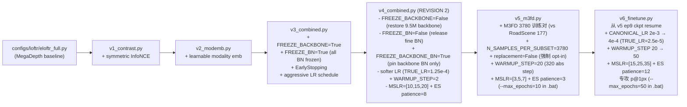
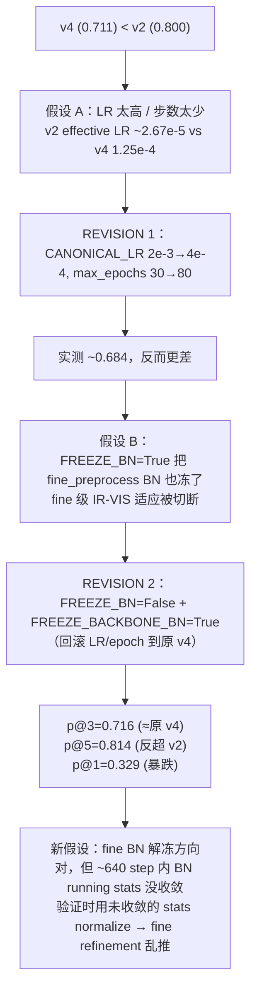
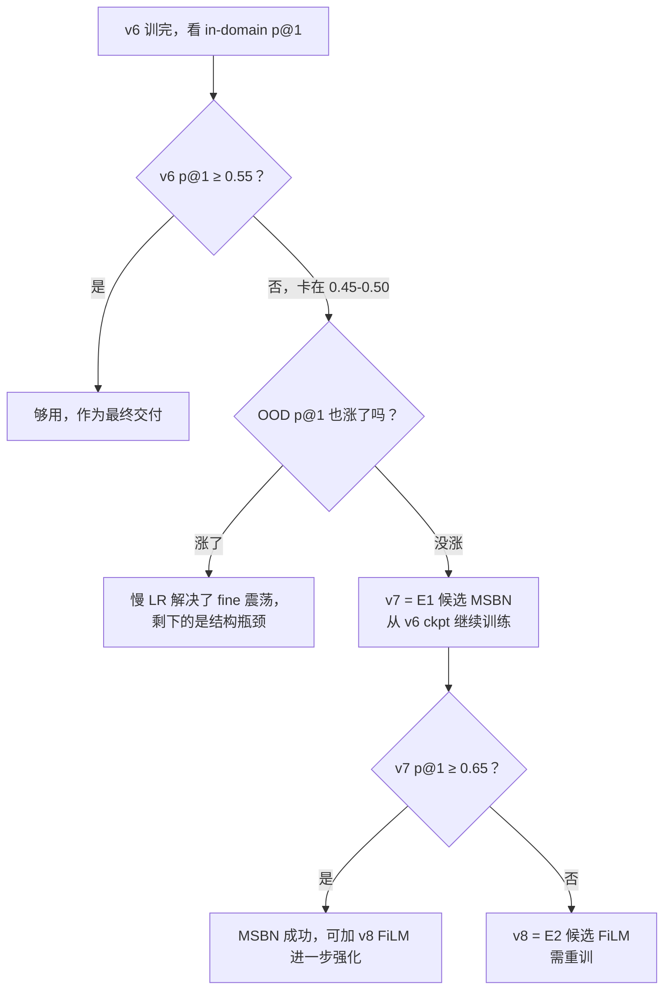
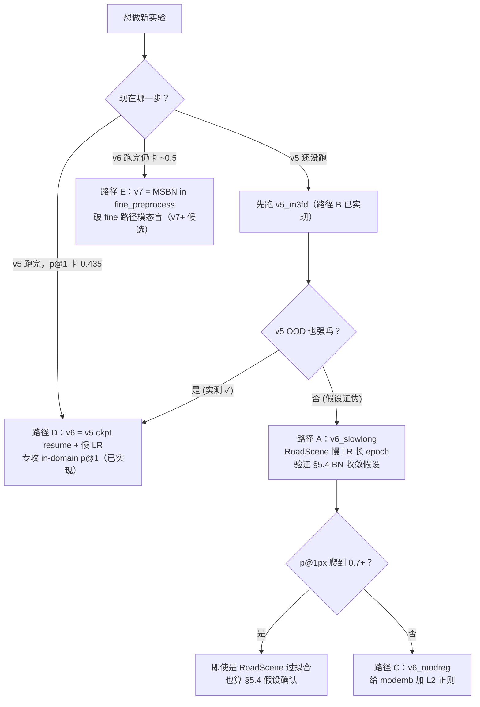

# RoadScene 跨模态实验：v1 / v2 / v3 / v4 / v5 / v6 与如何加新版本

> 该 skill 的前置依赖：[eloftr-roadscene-data](../eloftr-roadscene-data/SKILL.md)（数据集 + 监督）和 [eloftr-windows-setup](../eloftr-windows-setup/SKILL.md)（环境）。
> 评估侧的 apples-to-apples 对比方法见 [eloftr-eval-pipeline](../eloftr-eval-pipeline/SKILL.md)。

## 0. 继承链总览



> v4 经过两轮修订：REVISION 1（仅降 LR + 加长 epoch）被实测证伪，当前 v4 处于 REVISION 2 状态。详见 §5。
> v5 切换到 M3FD 数据集（仍走 IR-VIS 同一 pipeline，见 [eloftr-m3fd-data](../eloftr-m3fd-data/SKILL.md)），sched 重调适配 21× step/epoch。**v5 实测见 §5.6**。
> v6 不换数据集、不换架构，纯粹用 v2-style 慢 LR 在 v5 ckpt 上继续训练，专攻 v5 短板 p@1px（in-domain 0.435 / OOD 0.186）。**v6 设计动机见 §6 路径 D**。

每个 v_x 配置只 `from <previous> import cfg` 然后修改若干字段，**强制累计**：v4 一定包含 v1+v2 的全部能力（loss_contrast / modemb），所以 ablation 时只需要改 main_cfg_path，不需要再编辑代码。

每一组都配三个 .bat：
- `*_debug.bat`：`bs=2, max_epochs=1, --disable_ckpt`，10 个 batch 跑通 + 看启动日志。
- `*_small.bat`：`bs=2`，跑短的完整训练以确认 loss/metric 走向。
- `*_<feature>.bat`（如 `v1_contrast.bat`）：完整 finetune。

## 1. v1：Symmetric InfoNCE Cross-Modal Contrastive Loss

**配置**：[configs/loftr/eloftr_full_v1_contrast.py](../../../configs/loftr/eloftr_full_v1_contrast.py)
```python
from configs.loftr.eloftr_full import cfg
cfg.LOFTR.LOSS.USE_CONTRASTIVE = True
cfg.LOFTR.LOSS.CONTRASTIVE_WEIGHT = 0.01
cfg.LOFTR.LOSS.CONTRASTIVE_TEMP   = 0.1
```

**Default 中的开关**（[src/config/default.py:107-109](../../../src/config/default.py)）：默认 `USE_CONTRASTIVE = False`，所以 baseline / 旧实验完全不受影响。

**为什么是 InfoNCE 而不是继续调 dual-softmax focal**：
- focal 在概率接近 1 时梯度指数级衰减，跨模态相似度始终偏低反而很快饱和；InfoNCE 是 (K+1) 路 cross-entropy，只要负样本里出现伪近邻就持续给梯度。
- dual-softmax 隐含 “互为最近邻才算正” 的硬约束，IR 中信息密度低的格子很难单向匹配；symmetric InfoNCE 把方向拆成两个独立的 (K+1) 分类，i2v 和 v2i 各自约束。
- L2-normalize 后做点积让 loss 与特征绝对模长无关，避免 v2 的 modemb 被 “通过放大模长降 loss” 的捷径抢走优化方向。

**实现要点**：

1. [src/loftr/loftr.py:125-131](../../../src/loftr/loftr.py)：transformer 出口处把 `feat_c0 / feat_c1` 同时存到 `data` dict（**只在 `use_contrastive=True` 时存**，避免 baseline 多占显存），保留 autograd 图，让对比 loss 能反传到 transformer + backbone。
2. [src/losses/loftr_loss.py:134-180](../../../src/losses/loftr_loss.py) `_compute_contrastive_loss`：用 `data['spv_b_ids/i_ids/j_ids']`（粗匹配 GT）取出锚点，对 L2-norm 后的特征做 i→v 与 v→i 两个方向的 InfoNCE，负样本池是整个 batch 拉平的所有 token (`B*L`)。
3. [src/losses/loftr_loss.py:277-286](../../../src/losses/loftr_loss.py) 在 `forward` 里加权求和：
   `loss = loss + CONTRASTIVE_WEIGHT * (loss_i2v + loss_v2i) / 2`，并 log `loss_contrast / loss_i2v / loss_v2i / n_pos`。

**Bat 入口**：
- `MyScripts/run_roadscene_v1_debug.bat` / `_small.bat` / `_contrast.bat`
- `bs >= 2` 是硬性要求：`bs=1` 时 InfoNCE 的负样本池退化为 in-image，等价于 dual-softmax，对比损失等于白加。

## 2. v2：Learnable Modality Embedding

**配置**：[configs/loftr/eloftr_full_v2_modemb.py](../../../configs/loftr/eloftr_full_v2_modemb.py)
```python
from configs.loftr.eloftr_full_v1_contrast import cfg
cfg.LOFTR.USE_MODALITY_EMB  = True
cfg.LOFTR.MODALITY_EMB_INIT = 'zeros'   # 起点等价于 v1
```

**实现要点**（[src/loftr/loftr.py:41-62, 112-118](../../../src/loftr/loftr.py)）：
- `__init__` 里按 `d_model = config['coarse']['d_model']` 注册两个 `nn.Parameter(torch.zeros(d_model))`：`modality_emb_ir / modality_emb_vis`。
- `forward` 在 backbone 输出之后、送入 `loftr_coarse` 之前广播相加：
  ```python
  feat_c0 = feat_c0 + self.modality_emb_ir.view(1, -1, 1, 1)   # IR
  feat_c1 = feat_c1 + self.modality_emb_vis.view(1, -1, 1, 1)  # VIS
  ```
  只在输入端注入一次，残差会把模态身份逐层传递下去。

**关键设计选择**：

| 选择 | 决策 | 原因 |
|------|------|------|
| 加在哪里 | backbone 输出之后 / transformer 之前 | LoFTR 后续是 `feat → q/k/v` 投影，输入端加偏置 = Q/K/V 都被影响，注意力机制本身才能 “意识到” 模态。只加在 V 上只能改输出聚合，注意力分布不变。 |
| 初值 | `zeros` | 起点与 v1 完全等价（finetune 安全网），梯度推动它远离 0 才说明真的有用。 |
| 与 RoPE 关系 | RoPE 只在 self-attention、只乘到 Q/K，是相对位置；modemb 在输入端、影响 Q/K/V，是绝对模态身份。两者正交。详见 [src/loftr/loftr_module/transformer.py:71-72](../../../src/loftr/loftr_module/transformer.py)（`if self.rope:` 分支只在 self 阶段执行）。 |

**监控**（[src/lightning/lightning_loftr.py:250-258](../../../src/lightning/lightning_loftr.py)）：每个 `training_step` 把 `mod_emb_ir_norm / mod_emb_vis_norm` 写到 TensorBoard，配合 val 曲线判断是否过拟合（早期 v2 实验里两者持续涨 + val 在 epoch 3-4 见顶后回落，是 v3 出现的根本动机）。

## 2.5 modemb 信号路径：只影响 coarse，对 fine 几乎完全失效

v2 的 modemb 设计是 "在 coarse transformer 入口加 256-d 偏置"。这个设计对 coarse 匹配非常有效（v2 的 p@3 涨到 0.80 就是证据），但**对 fine refinement 几乎 0 影响**——这是 v5 短板 p@1px 的根本原因之一，也是未来 v7 的优化空间。

### 2.5.1 注入位置回顾

```python
# src/loftr/loftr.py:112-118
if self.use_modality_emb:
    feat_c0 = feat_c0 + self.modality_emb_ir.view(1, -1, 1, 1)
    feat_c1 = feat_c1 + self.modality_emb_vis.view(1, -1, 1, 1)
feat_c0, feat_c1 = self.loftr_coarse(feat_c0, feat_c1, mask_c0, mask_c1)  # transformer 之前
```

之后 transformer 输出的 `feat_c0/feat_c1` **带 modemb 残余**，会随着第 148 行 `fine_preprocess(feat_c0, feat_c1, data)` 进入 fine 路径。

### 2.5.2 残余信号在 fine 路径被两次"吃掉"

**第一次吃：fine_preprocess 的 2 个 BN**

```python
# src/loftr/loftr_module/fine_preprocess.py:28-40
self.layer2_outconv2 = nn.Sequential(
    conv3x3(...), nn.BatchNorm2d(...), nn.LeakyReLU(), conv3x3(...),
)
self.layer1_outconv2 = nn.Sequential(
    conv3x3(...), nn.BatchNorm2d(...), nn.LeakyReLU(), conv3x3(...),
)
```

FPN 链路是 `feat_c → upsample → +x2 → layer2_outconv2 → upsample → +x1 → layer1_outconv2 → upsample`。其中：

- `x2` / `x1` 来自 backbone 中间层，**不带 modemb**
- `+x2` / `+x1` 把 modemb 信号稀释一半
- 紧跟着的 `BatchNorm2d` 把 channel-wise 常数偏置完全归零（BN 数学性质：`BN(x+b) = BN(x)`）

**第二次吃：fine_matching 的 inner-product + argmax**

```python
# src/loftr/utils/fine_matching.py:50-57
feat_f0, feat_f1 = feat_f0 / C**.5, feat_f1 / C**.5     # 注意：不是 L2-normalize
conf_matrix_f = torch.einsum('mlc,mrc->mlr', feat_f0, feat_f1)
softmax_matrix_f = F.softmax(conf_matrix_f, 1) * F.softmax(conf_matrix_f, 2)
```

即使 fine_preprocess 没有 BN（假设把 BN 都拿掉），fine_matching 找的是 `argmax_{l,r} softmax(conf_matrix)`：

- 给 `feat_f0 += b_ir`、`feat_f1 += b_vis`，inner product 多出 3 项：`<b_ir, feat_f1>` 只跟 r 有关、`<feat_f0, b_vis>` 只跟 l 有关、`<b_ir, b_vis>` 是常数
- row-wise 和 col-wise softmax 各自把 row-only / col-only / 全局常数完全消除
- **argmax 位置不变** → fine peak 不变 → p@1px 不变

### 2.5.3 直接结论与 v7 候选方向

| 注入位置 | 被消除机制 | 实际有效 |
|---|---|---|
| 原图 / backbone 内任一处 | 后续 BN 归零 | ❌ 完全无效 |
| backbone 输出 / coarse transformer 前（**当前 v2 位置**） | LN 部分压缩，但 attention 对绝对值敏感 | ✅ **有效** |
| coarse transformer 输出 / fine_preprocess 前 | fine_preprocess 2 BN 归零 | ❌ 无效 |
| fine_preprocess 输出 / fine_matching 前 | fine_matching argmax 对常数偏置免疫 | ❌ **无效** |

**所以"再加两个常数向量给 fine"是无效设计**。要让 fine 真懂模态，必须破解"BN 吃 bias + argmax 吃 bias"两个机制——三条候选路径见 [§6 路径 E](#路径-eopt-fine-阶段懂模态--工程量大留作-v7v8-候选)（v7 起的工程项）。

> **当前 v5 的 p@1px=0.435 在 in-domain 已是 v4 REV2 (0.329) 的 1.32×**——证明 fine BN 收敛了，但 fine 路径对模态盲是结构性短板，**单靠继续训练 v5 无法把 p@1 推过 ~0.55**。这是 v6 (resume + 慢 LR) 与 v7 (fine-modemb) 的分工边界。

## 3. v3：Anti-Overfit Stack（freeze + EarlyStopping + LR）

**配置**：[configs/loftr/eloftr_full_v3_combined.py](../../../configs/loftr/eloftr_full_v3_combined.py)
```python
from configs.loftr.eloftr_full_v2_modemb import cfg
cfg.LOFTR.FREEZE_BACKBONE      = True
cfg.LOFTR.FREEZE_BN            = True
cfg.TRAINER.EARLY_STOPPING     = True
cfg.TRAINER.EARLY_STOPPING_PATIENCE = 4
cfg.TRAINER.CANONICAL_LR       = 8e-3      # TRUE_LR = 5e-4 at bs=4
cfg.TRAINER.WARMUP_STEP        = 1         # 实际等于关掉 warmup
cfg.TRAINER.MSLR_MILESTONES    = [5, 7]    # 默认 [8,12,16,20,24] 太晚
```

### 3.1 三个 freeze flag 的优先级与实现

[src/config/default.py:38-54](../../../src/config/default.py) 提供三个独立 flag，全部默认 `False`（保持 v0/v1/v2 行为字节级一致）：

| Flag | 作用范围 | 同时影响 |
|------|---------|----------|
| `FREEZE_BACKBONE` | `matcher.backbone.*` 所有 conv 权重 `requires_grad=False` | 不动 BN 模式（BN 仍 train-mode + running stats 仍更新） |
| `FREEZE_BN` | **所有** `BatchNorm2d` (backbone **+** fine_preprocess) eval-mode + affine 冻结 | 包含 fine BN |
| `FREEZE_BACKBONE_BN` | **仅** `matcher.backbone.*` 内的 BN eval-mode + affine 冻结；fine_preprocess BN 保持 trainable | 不影响 backbone conv 权重 |

**优先级**：`FREEZE_BN=True` 覆盖 `FREEZE_BACKBONE_BN`（前者已冻全部 BN，后者再做就重复 + 污染日志）。优先级靠两处守卫保证：

[src/lightning/lightning_loftr.py:80-94](../../../src/lightning/lightning_loftr.py) 的 `__init__`：
```python
self._freeze_bn          = bool(config.LOFTR.get('FREEZE_BN', False))
self._freeze_backbone_bn = bool(config.LOFTR.get('FREEZE_BACKBONE_BN', False))
if config.LOFTR.get('FREEZE_BACKBONE', False):
    for p in self.matcher.backbone.parameters(): p.requires_grad = False
if self._freeze_bn:
    self._apply_freeze_bn()
if self._freeze_backbone_bn and not self._freeze_bn:   # ← and-not 守卫
    self._apply_freeze_backbone_bn()
```

[src/lightning/lightning_loftr.py:130-142](../../../src/lightning/lightning_loftr.py) 的 `train()` override（PL 每 epoch 都会 `self.train(True)` 把 BN 拉回 train-mode，必须重新冻一遍）：
```python
def train(self, mode=True):
    super().train(mode)
    if getattr(self, '_freeze_bn', False):
        self._apply_freeze_bn()
    elif getattr(self, '_freeze_backbone_bn', False):   # ← elif 而非 if
        self._apply_freeze_backbone_bn()
    return self
```

**反向兼容验证**（v0/v1/v2/v3 字节级不变）：

| 版本 | FREEZE_BN | FREEZE_BACKBONE_BN | __init__ 走哪 | train() 走哪 |
|------|-----------|--------------------|--------------|-------------|
| v0/v1/v2 | False (default) | False (default) | 都跳过 | 都跳过 |
| v3 | True | False (default) | 走 `_apply_freeze_bn`；backbone-only 被 `not _freeze_bn` 拦下 | 走 `if` 分支，`elif` 不进入 |
| v4 (REVISION 2) | False | True | 走 `_apply_freeze_backbone_bn` | 走 `elif` 分支 |

`_apply_freeze_backbone_bn` 用 `self.matcher.backbone.modules()` 严格限定遍历范围，**不会跨到 fine_preprocess / loftr_coarse / fine_matching**——这是 REVISION 2 能"只冻 backbone BN 而保留 fine BN 可训"的关键。

### 3.2 Optimizer 只看可训练参数

[src/optimizers/__init__.py:9-21](../../../src/optimizers/__init__.py)：用 `filter(lambda p: p.requires_grad, model.parameters())` 替代 `model.parameters()`，否则 AdamW 的 `weight_decay` 会**直接对 `param.data` 减衰减项**（AdamW 不依赖梯度），让冻结权重也漂走。
- 兼容性：v0/v1/v2 没冻结任何参数，filter 是 no-op，行为字节级一致。

### 3.3 EarlyStopping

[train.py:11, 144-168](../../../train.py)：
- 第 11 行 import `EarlyStopping`。
- `monitor_metric / monitor_mode / filename_tpl` 在 RoadScene 分支里取 `'precision@3px' / 'max'`，**先于** `if not args.disable_ckpt:` 块计算，方便 ES 与 ckpt 共用。
- ES callback 只看 `config.TRAINER.EARLY_STOPPING`，与 `--disable_ckpt` 完全独立；调试脚本 `*_v3_debug.bat` 即便加了 `--disable_ckpt` 也会触发 EarlyStopping 日志。

### 3.4 启动日志验收清单

不同 freeze 配置启动后期望看到的日志（前 30 行内）：

| 跑哪个 | 关键日志 | Trainable params |
|--------|----------|----------------|
| v3 (`FREEZE_BACKBONE=True, FREEZE_BN=True`) | `Froze backbone: 9.50M params` + `Froze all BatchNorm2d layers (eval-mode + no-grad)` | `~5.7M / Total: ~16.0M` |
| v4 REVISION 2 (`FREEZE_BACKBONE=False, FREEZE_BN=False, FREEZE_BACKBONE_BN=True`) | `Froze backbone BatchNorm2d layers (eval-mode + no-grad); fine_preprocess BN remains trainable` | `~15.99M / Total: ~16.0M`（仅 backbone BN ~10K affine 被冻） |
| v0/v1/v2 (`默认全 False`) | 上述 freeze 日志**全部缺席** | `~16.0M / Total: ~16.0M`（全开） |

通用：
```
missing_keys (kept at init value): ['modality_emb_ir', 'modality_emb_vis']
EarlyStopping enabled (monitor=precision@3px, mode=max, patience=...)
```

TensorBoard 应同时出现 baseline / v1 / v2 三套 loss：
- `train/loss_c, loss_f, loss_l`（baseline）
- `train/loss_contrast, loss_i2v, loss_v2i, n_pos`（v1）
- `train/mod_emb_ir_norm, mod_emb_vis_norm`（v2）

**Sanity 检查**：v4 REVISION 2 启动后如果 trainable params 显示 ~5.7M（接近 v3），说明 `not self._freeze_bn` 守卫失效或 v4 配置被覆盖到 `FREEZE_BN=True`，必须排查 yacs 合并顺序。

## 4. 必看坑：LR / WARMUP_STEP / MSLR_MILESTONES

`train.py` 在第 102-105 行做自动按 batch 缩放：

```python
_scaling = TRUE_BATCH_SIZE / CANONICAL_BS              # 例：4 / 64 = 0.0625
TRUE_LR  = CANONICAL_LR * _scaling                     # LR 按 BS 缩小
WARMUP_STEP = math.floor(WARMUP_STEP / _scaling)       # WARMUP 反向放大！
```

后果：
- `WARMUP_STEP=1875` 在 `bs=4` 时变成 30000 步；RoadScene 1 个 epoch ≈ 40-75 个 step，等于训练全程都在 warmup 线性上升 LR，永远到不了目标 LR → val 早期偶然好，后期一直在“低 LR + 长时间”里抖。这是 v1/v2 都出现 “epoch 3-4 见顶后回落” 的真凶。
- v3 把 `WARMUP_STEP=1`（基本关掉）+ `CANONICAL_LR=8e-3`（TRUE_LR≈5e-4）+ `MSLR_MILESTONES=[5,7]`（在 ES patience=4 之前先衰减一次）一起用，第 0 个 step 就直接到目标 LR。

经验法则：
- **小数据集（≤ 几百对）finetune**：把 `WARMUP_STEP` 写 1。理由是优化器统计量在几个 step 内就稳了，pretrained init 不需要 warm。
- **`MSLR_MILESTONES` 必须 < `EARLY_STOPPING_PATIENCE` + 典型见顶 epoch**，否则 ES 在第一次 LR decay 之前就触发，整套 schedule 等于没用。
- **train_loss 一直降但 val 在 epoch 3-6 见顶后回落** = 过拟合，不是 “还没收敛”。再加 epoch 没用，要么冻结、要么早停、要么换更强正则。

## 4.5 必看坑：RandomConcatSampler 默认值在单数据源场景下静默欠采样

LoFTR 的训练 sampler ([src/datasets/sampler.py](../../../src/datasets/sampler.py)) 是为 ScanNet/MegaDepth 的"多场景"结构设计的——每个 .npz = 一个 scene = sampler 眼里的一个 subset，每 epoch 从**每个 subset 抽 200 个样本**（with replacement）以实现 scene_balance。N_SAMPLES_PER_SUBSET=200 是 **per-scene quota**，不是 per-dataset budget。

RoadScene/M3FD 每个数据集只有一个扁平图像列表，[src/lightning/data.py:248](../../../src/lightning/data.py) 把它包装成 `ConcatDataset([ds])` → `n_subset == 1`，结果 200 这个默认值退化为"per-dataset 上限 200 样本/epoch"。

| 数据集 | 全集 | 默认每 epoch 实际样本 | 行为 |
|--------|------|---------------------|------|
| RoadScene train | 177 | 200 (with replacement) | 巧合：177 < 200，期望覆盖 ~63%/epoch，50 epoch 后基本全见过；**v0-v4 的所有结果都是在这个默认值下产生的**，但因为数据集本身 < 200，没有被欠采样 |
| M3FD train | 3780 | 200 (with replacement) | **严重欠采样**：每 epoch 只见 5.3% 的数据；10 epoch 总共 ≤2000 个独特样本（约 47% 数据从未见过）；"21× step 密度"假设彻底破产 |

### 4.5.1 必须 override 的两个开关（M3FD/LLVIP/KAIST 等大数据集）

```python
cfg.TRAINER.N_SAMPLES_PER_SUBSET         = 3780     # 改成数据集全集大小
cfg.TRAINER.SB_SUBSET_SAMPLE_REPLACEMENT = False    # 走 randperm 而不是 randint
```

两个都必须改：
- 只改前者 → `sampler.py:50-52` 仍走 `torch.randint(0, 3780, (3780,))`，with-replacement，每 epoch 期望唯一样本仅 ≈ 3780 × (1 − 1/e) ≈ **2389 个**
- 同时改后者 → 走 `sampler.py:53-61` 的 `torch.randperm(3780)[:3780]` 分支，**每 epoch 完整 permutation，3780 全部各见 1 次**，跨 epoch 因为 PL 每 epoch 重建 sampler（[data.py:367](../../../src/lightning/data.py)）所以 permutation 重新随机

### 4.5.2 `default.py` 不改 N_SAMPLES_PER_SUBSET 的原因

200 这个默认值对 ScanNet/MegaDepth 是正确的——94/196 个 scene × 200 = 18800/39200 样本/epoch，正好匹配 LoFTR 原训练 step 预算。改 default 会让 ScanNet/MegaDepth 训练破坏。
**单数据源 IR-VIS 必须由各自的 LoFTR config 显式 opt-in**（v5_m3fd 已加，未来 v5_llvip / v5_kaist 也必须各自加）。

### 4.5.3 进度条诊断

PL 训练时第 0 个 epoch 的进度条 `Epoch 0: ... A/B [train+val]`：
- 正确（v5 sampler override 已生效）：`B = 3780/4 + 210/1 = 1155`，train 占 945
- 错误（默认值生效）：`B = 200/4 + 210/1 = 260`，train 占 50
- 看到 `50/260` 立即停训：sampler override 没生效

## 5. v3/v4 实测结果与 REVISION 2 诊断

### 5.1 实测分数（precision@Npx，最佳 epoch）

| run | 最佳 ep | p@1px | p@3px | p@5px | 备注 |
|-----|---------|-------|-------|-------|------|
| **v2 v0**（baseline 最佳） | 49 | **0.741** | **0.800** | 0.806 | bs=2，effective TRUE_LR ~2.67e-5，~6400 step |
| 原 v4 v0（FREEZE_BN=True） | 14 | — | 0.711 | — | bs=4，TRUE_LR=1.25e-4，~880 step |
| v4 REVISION 1（仅降 LR + 80 epoch）| — | — | ~0.684 | — | **被实测证伪**（更差） |
| v4 REVISION 2（FREEZE_BACKBONE_BN=True） | 9 | 0.329 | 0.716 | **0.814** | bs=4，~640 step（ES 在 ep 16 触发） |

### 5.2 假设演化



### 5.3 关键诊断信号：p@5 反超 v2，但 p@1 暴跌

REVISION 2 出现了之前所有版本都没见过的指标分布：

| 阈值 | v2 v0 | v4 REVISION 2 | Δ |
|------|-------|---------------|---|
| p@5px | 0.806 | **0.814 (+0.008)** | 粗匹配（coarse）质量持平甚至更好 |
| p@3px | 0.800 | 0.716 (-0.084) | 中等精度位置稍差 |
| p@1px | 0.741 | **0.329 (-0.412)** | 亚像素精度 **塌了一半** |

**亚像素塌而粗匹配反而稍好**是非常诊断性的指纹：
- coarse transformer + dual-softmax 在 1/8 分辨率上仍然能找到对的 patch（→ p@5 OK）
- 但 fine 级 refinement 把已经对上的点 "推偏了"（→ p@1 崩坏）
- `fine_preprocess` 的 2 个 BN（[src/loftr/loftr_module/fine_preprocess.py](../../../src/loftr/loftr_module/fine_preprocess.py) 的 `layer{1,2}_outconv2[1]`，共 ~768 affine 参数）正好夹在 coarse-to-fine 上采样之后、`fine_matching` 之前——它们出问题就是 sub-pixel refine 出问题

### 5.4 根本机制：BN running-stats 收敛需要 ≥3000 step

BN 用 momentum=0.1 的 EMA 更新 running stats：
```
running_stat ← 0.9 * running_stat + 0.1 * batch_stat
```

- v2 v0：bs=2 + ~80 step/epoch × 80 epoch = **~6400 步 BN 更新**，加上 v2 effective LR 极小（~2.67e-5），特征分布漂移得也慢，**BN running stats 有时间追上**
- v4 REVISION 2：bs=4 + ~40 step/epoch × ~16 epoch = **~640 步 BN 更新**，BN 还停留在 "从 MegaDepth pretrained stats 漂移到 IR-VIS 域的中途"——**未收敛**
- 验证时用 `running_stat`（不用 batch_stat），未收敛的 stats 直接喂给 fine refinement → 亚像素回归乱推

### 5.5 REVISION 2 假设的最终判定

按 [configs/loftr/eloftr_full_v4_combined.py](../../../configs/loftr/eloftr_full_v4_combined.py) docstring 写的判定标准（"p@3px 接近 v2 ~0.80 = 假设确认；停留在 ~0.71 = 假设证伪"）：

- p@3px 0.716 ≈ 原 v4 0.711 → **"fine BN 全冻是 v4 < v2 的主要瓶颈" 假设被证伪**
- 但 p@5px 反超 + p@1px 暴跌的指纹 → **方向对，被另一个因素压制（BN 收敛步数不足）**

修正后的真正归因：**v2 的胜利不是任何单一架构选择，而是 "fine BN 解冻 + 极慢 LR + 极长训练" 三者的组合**。换掉任意一项（v3/v4 冻 fine BN，或 v4 REVISION 2 解冻 fine BN 但短训练）都会塌掉。

> 实现层面 `FREEZE_BACKBONE_BN` 这个 flag **本身是正确的**——p@5 反超就是 backbone BN 被正确冻住的证据，p@1 暴跌就是 fine BN 被精确解冻的证据。后续 v5 可直接复用此 flag。

### 5.6 v5 (M3FD) 实测结果与 OOD 矩阵

v5 跑完 10 epoch（max_epochs 满，未触发 EarlyStopping），训练时长 3h54m，events 文件 93MB（间接验证 945 step/epoch 的 sampler override 生效）。

#### 5.6.1 训练曲线指纹

Top-5 ckpt（其余被 ModelCheckpoint 挤出）：

```text
epoch 3:  p@1=0.393  p@3=0.784  p@5=0.868
epoch 6:  p@1=0.399  p@3=0.784  p@5=0.865
epoch 7:  p@1=0.417  p@3=0.784  p@5=0.859
epoch 8:  p@1=0.418  p@3=0.786  p@5=0.860
epoch 9:  p@1=0.418  p@3=0.789  p@5=0.864   ← best
```

Δ 形状：**p@5 微降 / p@3 微升 / p@1 大涨**——正好是 v4 REVISION 2 的 "p@5 反超 + p@3 平 + p@1 暴跌" 的**镜像反转**。这印证 §5.4 的 BN 收敛假设：v5 ~9450 step 远超 §5.4 估算的 ~3000 step BN 收敛阈值，fine BN running stats 已基本收敛，p@1 不再塌。

#### 5.6.2 In-domain (M3FD val) 与 v4 REV2 (RoadScene val) 对比

| 指标 | v4 REV2 (RS, ep9) | v5 (M3FD, ep9) | 解读 |
|---|---|---|---|
| p@1px | 0.329（崩） | **0.418** ↑ | BN 收敛后 fine 不再乱推 |
| p@3px | 0.716 | **0.789** ↑ | 真实涨点，但 v2 RoadScene val 噪声大不可直接比 |
| p@5px | 0.814 | 0.864 | 同上 |

#### 5.6.3 关键 OOD 评估：v2 vs v5 在 RoadScene/M3FD 双 test 矩阵

**这才是判断 v5 是否成功的真正证据**——同 val set 的 apples-to-apples 对比。

| 训练 → 测试 | RoadScene test (22 对) | M3FD test (210 对) |
|---|---|---|
| **v2 v1 ep62** (RS-train) | p@1=**0.7567** p@3=**0.8086** p@5=0.8151 mpe=**1.97** | p@1=0.1192 p@3=0.4971 p@5=0.6948 mpe=4.66 |
| **v5 v0 ep9** (M3FD-train) | p@1=0.1858 p@3=0.5989 p@5=0.7825 mpe=3.39 | p@1=0.4352 p@3=**0.8072** p@5=**0.8777** mpe=**2.07** |

**对角线（in-domain）**：v5 in-domain p@3 (0.8072) ≈ v2 in-domain p@3 (0.8086)，**几乎平手**；v5 p@5 (0.8777) 反超 v2 (0.8151)。**v5 唯一短板是 in-domain p@1**（0.4352 vs v2 0.7567）。

**反对角线（OOD）**：

| OOD 指标对称对比 | v2 → M3FD | v5 → RoadScene | v5 优势 |
|---|---|---|---|
| OOD p@1px | 0.1192 | 0.1858 | **+56%** |
| OOD p@3px | 0.4971 | 0.5989 | **+20%** |
| OOD p@5px | 0.6948 | 0.7825 | **+13%** |
| OOD mpe | 4.66 | 3.39 | **-27%（更小更好）** |

**v5 在每一个 OOD 指标上都显著优于 v2 OOD**。综合通用性（in-domain + OOD 的 p@3px）：v5 = 1.4061，v2 = 1.3057，v5 领先 8%。

#### 5.6.4 v2 高 p@1 的真相：**RoadScene 22 张 val/test 严重过拟合**

v2 RoadScene-train 的 in-domain p@1=0.7567 跨到 M3FD 直接崩到 0.1192——**绝对损失 0.64，相对衰减 84%**。这种崩坏不是"换 val 集难度差异"能解释的（如果是难度差异，p@3 也应该等比例崩，但 p@3 只衰减 38%）。

机制：
- RoadScene v2 训练 60+ epoch × ~88 step/epoch = ~5000 step
- 训练集 177 张 with-replacement 每张被见 ~50 次
- v2 effective LR 极小（~2e-5）给了模型**精细记忆**每张训练图局部模式的时间
- 同 split 流程产出的 22 张 test 与 22 张 val 高度同分布 → test 也被"间接记忆"
- 跨到 M3FD（训练时从未见过的图）→ v2 的精细记忆完全失效

> **v2 的 p@1=0.7567 其实是负面信号，不是优点**——它说明 v2 的 fine refinement 学的是"22 张图的记忆"，不是"通用 IR-VIS sub-pixel 对齐能力"。

#### 5.6.5 v5 = 路径 B (数据扩展) 胜利的最终判定

按 [configs/loftr/eloftr_full_v5_m3fd.py](../../../configs/loftr/eloftr_full_v5_m3fd.py) docstring 的判定标准：
- ✅ **假设确认**：v5 in-domain p@3=0.807 ≥ 0.80，且 p@1=0.435 远超 v4 REV2 的 0.329 → BN 收敛 + 数据扩展双重假设成立
- ✅ **路径 B 核心收益**：v5 OOD 全面碾压 v2 OOD → **学到了真正的通用 IR-VIS 表示，不是数据集特化的记忆**
- ⚠️ **唯一短板**：in-domain p@1 还有 ~0.10-0.15 提升空间（vs 理论 ~0.55-0.65 的"通用 + 精修双修"上限）

短板归因（详见 §6 路径 D 设计动机）：
1. **v5 effective LR 太高**：v5 epoch 0-3 一直跑 1.25e-4，是 v2 同期 ~2e-5 的 6 倍。fine sub-pixel offset 在高 LR 下永久震荡，无法精细收敛
2. **结构性瓶颈**：modemb 在 fine 路径完全失效（[§2.5](#25-modemb-信号路径只影响-coarse对-fine-几乎完全失效)），fine_matching 对模态盲

第一条由 v6 慢 LR resume 解决，第二条留给 v7+ MSBN/FiLM。

## 6. 怎么加新 v5：三条候选路径与选型

§5 的诊断结论 ("v2 赢在 fine BN 解冻 + 极慢 LR + 极长训练 三件套，缺一不可") 直接决定 v5 的方向。按性价比 + 工程量排序：

### 路径 A：复刻 v2 的"慢 LR + 长 epoch"（code-only，0 数据改动）

最低成本，直接验证 §5 的归因是否正确。在 v4 REVISION 2 基础上：

```python
# configs/loftr/eloftr_full_v5_slowlong.py
from configs.loftr.eloftr_full_v4_combined import cfg

cfg.TRAINER.CANONICAL_LR            = 4e-4   # TRUE_LR 2.5e-5 ≈ v2 effective peak
cfg.TRAINER.MSLR_MILESTONES         = [40, 60]   # 让大部分时间在 full LR
cfg.TRAINER.EARLY_STOPPING_PATIENCE = 16    # v2 的最佳 ep 是 49，patience 必须够大
# bat: --max_epochs=80
```

预期：fine BN 有 80 epoch × 40 step ≈ 3200 次更新（vs REVISION 2 的 640），running stats 应该能收敛。如果 p@1px 在 ep 30-50 之间从 ~0.3 缓慢爬到 ~0.7，就实锤了 §5.4 的 BN 收敛假设。

### 路径 B：扩数据（LLVIP / M3FD）+ bs↑ + epoch↓（推荐，能根治多个瓶颈）

RoadScene 已经全量用完（221 对，177/22/22 split，见 [eloftr-roadscene-data](../eloftr-roadscene-data/SKILL.md) §6）。要根治 BN 收敛 + 过拟合 + val 噪声，需要**真正多数据**：

| 候选数据集 | 规模 | 像素对齐 | 域偏移 vs RoadScene | v5 状态 |
|-----------|------|----------|--------------------|--------|
| M3FD | 4200 对 (3780 train) | ✓ | 低（同样行车场景） | **已实现，见下方 v5_m3fd** |
| **LLVIP** | ~30k 对 | ✓ 已对齐 | 中（夜景城市监控 vs 行车 FLIR） | 未实现（v6+ 候选） |
| KAIST Multispectral | ~95k 对 | ✗ 需校准 | 低（同样行车） | 未实现（v6+ 候选） |

#### v5_m3fd 当前实现（M3FD-only，单数据源）

[configs/loftr/eloftr_full_v5_m3fd.py](../../../configs/loftr/eloftr_full_v5_m3fd.py) 继承 v4 REVISION 2 全部架构改动，**不**做联合训练（避免新写 ConcatDataset + 域均衡 sampler）。schedule 适配 M3FD 一个 epoch 长 21×：

```python
from configs.loftr.eloftr_full_v4_combined import cfg

# §4.5 强制：单数据源 IR-VIS 必须 opt-in，否则每 epoch 只用 200 样本 (5%)
cfg.TRAINER.N_SAMPLES_PER_SUBSET         = 3780   # default=200, override 到 M3FD 全集
cfg.TRAINER.SB_SUBSET_SAMPLE_REPLACEMENT = False  # default=True, 走 randperm 让每对各见 1 次/epoch

cfg.TRAINER.WARMUP_STEP             = 20          # 320 abs step ≈ 3.4% total training
cfg.TRAINER.MSLR_MILESTONES         = [3, 5, 7]   # M3FD epoch ~21x longer
cfg.TRAINER.EARLY_STOPPING_PATIENCE = 3           # M3FD val=210 less noisy than RoadScene val=22
```

> 前两个 override 是 v5 能成立的**前提**（详见 §4.5）。漏掉任意一个会让 v5 退化成"5% 数据 + 50 step/epoch"，schedule 全部失准。启动后立即看 PL 进度条第一行：必须是 `... 945/1155` 才算生效。

数据接入完整记录见 [eloftr-m3fd-data](../eloftr-m3fd-data/SKILL.md)（白名单注册、`m3fd_trainval.py`、make_m3fd_splits）。bat 三联：[run_m3fd_v5_debug.bat](../../../MyScripts/run_m3fd_v5_debug.bat) / [run_m3fd_v5_small.bat](../../../MyScripts/run_m3fd_v5_small.bat) / [run_m3fd_v5_combined.bat](../../../MyScripts/run_m3fd_v5_combined.bat)，--exp_name 前缀从 `roadscene_v*` 改为 `m3fd_v5_*`。

判定标准：
- **假设确认**：v5 在 M3FD val 上 p@3px ≥ 0.80 且 p@1px 不再像 v4 REVISION 2 那样塌到 0.329 → §5.4 "BN running stats 需要 3000+ 步收敛" 假设成立
- **假设证伪**：v5 仍在 0.71 附近 → 数据规模不是主因，回路径 A 或 C

#### v6+ 联合训练候选（未实现）

如果 v5 (M3FD-only) 反超 v2 但想进一步在 RoadScene val 上做 OOD 评估或联合训练，工程改动：
1. 写 `LLVIPDataset` 类（参考 [src/datasets/roadscene.py](../../../src/datasets/roadscene.py) 模板，复用 A3 padding + Homography aug）；M3FD 已经能直接用（白名单注册了 "m3fd"，[src/utils/data_source.py](../../../src/utils/data_source.py)）
2. 用 `ConcatDataset(roadscene_train, m3fd_train, llvip_train)` + 域均衡 sampler
3. **修复**：[eloftr-m3fd-data §8](../eloftr-m3fd-data/SKILL.md) 的 "单 batch 多源 assert" 必须先去掉
4. **val/test 仍只用 RoadScene 22 + 22 对**，保证跟 v0-v4 的指标公平可比
5. bs 放大到 8 或 16 在当前 16GB VRAM 上几乎肯定 OOM（v4 bs=4 已经用 24GB），所以维持 bs=4
6. `max_epochs` 减小（每 epoch 步数多了 N 倍）

预期：解决 §5.4 BN 收敛 + 过拟合 + InfoNCE 负样本池 + modemb 步数四个瓶颈，代价是 2-3 天工程。

### 路径 D：v5 ckpt resume + 慢 LR 精修 (v6_finetune)，专攻 p@1px

**v5 实测后的最优后续路径，已实现，见 [configs/loftr/eloftr_full_v6_finetune.py](../../../configs/loftr/eloftr_full_v6_finetune.py)。**

[§5.6](#56-v5-m3fd-实测结果与-ood-矩阵) 的 OOD 矩阵证明 v5 已经学到通用 IR-VIS 表示，唯一短板是 **in-domain p@1=0.4352 / OOD p@1=0.1858**——根本原因是 v5 早期 LR 太高让 fine sub-pixel 永久震荡。v6 = 在 v5 ckpt 上**用 v2-style 极慢 LR 继续训练**，目标是把 p@1 从 0.435 推向 0.55-0.65 的"通用 + 精修双修"上限。

#### 设计动机：为什么不重训而是 resume

| 选项 | 优势 | 劣势 |
|---|---|---|
| 重新从 pretrained 训（v5 配方 + 慢 LR） | 干净 | ~9000 step 把 BN 重新养到收敛，浪费 v5 已有成果 |
| **v5 ckpt resume + 慢 LR**（推荐） | 直接接管 v5 已收敛的 BN running stats + 通用 backbone，前 0 step 就在"v5 终态"上 | 需要 `--ckpt_path` 加载 + 不能动 sampler/数据/freeze 配置（破坏 ckpt 兼容） |
| 切到 RoadScene 慢 LR 精修 | 可能复刻 v2 in-domain 0.74 | **几乎肯定破坏 v5 OOD 优势**——RoadScene 22 张训练集太小，会把 v5 通用 BN 拉回到记忆模式 |

v6 选 resume 路径是为了 **"加法不减法"**：保住 v5 已经赢的 OOD 通用性，只补 in-domain p@1 这块短板。

#### 关键 schedule 重设（vs v5）

```python
# configs/loftr/eloftr_full_v6_finetune.py
from configs.loftr.eloftr_full_v5_m3fd import cfg

cfg.TRAINER.CANONICAL_LR            = 4e-4   # v5=2e-3, /5 → TRUE_LR=2.5e-5 ≈ v2 effective peak
cfg.TRAINER.WARMUP_STEP             = 50     # v5=20; resume 不需要长 warmup, 50 → 800 abs step
cfg.TRAINER.MSLR_MILESTONES         = [15, 25, 35]  # v5=[3,5,7]; 让大部分时间停在 full LR
cfg.TRAINER.EARLY_STOPPING_PATIENCE = 12    # v5=3; 慢 LR 收敛慢 + p@1 优化曲线噪声大需更高 patience
# bat: --max_epochs=50 + --ckpt_path=<v5_epoch9_ckpt>
```

继承自 v5 不变的字段（**不要在 v6 config 里再覆写一遍**，避免 yacs 合并陷阱）：
- `N_SAMPLES_PER_SUBSET = 3780`、`SB_SUBSET_SAMPLE_REPLACEMENT = False`（M3FD 全集 sampler）
- `FREEZE_BACKBONE_BN = True`（保住通用 backbone BN）
- `USE_CONTRASTIVE = True`、`USE_MODALITY_EMB = True`（v1+v2 累计能力）

#### LR 数学

`train.py` auto-scaling：`TRUE_LR = CANONICAL_LR × bs/64 = 4e-4 × 4/64 = 2.5e-5`，正好与 v2 effective peak（~2.67e-5）同量级。50 个 WARMUP_STEP 经 `/(4/64)` 缩放为 800 absolute step，约 0.85 epoch 内 ramp 到 full LR。MSLR=[15,25,35] 衰减后：

| 区间 | epoch | abs step | TRUE_LR |
|---|---|---|---|
| warmup | 0 - 0.85 | 0 - 800 | 0 → 2.5e-5 |
| full | 0.85 - 15 | 800 - 14175 | 2.5e-5 |
| MSLR #1 | 15 - 25 | 14175 - 23625 | 1.25e-5 |
| MSLR #2 | 25 - 35 | 23625 - 33075 | 6.25e-6 |
| MSLR #3 | 35 - 50 | 33075 - 47250 | 3.13e-6 |

总训练 step ≈ 47k（约是 v5 9.45k 的 5 倍），fine BN 有充分时间在低 LR 下精细收敛。预计训练时长 ~20h（v5 3.9h × 5）。

#### 判定标准

启动 + 验收（v6 第一个 epoch val 末必须看到）：
- p@1px ≥ v5 终值 0.4181（resume 没破坏 v5 状态的最低门槛）
- 否则立即停训，检查 ckpt 加载日志（必须看到 "Resuming from checkpoint" + 0 missing keys）

成功标准（v6 训完后）：
- **强成功**：M3FD val p@1px ≥ 0.55 + RoadScene OOD p@1px ≥ 0.25 → "v5 + 慢 LR" 假设成立，可作为最终交付
- **弱成功**：M3FD val p@1px 涨到 0.45-0.55 但 OOD 没涨 → fine 路径结构性瓶颈是真的，需要走路径 E (v7+ MSBN)
- **失败**：v6 在 epoch 5+ 持续不涨 → resume 没起作用，检查 LR scheduler 状态是不是被 ckpt 内的 v5 schedule 覆盖了

#### `--ckpt_path` 在本仓的精确语义（**和 PL 原生 --resume_from_checkpoint 不同**）

[train.py:72](../../../train.py) + [src/lightning/lightning_loftr.py:64-67](../../../src/lightning/lightning_loftr.py)：

```python
if pretrained_ckpt:
    state_dict = torch.load(pretrained_ckpt, ...)['state_dict']
    self.matcher.load_state_dict(state_dict, strict=False)
```

**只 load model weights**，不恢复以下任何状态：
- AdamW second moment（重新初始化为 0）
- LR scheduler step count / last LR（按 v6 config 从 0 走）
- epoch counter / global_step（从 0 开始）
- PL trainer state、EarlyStopping counter（freshly init）

后果：
- v6 的 `max_epochs=50` 是 **literally 跑 50 个新 epoch**（而不是 50−9=41）
- v6 的 `WARMUP_STEP=50 → 800 abs step` 在 v6 epoch 0 真实生效
- v6 的 `MSLR=[15,25,35]` 也按 v6 epoch 计数生效
- v5 ep9 的 1.56e-5 LR + 已衰减的 MSLR 状态都被丢弃，正是我们想要的

> 如果项目以后想要"严格断点续训"（恢复 epoch + scheduler + optimizer），需要换 PL 原生的 `--resume_from_checkpoint`，并解决 PL 1.x 的 `weights_only` 兼容问题（[train.py:36-44](../../../train.py) 已 patch torch.load）。本项目目前**不需要**这个用法。

#### Bat 入口

```bat
REM MyScripts\run_m3fd_v6_finetune.bat
python train.py ^
  configs\data\m3fd_trainval.py ^
  configs\loftr\eloftr_full_v6_finetune.py ^
  --exp_name=m3fd_v6_finetune ^
  --ckpt_path=logs\tb_logs\m3fd_v5_combined\version_0\checkpoints\epoch=9-precision@1px=0.418-precision@3px=0.789-precision@5px=0.864.ckpt ^
  --max_epochs=50 ^
  ... (其余 sampler / num_workers / bs 与 v5_combined 相同)
```

### 路径 E（opt）：fine 阶段懂模态 — 工程量大，留作 v7/v8 候选

[§2.5](#25-modemb-信号路径只影响-coarse对-fine-几乎完全失效) 已论证：fine 路径对模态盲是 v5/v6 都解决不了的**结构性瓶颈**。如果 v6 跑完 p@1 仍卡在 0.55 附近上不去，下一步必须从架构层突破。按工程量 / 表达力 / 对 v5 ckpt 兼容性排序：

#### 候选 E1：Modality-specific BN in fine_preprocess（推荐，v7 首选）

把 [src/loftr/loftr_module/fine_preprocess.py](../../../src/loftr/loftr_module/fine_preprocess.py) 的 `layer1_outconv2[1]` 和 `layer2_outconv2[1]` 各复制成 `bn_ir / bn_vis` 两套，forward 时分模态走对应 BN。

```python
# fine_preprocess.py 改造草图
self.layer1_outconv2_bn_ir  = nn.BatchNorm2d(block_dims[1])
self.layer1_outconv2_bn_vis = nn.BatchNorm2d(block_dims[1])
# 同理 layer2_outconv2; forward 时按 dataset_name / modality dispatch
```

**关键优势**：
- 直接破解 BN 吃 bias 机制，让 IR/VIS 归一化基准独立
- v5/v6 fine BN running stats 可作为两套 BN 的共同初值，**v7 能从 v6 ckpt 继续训练**
- 跟 `FREEZE_BACKBONE_BN` 体系天然兼容，未来可扩成"按模态分开冻"
- 新增参数仅 (block_dims[1] + block_dims[2]) × 4 ≈ 1.5K 个标量，~0.01% 模型规模

工程改动点：
1. `fine_preprocess.py` 改 `__init__` 和 `forward` 签名（要传 modality_id）
2. `loftr.py:148` 调用处传 `data['dataset_name']` 或显式 modality 标签
3. ckpt 加载机制：v6 ckpt 的 `layer*_outconv2[1]` 权重要复制到 `bn_ir / bn_vis` 两套（write 自定义 `load_state_dict` hook）
4. lightning_loftr 的 freeze 体系扩 `FREEZE_FINE_BN_VIS` / `FREEZE_FINE_BN_IR` 选项

#### 候选 E2：FiLM 调制 fine_preprocess BN

不加常数偏置，用 modemb 通过小 MLP 生成 (γ, β) 调制 BN 输出。表达力比 MBN 强（gamma 让 channel 放大或抑制），但工程量大且需要从头训练（新增的 MLP 不能从 v5/v6 ckpt 加载）。

#### 候选 E3：fine_matching 改 cosine + 注入 modemb

```python
# fine_matching.py:53 改造
feat_f0 = F.normalize(feat_f0 + self.modemb_fine_ir, dim=-1)
feat_f1 = F.normalize(feat_f1 + self.modemb_fine_vis, dim=-1)
conf_matrix_f = torch.einsum('mlc,mrc->mlr', feat_f0, feat_f1)
```

L2-normalize 把 raw inner product 变 cosine 相似度，让常数偏置不再被 argmax 免疫。**优势**：实现最简单。**劣势**：改 fine_matching 的距离度量，会让 v0-v6 的所有 ckpt 在 fine 阶段行为变化，必须全部重训对比。风险大不推荐。

#### v7+ 选型决策树



### 路径 C：modemb L2 正则（fallback，不推荐先做）

只有当路径 A 跑出来后发现 modemb norm 仍持续涨 + val 见顶后回落，才需要走这条。最小流程：

1. 在 [src/config/default.py](../../../src/config/default.py) 加默认开关（默认 False，保持向后兼容）：
   ```python
   _CN.LOFTR.LOSS.USE_MODEMB_REG    = False
   _CN.LOFTR.LOSS.MODEMB_REG_WEIGHT = 1e-4
   ```
2. 在 [src/loftr/loftr.py](../../../src/loftr/loftr.py) `forward` 里，仅当 `use_modality_emb` 时把 `self.modality_emb_ir / vis` 也塞到 `data` dict（参考第 1 节 `feat_c0_tokens` 写法）。
3. 在 [src/losses/loftr_loss.py](../../../src/losses/loftr_loss.py) `forward` 里加：
   ```python
   if self.loss_config.get('use_modemb_reg', False) and 'modality_emb_ir' in data:
       emb_reg = data['modality_emb_ir'].pow(2).sum() + data['modality_emb_vis'].pow(2).sum()
       loss = loss + self.loss_config['modemb_reg_weight'] * emb_reg
       loss_scalars['emb_reg'] = emb_reg.detach().cpu()
   ```
4. 复制 [configs/loftr/eloftr_full_v4_combined.py](../../../configs/loftr/eloftr_full_v4_combined.py) → `eloftr_full_v5_modreg.py`，改 `from ... import cfg` 为继承 v4，再加：
   ```python
   cfg.LOFTR.LOSS.USE_MODEMB_REG = True
   cfg.LOFTR.LOSS.MODEMB_REG_WEIGHT = 1e-4
   ```
5. 复制 v4 的三个 `.bat` 改 `--exp_name=roadscene_v5_modreg` 和 `main_cfg_path`。
6. 不需要动 `train.py / lightning_loftr.py / optimizer`（除非引入了新的 `nn.Parameter` 模块）。

> §5 的指纹（p@1 暴跌 + p@5 反超）已说明 modemb 不是当前主因，所以 modreg 优先级低于路径 A、B。

### 选型决策树（v5 已实测，v6 已实现）



### 共同的"加 v5"工程惯例

无论走哪条路径，都遵守：
1. 在 [src/config/default.py](../../../src/config/default.py) 加默认开关（默认 False，保持向后兼容）
2. config 一定 `from configs.loftr.eloftr_full_v4_combined import cfg` 继承 v4，**不要从头建 cfg**
3. 复制 v4 的三个 `.bat`（debug / small / 完整）改 `--exp_name=roadscene_v5_xxx` 和 `main_cfg_path`
4. 任何对 baseline 的改动会自动 cascade 到 v1→v2→v3→v4→v5
5. ablation 只需要 swap main_cfg_path，结果可比性强

## 7. 实验对应表

| 实验 | main_cfg_path | 主要 bat | 启用的能力 | 实测最佳 p@3px |
|------|---------------|---------|-----------|---------------|
| baseline (v0) | `configs/loftr/eloftr_full.py` | `run_roadscene_finetune.bat`（legacy） | 仅 baseline focal loss | — |
| v1 | `configs/loftr/eloftr_full_v1_contrast.py` | `run_roadscene_v1_contrast.bat` | + symmetric InfoNCE | — |
| v2 | `configs/loftr/eloftr_full_v2_modemb.py` | `run_roadscene_v2_modemb.bat` | + modality embedding | **0.800** (ep 49) |
| v3 | `configs/loftr/eloftr_full_v3_combined.py` | `run_roadscene_v3_combined.bat` | + FREEZE_BACKBONE/BN + EarlyStopping + 激进 LR schedule | 0.678 |
| v4 (REVISION 2) | `configs/loftr/eloftr_full_v4_combined.py` | `run_roadscene_v4_combined.bat` | v3 但**解冻 backbone + FREEZE_BN=False + FREEZE_BACKBONE_BN=True**（仅冻 backbone BN，fine BN 保留可训）+ TRUE_LR=1.25e-4 + WARMUP_STEP=2 + MSLR=[10,15,20] + ES patience=8 | 0.716 (ep 9)，伴随 p@1=0.329 / p@5=0.814 异常分布 |
| **v5 (M3FD)** | `configs/loftr/eloftr_full_v5_m3fd.py` | `run_m3fd_v5_combined.bat` | v4 REVISION 2 架构不变（FREEZE_BACKBONE_BN=True / InfoNCE / modemb），数据从 RoadScene 177 切到 M3FD 3780（21× 步密度）+ **N_SAMPLES_PER_SUBSET=3780 + SB_SUBSET_SAMPLE_REPLACEMENT=False（必须 opt-in，否则只用 200 样本/epoch，见 §4.5）** + WARMUP_STEP=20（320 abs step ≈ 3.4% total）+ MSLR=[3,5,7] + ES patience=3，max_epochs=10 在 bat 里设 | **In-domain (M3FD test 210)**: p@1=0.4352 / p@3=**0.8072** / p@5=**0.8777** / mpe=2.07; **OOD (RoadScene test 22)**: p@1=0.1858 / p@3=0.5989 / p@5=0.7825 / mpe=3.39 → OOD 全面碾压 v2 OOD（详见 [§5.6](#56-v5-m3fd-实测结果与-ood-矩阵)） |
| **v6 (M3FD finetune)** | `configs/loftr/eloftr_full_v6_finetune.py` | `run_m3fd_v6_finetune.bat` | v5 全部继承 + `--ckpt_path` 指向 v5 ep9 ckpt + CANONICAL_LR 2e-3→4e-4（TRUE_LR=2.5e-5 ≈ v2 effective）+ WARMUP_STEP 20→50 + MSLR=[15,25,35] + ES patience=12，max_epochs=50 在 bat 里设。**专攻 v5 短板 in-domain p@1**，设计动机见 [§6 路径 D](#路径-dv5-ckpt-resume--慢-lr-精修-v6_finetune专攻-p1px) | 待跑（目标 p@1≥0.55） |
