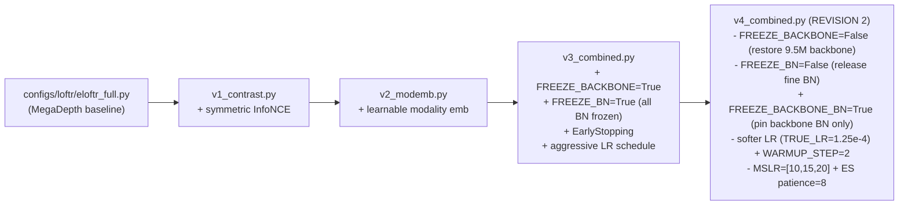
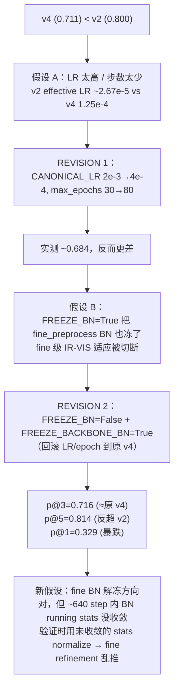
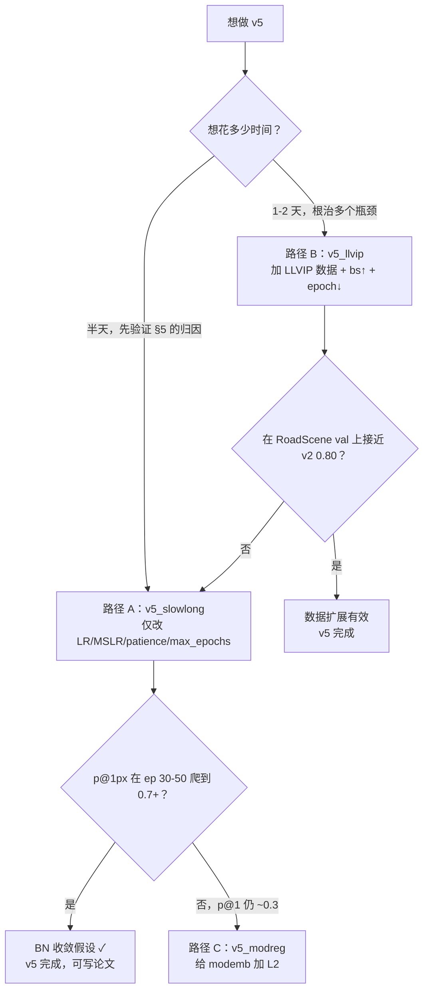

# RoadScene 跨模态实验：v1 / v2 / v3 / v4 与如何加 v5

> 该 skill 的前置依赖：[eloftr-roadscene-data](../eloftr-roadscene-data/SKILL.md)（数据集 + 监督）和 [eloftr-windows-setup](../eloftr-windows-setup/SKILL.md)（环境）。
> 评估侧的 apples-to-apples 对比方法见 [eloftr-eval-pipeline](../eloftr-eval-pipeline/SKILL.md)。

## 0. 继承链总览



> v4 经过两轮修订：REVISION 1（仅降 LR + 加长 epoch）被实测证伪，当前 v4 处于 REVISION 2 状态。详见 §5。

每个 v_x 配置只 `from <previous> import cfg` 然后修改若干字段，**强制累计**：v4 一定包含 v1+v2 的全部能力（loss_contrast / modemb），所以 ablation 时只需要改 main_cfg_path，不需要再编辑代码。

每一组都配三个 .bat：
- `*_debug.bat`：`bs=2, max_epochs=1, --disable_ckpt`，10 个 batch 跑通 + 看启动日志。
- `*_small.bat`：`bs=2`，跑短的完整训练以确认 loss/metric 走向。
- `*_<feature>.bat`（如 `v1_contrast.bat`）：完整 finetune。

## 1. v1：Symmetric InfoNCE Cross-Modal Contrastive Loss

**配置**：[configs/loftr/eloftr_full_v1_contrast.py](../../../configs/loftr/eloftr_full_v1_contrast.py)
```python
from configs.loftr.eloftr_full import cfg
cfg.LOFTR.LOSS.USE_CONTRASTIVE = True
cfg.LOFTR.LOSS.CONTRASTIVE_WEIGHT = 0.01
cfg.LOFTR.LOSS.CONTRASTIVE_TEMP   = 0.1
```

**Default 中的开关**（[src/config/default.py:107-109](../../../src/config/default.py)）：默认 `USE_CONTRASTIVE = False`，所以 baseline / 旧实验完全不受影响。

**为什么是 InfoNCE 而不是继续调 dual-softmax focal**：
- focal 在概率接近 1 时梯度指数级衰减，跨模态相似度始终偏低反而很快饱和；InfoNCE 是 (K+1) 路 cross-entropy，只要负样本里出现伪近邻就持续给梯度。
- dual-softmax 隐含 “互为最近邻才算正” 的硬约束，IR 中信息密度低的格子很难单向匹配；symmetric InfoNCE 把方向拆成两个独立的 (K+1) 分类，i2v 和 v2i 各自约束。
- L2-normalize 后做点积让 loss 与特征绝对模长无关，避免 v2 的 modemb 被 “通过放大模长降 loss” 的捷径抢走优化方向。

**实现要点**：

1. [src/loftr/loftr.py:125-131](../../../src/loftr/loftr.py)：transformer 出口处把 `feat_c0 / feat_c1` 同时存到 `data` dict（**只在 `use_contrastive=True` 时存**，避免 baseline 多占显存），保留 autograd 图，让对比 loss 能反传到 transformer + backbone。
2. [src/losses/loftr_loss.py:134-180](../../../src/losses/loftr_loss.py) `_compute_contrastive_loss`：用 `data['spv_b_ids/i_ids/j_ids']`（粗匹配 GT）取出锚点，对 L2-norm 后的特征做 i→v 与 v→i 两个方向的 InfoNCE，负样本池是整个 batch 拉平的所有 token (`B*L`)。
3. [src/losses/loftr_loss.py:277-286](../../../src/losses/loftr_loss.py) 在 `forward` 里加权求和：
   `loss = loss + CONTRASTIVE_WEIGHT * (loss_i2v + loss_v2i) / 2`，并 log `loss_contrast / loss_i2v / loss_v2i / n_pos`。

**Bat 入口**：
- `MyScripts/run_roadscene_v1_debug.bat` / `_small.bat` / `_contrast.bat`
- `bs >= 2` 是硬性要求：`bs=1` 时 InfoNCE 的负样本池退化为 in-image，等价于 dual-softmax，对比损失等于白加。

## 2. v2：Learnable Modality Embedding

**配置**：[configs/loftr/eloftr_full_v2_modemb.py](../../../configs/loftr/eloftr_full_v2_modemb.py)
```python
from configs.loftr.eloftr_full_v1_contrast import cfg
cfg.LOFTR.USE_MODALITY_EMB  = True
cfg.LOFTR.MODALITY_EMB_INIT = 'zeros'   # 起点等价于 v1
```

**实现要点**（[src/loftr/loftr.py:41-62, 112-118](../../../src/loftr/loftr.py)）：
- `__init__` 里按 `d_model = config['coarse']['d_model']` 注册两个 `nn.Parameter(torch.zeros(d_model))`：`modality_emb_ir / modality_emb_vis`。
- `forward` 在 backbone 输出之后、送入 `loftr_coarse` 之前广播相加：
  ```python
  feat_c0 = feat_c0 + self.modality_emb_ir.view(1, -1, 1, 1)   # IR
  feat_c1 = feat_c1 + self.modality_emb_vis.view(1, -1, 1, 1)  # VIS
  ```
  只在输入端注入一次，残差会把模态身份逐层传递下去。

**关键设计选择**：

| 选择 | 决策 | 原因 |
|------|------|------|
| 加在哪里 | backbone 输出之后 / transformer 之前 | LoFTR 后续是 `feat → q/k/v` 投影，输入端加偏置 = Q/K/V 都被影响，注意力机制本身才能 “意识到” 模态。只加在 V 上只能改输出聚合，注意力分布不变。 |
| 初值 | `zeros` | 起点与 v1 完全等价（finetune 安全网），梯度推动它远离 0 才说明真的有用。 |
| 与 RoPE 关系 | RoPE 只在 self-attention、只乘到 Q/K，是相对位置；modemb 在输入端、影响 Q/K/V，是绝对模态身份。两者正交。详见 [src/loftr/loftr_module/transformer.py:71-72](../../../src/loftr/loftr_module/transformer.py)（`if self.rope:` 分支只在 self 阶段执行）。 |

**监控**（[src/lightning/lightning_loftr.py:250-258](../../../src/lightning/lightning_loftr.py)）：每个 `training_step` 把 `mod_emb_ir_norm / mod_emb_vis_norm` 写到 TensorBoard，配合 val 曲线判断是否过拟合（早期 v2 实验里两者持续涨 + val 在 epoch 3-4 见顶后回落，是 v3 出现的根本动机）。

## 3. v3：Anti-Overfit Stack（freeze + EarlyStopping + LR）

**配置**：[configs/loftr/eloftr_full_v3_combined.py](../../../configs/loftr/eloftr_full_v3_combined.py)
```python
from configs.loftr.eloftr_full_v2_modemb import cfg
cfg.LOFTR.FREEZE_BACKBONE      = True
cfg.LOFTR.FREEZE_BN            = True
cfg.TRAINER.EARLY_STOPPING     = True
cfg.TRAINER.EARLY_STOPPING_PATIENCE = 4
cfg.TRAINER.CANONICAL_LR       = 8e-3      # TRUE_LR = 5e-4 at bs=4
cfg.TRAINER.WARMUP_STEP        = 1         # 实际等于关掉 warmup
cfg.TRAINER.MSLR_MILESTONES    = [5, 7]    # 默认 [8,12,16,20,24] 太晚
```

### 3.1 三个 freeze flag 的优先级与实现

[src/config/default.py:38-54](../../../src/config/default.py) 提供三个独立 flag，全部默认 `False`（保持 v0/v1/v2 行为字节级一致）：

| Flag | 作用范围 | 同时影响 |
|------|---------|----------|
| `FREEZE_BACKBONE` | `matcher.backbone.*` 所有 conv 权重 `requires_grad=False` | 不动 BN 模式（BN 仍 train-mode + running stats 仍更新） |
| `FREEZE_BN` | **所有** `BatchNorm2d` (backbone **+** fine_preprocess) eval-mode + affine 冻结 | 包含 fine BN |
| `FREEZE_BACKBONE_BN` | **仅** `matcher.backbone.*` 内的 BN eval-mode + affine 冻结；fine_preprocess BN 保持 trainable | 不影响 backbone conv 权重 |

**优先级**：`FREEZE_BN=True` 覆盖 `FREEZE_BACKBONE_BN`（前者已冻全部 BN，后者再做就重复 + 污染日志）。优先级靠两处守卫保证：

[src/lightning/lightning_loftr.py:80-94](../../../src/lightning/lightning_loftr.py) 的 `__init__`：
```python
self._freeze_bn          = bool(config.LOFTR.get('FREEZE_BN', False))
self._freeze_backbone_bn = bool(config.LOFTR.get('FREEZE_BACKBONE_BN', False))
if config.LOFTR.get('FREEZE_BACKBONE', False):
    for p in self.matcher.backbone.parameters(): p.requires_grad = False
if self._freeze_bn:
    self._apply_freeze_bn()
if self._freeze_backbone_bn and not self._freeze_bn:   # ← and-not 守卫
    self._apply_freeze_backbone_bn()
```

[src/lightning/lightning_loftr.py:130-142](../../../src/lightning/lightning_loftr.py) 的 `train()` override（PL 每 epoch 都会 `self.train(True)` 把 BN 拉回 train-mode，必须重新冻一遍）：
```python
def train(self, mode=True):
    super().train(mode)
    if getattr(self, '_freeze_bn', False):
        self._apply_freeze_bn()
    elif getattr(self, '_freeze_backbone_bn', False):   # ← elif 而非 if
        self._apply_freeze_backbone_bn()
    return self
```

**反向兼容验证**（v0/v1/v2/v3 字节级不变）：

| 版本 | FREEZE_BN | FREEZE_BACKBONE_BN | __init__ 走哪 | train() 走哪 |
|------|-----------|--------------------|--------------|-------------|
| v0/v1/v2 | False (default) | False (default) | 都跳过 | 都跳过 |
| v3 | True | False (default) | 走 `_apply_freeze_bn`；backbone-only 被 `not _freeze_bn` 拦下 | 走 `if` 分支，`elif` 不进入 |
| v4 (REVISION 2) | False | True | 走 `_apply_freeze_backbone_bn` | 走 `elif` 分支 |

`_apply_freeze_backbone_bn` 用 `self.matcher.backbone.modules()` 严格限定遍历范围，**不会跨到 fine_preprocess / loftr_coarse / fine_matching**——这是 REVISION 2 能"只冻 backbone BN 而保留 fine BN 可训"的关键。

### 3.2 Optimizer 只看可训练参数

[src/optimizers/__init__.py:9-21](../../../src/optimizers/__init__.py)：用 `filter(lambda p: p.requires_grad, model.parameters())` 替代 `model.parameters()`，否则 AdamW 的 `weight_decay` 会**直接对 `param.data` 减衰减项**（AdamW 不依赖梯度），让冻结权重也漂走。
- 兼容性：v0/v1/v2 没冻结任何参数，filter 是 no-op，行为字节级一致。

### 3.3 EarlyStopping

[train.py:11, 144-168](../../../train.py)：
- 第 11 行 import `EarlyStopping`。
- `monitor_metric / monitor_mode / filename_tpl` 在 RoadScene 分支里取 `'precision@3px' / 'max'`，**先于** `if not args.disable_ckpt:` 块计算，方便 ES 与 ckpt 共用。
- ES callback 只看 `config.TRAINER.EARLY_STOPPING`，与 `--disable_ckpt` 完全独立；调试脚本 `*_v3_debug.bat` 即便加了 `--disable_ckpt` 也会触发 EarlyStopping 日志。

### 3.4 启动日志验收清单

不同 freeze 配置启动后期望看到的日志（前 30 行内）：

| 跑哪个 | 关键日志 | Trainable params |
|--------|----------|----------------|
| v3 (`FREEZE_BACKBONE=True, FREEZE_BN=True`) | `Froze backbone: 9.50M params` + `Froze all BatchNorm2d layers (eval-mode + no-grad)` | `~5.7M / Total: ~16.0M` |
| v4 REVISION 2 (`FREEZE_BACKBONE=False, FREEZE_BN=False, FREEZE_BACKBONE_BN=True`) | `Froze backbone BatchNorm2d layers (eval-mode + no-grad); fine_preprocess BN remains trainable` | `~15.99M / Total: ~16.0M`（仅 backbone BN ~10K affine 被冻） |
| v0/v1/v2 (`默认全 False`) | 上述 freeze 日志**全部缺席** | `~16.0M / Total: ~16.0M`（全开） |

通用：
```
missing_keys (kept at init value): ['modality_emb_ir', 'modality_emb_vis']
EarlyStopping enabled (monitor=precision@3px, mode=max, patience=...)
```

TensorBoard 应同时出现 baseline / v1 / v2 三套 loss：
- `train/loss_c, loss_f, loss_l`（baseline）
- `train/loss_contrast, loss_i2v, loss_v2i, n_pos`（v1）
- `train/mod_emb_ir_norm, mod_emb_vis_norm`（v2）

**Sanity 检查**：v4 REVISION 2 启动后如果 trainable params 显示 ~5.7M（接近 v3），说明 `not self._freeze_bn` 守卫失效或 v4 配置被覆盖到 `FREEZE_BN=True`，必须排查 yacs 合并顺序。

## 4. 必看坑：LR / WARMUP_STEP / MSLR_MILESTONES

`train.py` 在第 102-105 行做自动按 batch 缩放：

```python
_scaling = TRUE_BATCH_SIZE / CANONICAL_BS              # 例：4 / 64 = 0.0625
TRUE_LR  = CANONICAL_LR * _scaling                     # LR 按 BS 缩小
WARMUP_STEP = math.floor(WARMUP_STEP / _scaling)       # WARMUP 反向放大！
```

后果：
- `WARMUP_STEP=1875` 在 `bs=4` 时变成 30000 步；RoadScene 1 个 epoch ≈ 40-75 个 step，等于训练全程都在 warmup 线性上升 LR，永远到不了目标 LR → val 早期偶然好，后期一直在“低 LR + 长时间”里抖。这是 v1/v2 都出现 “epoch 3-4 见顶后回落” 的真凶。
- v3 把 `WARMUP_STEP=1`（基本关掉）+ `CANONICAL_LR=8e-3`（TRUE_LR≈5e-4）+ `MSLR_MILESTONES=[5,7]`（在 ES patience=4 之前先衰减一次）一起用，第 0 个 step 就直接到目标 LR。

经验法则：
- **小数据集（≤ 几百对）finetune**：把 `WARMUP_STEP` 写 1。理由是优化器统计量在几个 step 内就稳了，pretrained init 不需要 warm。
- **`MSLR_MILESTONES` 必须 < `EARLY_STOPPING_PATIENCE` + 典型见顶 epoch**，否则 ES 在第一次 LR decay 之前就触发，整套 schedule 等于没用。
- **train_loss 一直降但 val 在 epoch 3-6 见顶后回落** = 过拟合，不是 “还没收敛”。再加 epoch 没用，要么冻结、要么早停、要么换更强正则。

## 5. v3/v4 实测结果与 REVISION 2 诊断

### 5.1 实测分数（precision@Npx，最佳 epoch）

| run | 最佳 ep | p@1px | p@3px | p@5px | 备注 |
|-----|---------|-------|-------|-------|------|
| **v2 v0**（baseline 最佳） | 49 | **0.741** | **0.800** | 0.806 | bs=2，effective TRUE_LR ~2.67e-5，~6400 step |
| 原 v4 v0（FREEZE_BN=True） | 14 | — | 0.711 | — | bs=4，TRUE_LR=1.25e-4，~880 step |
| v4 REVISION 1（仅降 LR + 80 epoch）| — | — | ~0.684 | — | **被实测证伪**（更差） |
| v4 REVISION 2（FREEZE_BACKBONE_BN=True） | 9 | 0.329 | 0.716 | **0.814** | bs=4，~640 step（ES 在 ep 16 触发） |

### 5.2 假设演化



### 5.3 关键诊断信号：p@5 反超 v2，但 p@1 暴跌

REVISION 2 出现了之前所有版本都没见过的指标分布：

| 阈值 | v2 v0 | v4 REVISION 2 | Δ |
|------|-------|---------------|---|
| p@5px | 0.806 | **0.814 (+0.008)** | 粗匹配（coarse）质量持平甚至更好 |
| p@3px | 0.800 | 0.716 (-0.084) | 中等精度位置稍差 |
| p@1px | 0.741 | **0.329 (-0.412)** | 亚像素精度 **塌了一半** |

**亚像素塌而粗匹配反而稍好**是非常诊断性的指纹：
- coarse transformer + dual-softmax 在 1/8 分辨率上仍然能找到对的 patch（→ p@5 OK）
- 但 fine 级 refinement 把已经对上的点 "推偏了"（→ p@1 崩坏）
- `fine_preprocess` 的 2 个 BN（[src/loftr/loftr_module/fine_preprocess.py](../../../src/loftr/loftr_module/fine_preprocess.py) 的 `layer{1,2}_outconv2[1]`，共 ~768 affine 参数）正好夹在 coarse-to-fine 上采样之后、`fine_matching` 之前——它们出问题就是 sub-pixel refine 出问题

### 5.4 根本机制：BN running-stats 收敛需要 ≥3000 step

BN 用 momentum=0.1 的 EMA 更新 running stats：
```
running_stat ← 0.9 * running_stat + 0.1 * batch_stat
```

- v2 v0：bs=2 + ~80 step/epoch × 80 epoch = **~6400 步 BN 更新**，加上 v2 effective LR 极小（~2.67e-5），特征分布漂移得也慢，**BN running stats 有时间追上**
- v4 REVISION 2：bs=4 + ~40 step/epoch × ~16 epoch = **~640 步 BN 更新**，BN 还停留在 "从 MegaDepth pretrained stats 漂移到 IR-VIS 域的中途"——**未收敛**
- 验证时用 `running_stat`（不用 batch_stat），未收敛的 stats 直接喂给 fine refinement → 亚像素回归乱推

### 5.5 REVISION 2 假设的最终判定

按 [configs/loftr/eloftr_full_v4_combined.py](../../../configs/loftr/eloftr_full_v4_combined.py) docstring 写的判定标准（"p@3px 接近 v2 ~0.80 = 假设确认；停留在 ~0.71 = 假设证伪"）：

- p@3px 0.716 ≈ 原 v4 0.711 → **"fine BN 全冻是 v4 < v2 的主要瓶颈" 假设被证伪**
- 但 p@5px 反超 + p@1px 暴跌的指纹 → **方向对，被另一个因素压制（BN 收敛步数不足）**

修正后的真正归因：**v2 的胜利不是任何单一架构选择，而是 "fine BN 解冻 + 极慢 LR + 极长训练" 三者的组合**。换掉任意一项（v3/v4 冻 fine BN，或 v4 REVISION 2 解冻 fine BN 但短训练）都会塌掉。

> 实现层面 `FREEZE_BACKBONE_BN` 这个 flag **本身是正确的**——p@5 反超就是 backbone BN 被正确冻住的证据，p@1 暴跌就是 fine BN 被精确解冻的证据。后续 v5 可直接复用此 flag。

## 6. 怎么加新 v5：三条候选路径与选型

§5 的诊断结论 ("v2 赢在 fine BN 解冻 + 极慢 LR + 极长训练 三件套，缺一不可") 直接决定 v5 的方向。按性价比 + 工程量排序：

### 路径 A：复刻 v2 的"慢 LR + 长 epoch"（code-only，0 数据改动）

最低成本，直接验证 §5 的归因是否正确。在 v4 REVISION 2 基础上：

```python
# configs/loftr/eloftr_full_v5_slowlong.py
from configs.loftr.eloftr_full_v4_combined import cfg

cfg.TRAINER.CANONICAL_LR            = 4e-4   # TRUE_LR 2.5e-5 ≈ v2 effective peak
cfg.TRAINER.MSLR_MILESTONES         = [40, 60]   # 让大部分时间在 full LR
cfg.TRAINER.EARLY_STOPPING_PATIENCE = 16    # v2 的最佳 ep 是 49，patience 必须够大
# bat: --max_epochs=80
```

预期：fine BN 有 80 epoch × 40 step ≈ 3200 次更新（vs REVISION 2 的 640），running stats 应该能收敛。如果 p@1px 在 ep 30-50 之间从 ~0.3 缓慢爬到 ~0.7，就实锤了 §5.4 的 BN 收敛假设。

### 路径 B：扩数据（LLVIP / M3FD）+ bs↑ + epoch↓（推荐，能根治多个瓶颈）

RoadScene 已经全量用完（221 对，177/22/22 split，见 [eloftr-roadscene-data](../eloftr-roadscene-data/SKILL.md) §6）。要根治 BN 收敛 + 过拟合 + val 噪声，需要**真正多数据**：

| 候选数据集 | 规模 | 像素对齐 | 域偏移 vs RoadScene |
|-----------|------|----------|--------------------|
| **LLVIP** | ~30k 对 | ✓ 已对齐 | 中（夜景城市监控 vs 行车 FLIR） |
| M3FD | ~4.2k 对 | ✓ | 低（多场景） |
| KAIST Multispectral | ~95k 对 | ✗ 需校准 | 低（同样行车） |

工程改动：
1. 写 `LLVIPDataset` 类（参考 [src/datasets/roadscene.py](../../../src/datasets/roadscene.py) 模板，复用 A3 padding + Homography aug）
2. [src/lightning/data.py](../../../src/lightning/data.py) `_setup_dataset` 加 `data_source == 'llvip'` short-circuit 分支
3. 用 `ConcatDataset(roadscene_train, llvip_train)` + 域均衡 sampler（避免 LLVIP 把 RoadScene 淹没）
4. **val/test 仍只用 RoadScene 22 + 22 对**，保证跟 v0-v4 的指标公平可比
5. 配套 v4 的 freeze 设置 (`FREEZE_BACKBONE_BN=True`) 不变；bs 放大到 8 或 16（数据多了过拟合风险下降）
6. `max_epochs` 反而可以**减小**到 5-10（每 epoch 步数多了 ~170 倍，wall-clock 时间不会爆炸）

预期：解决 §5.4 BN 收敛 + 过拟合 + InfoNCE 负样本池 + modemb 步数四个瓶颈，代价是 1-2 天工程。

### 路径 C：modemb L2 正则（fallback，不推荐先做）

只有当路径 A 跑出来后发现 modemb norm 仍持续涨 + val 见顶后回落，才需要走这条。最小流程：

1. 在 [src/config/default.py](../../../src/config/default.py) 加默认开关（默认 False，保持向后兼容）：
   ```python
   _CN.LOFTR.LOSS.USE_MODEMB_REG    = False
   _CN.LOFTR.LOSS.MODEMB_REG_WEIGHT = 1e-4
   ```
2. 在 [src/loftr/loftr.py](../../../src/loftr/loftr.py) `forward` 里，仅当 `use_modality_emb` 时把 `self.modality_emb_ir / vis` 也塞到 `data` dict（参考第 1 节 `feat_c0_tokens` 写法）。
3. 在 [src/losses/loftr_loss.py](../../../src/losses/loftr_loss.py) `forward` 里加：
   ```python
   if self.loss_config.get('use_modemb_reg', False) and 'modality_emb_ir' in data:
       emb_reg = data['modality_emb_ir'].pow(2).sum() + data['modality_emb_vis'].pow(2).sum()
       loss = loss + self.loss_config['modemb_reg_weight'] * emb_reg
       loss_scalars['emb_reg'] = emb_reg.detach().cpu()
   ```
4. 复制 [configs/loftr/eloftr_full_v4_combined.py](../../../configs/loftr/eloftr_full_v4_combined.py) → `eloftr_full_v5_modreg.py`，改 `from ... import cfg` 为继承 v4，再加：
   ```python
   cfg.LOFTR.LOSS.USE_MODEMB_REG = True
   cfg.LOFTR.LOSS.MODEMB_REG_WEIGHT = 1e-4
   ```
5. 复制 v4 的三个 `.bat` 改 `--exp_name=roadscene_v5_modreg` 和 `main_cfg_path`。
6. 不需要动 `train.py / lightning_loftr.py / optimizer`（除非引入了新的 `nn.Parameter` 模块）。

> §5 的指纹（p@1 暴跌 + p@5 反超）已说明 modemb 不是当前主因，所以 modreg 优先级低于路径 A、B。

### 选型决策树



### 共同的"加 v5"工程惯例

无论走哪条路径，都遵守：
1. 在 [src/config/default.py](../../../src/config/default.py) 加默认开关（默认 False，保持向后兼容）
2. config 一定 `from configs.loftr.eloftr_full_v4_combined import cfg` 继承 v4，**不要从头建 cfg**
3. 复制 v4 的三个 `.bat`（debug / small / 完整）改 `--exp_name=roadscene_v5_xxx` 和 `main_cfg_path`
4. 任何对 baseline 的改动会自动 cascade 到 v1→v2→v3→v4→v5
5. ablation 只需要 swap main_cfg_path，结果可比性强

## 7. 实验对应表

| 实验 | main_cfg_path | 主要 bat | 启用的能力 | 实测最佳 p@3px |
|------|---------------|---------|-----------|---------------|
| baseline (v0) | `configs/loftr/eloftr_full.py` | `run_roadscene_finetune.bat`（legacy） | 仅 baseline focal loss | — |
| v1 | `configs/loftr/eloftr_full_v1_contrast.py` | `run_roadscene_v1_contrast.bat` | + symmetric InfoNCE | — |
| v2 | `configs/loftr/eloftr_full_v2_modemb.py` | `run_roadscene_v2_modemb.bat` | + modality embedding | **0.800** (ep 49) |
| v3 | `configs/loftr/eloftr_full_v3_combined.py` | `run_roadscene_v3_combined.bat` | + FREEZE_BACKBONE/BN + EarlyStopping + 激进 LR schedule | 0.678 |
| v4 (REVISION 2) | `configs/loftr/eloftr_full_v4_combined.py` | `run_roadscene_v4_combined.bat` | v3 但**解冻 backbone + FREEZE_BN=False + FREEZE_BACKBONE_BN=True**（仅冻 backbone BN，fine BN 保留可训）+ TRUE_LR=1.25e-4 + WARMUP_STEP=2 + MSLR=[10,15,20] + ES patience=8 | 0.716 (ep 9)，伴随 p@1=0.329 / p@5=0.814 异常分布 |
