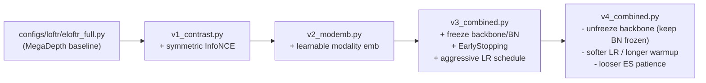

# RoadScene 跨模态实验：v1 / v2 / v3 / v4 与如何加 v5

> 该 skill 的前置依赖：[eloftr-roadscene-data](../eloftr-roadscene-data/SKILL.md)（数据集 + 监督）和 [eloftr-windows-setup](../eloftr-windows-setup/SKILL.md)（环境）。
> 评估侧的 apples-to-apples 对比方法见 [eloftr-eval-pipeline](../eloftr-eval-pipeline/SKILL.md)。

## 0. 继承链总览



每个 v_x 配置只 `from <previous> import cfg` 然后修改若干字段，**强制累计**：v4 一定包含 v1+v2 的全部能力（loss_contrast / modemb），所以 ablation 时只需要改 main_cfg_path，不需要再编辑代码。

每一组都配三个 .bat：
- `*_debug.bat`：`bs=2, max_epochs=1, --disable_ckpt`，10 个 batch 跑通 + 看启动日志。
- `*_small.bat`：`bs=2`，跑短的完整训练以确认 loss/metric 走向。
- `*_<feature>.bat`（如 `v1_contrast.bat`）：完整 finetune。

## 1. v1：Symmetric InfoNCE Cross-Modal Contrastive Loss

**配置**：[configs/loftr/eloftr_full_v1_contrast.py](../../../configs/loftr/eloftr_full_v1_contrast.py)
```python
from configs.loftr.eloftr_full import cfg
cfg.LOFTR.LOSS.USE_CONTRASTIVE = True
cfg.LOFTR.LOSS.CONTRASTIVE_WEIGHT = 0.01
cfg.LOFTR.LOSS.CONTRASTIVE_TEMP   = 0.1
```

**Default 中的开关**（[src/config/default.py:107-109](../../../src/config/default.py)）：默认 `USE_CONTRASTIVE = False`，所以 baseline / 旧实验完全不受影响。

**为什么是 InfoNCE 而不是继续调 dual-softmax focal**：
- focal 在概率接近 1 时梯度指数级衰减，跨模态相似度始终偏低反而很快饱和；InfoNCE 是 (K+1) 路 cross-entropy，只要负样本里出现伪近邻就持续给梯度。
- dual-softmax 隐含 “互为最近邻才算正” 的硬约束，IR 中信息密度低的格子很难单向匹配；symmetric InfoNCE 把方向拆成两个独立的 (K+1) 分类，i2v 和 v2i 各自约束。
- L2-normalize 后做点积让 loss 与特征绝对模长无关，避免 v2 的 modemb 被 “通过放大模长降 loss” 的捷径抢走优化方向。

**实现要点**：

1. [src/loftr/loftr.py:125-131](../../../src/loftr/loftr.py)：transformer 出口处把 `feat_c0 / feat_c1` 同时存到 `data` dict（**只在 `use_contrastive=True` 时存**，避免 baseline 多占显存），保留 autograd 图，让对比 loss 能反传到 transformer + backbone。
2. [src/losses/loftr_loss.py:134-180](../../../src/losses/loftr_loss.py) `_compute_contrastive_loss`：用 `data['spv_b_ids/i_ids/j_ids']`（粗匹配 GT）取出锚点，对 L2-norm 后的特征做 i→v 与 v→i 两个方向的 InfoNCE，负样本池是整个 batch 拉平的所有 token (`B*L`)。
3. [src/losses/loftr_loss.py:277-286](../../../src/losses/loftr_loss.py) 在 `forward` 里加权求和：
   `loss = loss + CONTRASTIVE_WEIGHT * (loss_i2v + loss_v2i) / 2`，并 log `loss_contrast / loss_i2v / loss_v2i / n_pos`。

**Bat 入口**：
- `MyScripts/run_roadscene_v1_debug.bat` / `_small.bat` / `_contrast.bat`
- `bs >= 2` 是硬性要求：`bs=1` 时 InfoNCE 的负样本池退化为 in-image，等价于 dual-softmax，对比损失等于白加。

## 2. v2：Learnable Modality Embedding

**配置**：[configs/loftr/eloftr_full_v2_modemb.py](../../../configs/loftr/eloftr_full_v2_modemb.py)
```python
from configs.loftr.eloftr_full_v1_contrast import cfg
cfg.LOFTR.USE_MODALITY_EMB  = True
cfg.LOFTR.MODALITY_EMB_INIT = 'zeros'   # 起点等价于 v1
```

**实现要点**（[src/loftr/loftr.py:41-62, 112-118](../../../src/loftr/loftr.py)）：
- `__init__` 里按 `d_model = config['coarse']['d_model']` 注册两个 `nn.Parameter(torch.zeros(d_model))`：`modality_emb_ir / modality_emb_vis`。
- `forward` 在 backbone 输出之后、送入 `loftr_coarse` 之前广播相加：
  ```python
  feat_c0 = feat_c0 + self.modality_emb_ir.view(1, -1, 1, 1)   # IR
  feat_c1 = feat_c1 + self.modality_emb_vis.view(1, -1, 1, 1)  # VIS
  ```
  只在输入端注入一次，残差会把模态身份逐层传递下去。

**关键设计选择**：

| 选择 | 决策 | 原因 |
|------|------|------|
| 加在哪里 | backbone 输出之后 / transformer 之前 | LoFTR 后续是 `feat → q/k/v` 投影，输入端加偏置 = Q/K/V 都被影响，注意力机制本身才能 “意识到” 模态。只加在 V 上只能改输出聚合，注意力分布不变。 |
| 初值 | `zeros` | 起点与 v1 完全等价（finetune 安全网），梯度推动它远离 0 才说明真的有用。 |
| 与 RoPE 关系 | RoPE 只在 self-attention、只乘到 Q/K，是相对位置；modemb 在输入端、影响 Q/K/V，是绝对模态身份。两者正交。详见 [src/loftr/loftr_module/transformer.py:71-72](../../../src/loftr/loftr_module/transformer.py)（`if self.rope:` 分支只在 self 阶段执行）。 |

**监控**（[src/lightning/lightning_loftr.py:250-258](../../../src/lightning/lightning_loftr.py)）：每个 `training_step` 把 `mod_emb_ir_norm / mod_emb_vis_norm` 写到 TensorBoard，配合 val 曲线判断是否过拟合（早期 v2 实验里两者持续涨 + val 在 epoch 3-4 见顶后回落，是 v3 出现的根本动机）。

## 3. v3：Anti-Overfit Stack（freeze + EarlyStopping + LR）

**配置**：[configs/loftr/eloftr_full_v3_combined.py](../../../configs/loftr/eloftr_full_v3_combined.py)
```python
from configs.loftr.eloftr_full_v2_modemb import cfg
cfg.LOFTR.FREEZE_BACKBONE      = True
cfg.LOFTR.FREEZE_BN            = True
cfg.TRAINER.EARLY_STOPPING     = True
cfg.TRAINER.EARLY_STOPPING_PATIENCE = 4
cfg.TRAINER.CANONICAL_LR       = 8e-3      # TRUE_LR = 5e-4 at bs=4
cfg.TRAINER.WARMUP_STEP        = 1         # 实际等于关掉 warmup
cfg.TRAINER.MSLR_MILESTONES    = [5, 7]    # 默认 [8,12,16,20,24] 太晚
```

### 3.1 Freeze backbone + BN

[src/lightning/lightning_loftr.py:80-119](../../../src/lightning/lightning_loftr.py)：
- `__init__` 末尾按 `LOFTR.FREEZE_BACKBONE / FREEZE_BN` flag：
  - 把 `self.matcher.backbone.parameters()` 全部 `requires_grad=False`，并 log 冻结参数量（应该 ~9.5M）。
  - 调用 `_apply_freeze_bn()` 把所有 `BatchNorm2d` 设为 `.eval()` 并冻结 affine 参数。
- 重写 `train(mode)` 方法：因为 PL 每个 epoch 都会 `self.train(True)` 把所有子模块放回 train 模式，会顺带把 BN 改回去。`train()` override 里在 `super().train(mode)` 之后再调一次 `_apply_freeze_bn()`，永久维持 BN.eval。

### 3.2 Optimizer 只看可训练参数

[src/optimizers/__init__.py:9-21](../../../src/optimizers/__init__.py)：用 `filter(lambda p: p.requires_grad, model.parameters())` 替代 `model.parameters()`，否则 AdamW 的 `weight_decay` 会**直接对 `param.data` 减衰减项**（AdamW 不依赖梯度），让冻结权重也漂走。
- 兼容性：v0/v1/v2 没冻结任何参数，filter 是 no-op，行为字节级一致。

### 3.3 EarlyStopping

[train.py:11, 144-168](../../../train.py)：
- 第 11 行 import `EarlyStopping`。
- `monitor_metric / monitor_mode / filename_tpl` 在 RoadScene 分支里取 `'precision@3px' / 'max'`，**先于** `if not args.disable_ckpt:` 块计算，方便 ES 与 ckpt 共用。
- ES callback 只看 `config.TRAINER.EARLY_STOPPING`，与 `--disable_ckpt` 完全独立；调试脚本 `*_v3_debug.bat` 即便加了 `--disable_ckpt` 也会触发 EarlyStopping 日志。

### 3.4 启动日志验收清单

跑 `MyScripts/run_roadscene_v3_debug.bat`，前 30 行应该能看到：

```
Froze backbone: 9.50M params
Froze all BatchNorm2d layers (eval-mode + no-grad)
Trainable params: ~5.7M / Total: ~16.0M       ← key signal
missing_keys (kept at init value): ['modality_emb_ir', 'modality_emb_vis']
EarlyStopping enabled (monitor=precision@3px, mode=max, patience=4)
```

TensorBoard 应同时出现 baseline / v1 / v2 三套 loss：
- `train/loss_c, loss_f, loss_l`（baseline）
- `train/loss_contrast, loss_i2v, loss_v2i, n_pos`（v1）
- `train/mod_emb_ir_norm, mod_emb_vis_norm`（v2）

## 4. 必看坑：LR / WARMUP_STEP / MSLR_MILESTONES

`train.py` 在第 102-105 行做自动按 batch 缩放：

```python
_scaling = TRUE_BATCH_SIZE / CANONICAL_BS              # 例：4 / 64 = 0.0625
TRUE_LR  = CANONICAL_LR * _scaling                     # LR 按 BS 缩小
WARMUP_STEP = math.floor(WARMUP_STEP / _scaling)       # WARMUP 反向放大！
```

后果：
- `WARMUP_STEP=1875` 在 `bs=4` 时变成 30000 步；RoadScene 1 个 epoch ≈ 40-75 个 step，等于训练全程都在 warmup 线性上升 LR，永远到不了目标 LR → val 早期偶然好，后期一直在“低 LR + 长时间”里抖。这是 v1/v2 都出现 “epoch 3-4 见顶后回落” 的真凶。
- v3 把 `WARMUP_STEP=1`（基本关掉）+ `CANONICAL_LR=8e-3`（TRUE_LR≈5e-4）+ `MSLR_MILESTONES=[5,7]`（在 ES patience=4 之前先衰减一次）一起用，第 0 个 step 就直接到目标 LR。

经验法则：
- **小数据集（≤ 几百对）finetune**：把 `WARMUP_STEP` 写 1。理由是优化器统计量在几个 step 内就稳了，pretrained init 不需要 warm。
- **`MSLR_MILESTONES` 必须 < `EARLY_STOPPING_PATIENCE` + 典型见顶 epoch**，否则 ES 在第一次 LR decay 之前就触发，整套 schedule 等于没用。
- **train_loss 一直降但 val 在 epoch 3-6 见顶后回落** = 过拟合，不是 “还没收敛”。再加 epoch 没用，要么冻结、要么早停、要么换更强正则。

## 5. 怎么加新 v5

例子：v5 给 modality embedding 加 L2 正则，控制 norm 增长（v4 验证后如果 modemb 仍然跑飞 + val 重蹈下降，就走这条路）。最小流程：

1. 在 [src/config/default.py](../../../src/config/default.py) 加默认开关（默认 False，保持向后兼容）：
   ```python
   _CN.LOFTR.LOSS.USE_MODEMB_REG    = False
   _CN.LOFTR.LOSS.MODEMB_REG_WEIGHT = 1e-4
   ```
2. 在 [src/loftr/loftr.py](../../../src/loftr/loftr.py) `forward` 里，仅当 `use_modality_emb` 时把 `self.modality_emb_ir / vis` 也塞到 `data` dict（参考第 1 节 `feat_c0_tokens` 写法）。
3. 在 [src/losses/loftr_loss.py](../../../src/losses/loftr_loss.py) `forward` 里加：
   ```python
   if self.loss_config.get('use_modemb_reg', False) and 'modality_emb_ir' in data:
       emb_reg = data['modality_emb_ir'].pow(2).sum() + data['modality_emb_vis'].pow(2).sum()
       loss = loss + self.loss_config['modemb_reg_weight'] * emb_reg
       loss_scalars['emb_reg'] = emb_reg.detach().cpu()
   ```
4. 复制 [configs/loftr/eloftr_full_v4_combined.py](../../../configs/loftr/eloftr_full_v4_combined.py) → `eloftr_full_v5_modreg.py`，改 `from ... import cfg` 为继承 v4，再加：
   ```python
   cfg.LOFTR.LOSS.USE_MODEMB_REG = True
   cfg.LOFTR.LOSS.MODEMB_REG_WEIGHT = 1e-4
   ```
5. 复制 v4 的三个 `.bat` 改 `--exp_name=roadscene_v5_modreg` 和 `main_cfg_path`。
6. 不需要动 `train.py / lightning_loftr.py / optimizer`（除非引入了新的 `nn.Parameter` 模块）。

按这条路径加新实验有两个隐性好处：
- 任何对 baseline 的改动会自动 cascade 到 v1→v2→v3→v4→v5，不需要在每个 config 重复。
- ablation 只需要 swap main_cfg_path，结果可比性强。

## 6. 实验对应表

| 实验 | main_cfg_path | 主要 bat | 启用的能力 |
|------|---------------|---------|-----------|
| baseline (v0) | `configs/loftr/eloftr_full.py` | `run_roadscene_finetune.bat`（legacy） | 仅 baseline focal loss |
| v1 | `configs/loftr/eloftr_full_v1_contrast.py` | `run_roadscene_v1_contrast.bat` | + symmetric InfoNCE |
| v2 | `configs/loftr/eloftr_full_v2_modemb.py` | `run_roadscene_v2_modemb.bat` | + modality embedding |
| v3 | `configs/loftr/eloftr_full_v3_combined.py` | `run_roadscene_v3_combined.bat` | + freeze backbone/BN + EarlyStopping + 激进 LR schedule |
| v4 | `configs/loftr/eloftr_full_v4_combined.py` | `run_roadscene_v4_combined.bat` | v3 但**解冻 backbone**（保留 FREEZE_BN + ES）+ 中等 LR (TRUE_LR=1.25e-4) + WARMUP_STEP=2 + MSLR=[10,15,20] + ES patience=8 |
