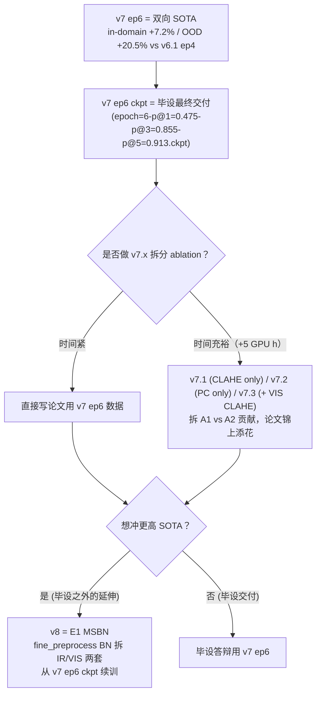

# Cross-Modal 实验链总览（v0..v7）

> 这是 7 个跨模态实验的 **index / overview**。每个版本的实现细节、配置、实测、Bat 入口都在独立 skill：
> - [eloftr-v1-contrast](../eloftr-v1-contrast/SKILL.md)：Symmetric InfoNCE
> - [eloftr-v2-modemb](../eloftr-v2-modemb/SKILL.md)：Modality embedding（含 fine 模态盲分析）
> - [eloftr-v3-v4-freeze](../eloftr-v3-v4-freeze/SKILL.md)：Freeze stack 与 REVISION 2
> - [eloftr-v5-m3fd](../eloftr-v5-m3fd/SKILL.md)：M3FD 数据扩展（路径 B）
> - [eloftr-v6-finetune](../eloftr-v6-finetune/SKILL.md)：v6 / v6.1 慢 LR resume + spillover 修复（路径 D）
> - [eloftr-v7-pcclahe](../eloftr-v7-pcclahe/SKILL.md)：PC 边缘 + CLAHE 输入端优化（路径 F）
>
> 前置：[eloftr-roadscene-data](../eloftr-roadscene-data/SKILL.md) + [eloftr-windows-setup](../eloftr-windows-setup/SKILL.md)；评估侧 [eloftr-eval-pipeline](../eloftr-eval-pipeline/SKILL.md)。

## 0. 继承链总览

```mermaid
flowchart LR
    base["configs/loftr/eloftr_full.py<br/>(MegaDepth baseline)"] --> v1["v1_contrast.py<br/>+ symmetric InfoNCE"]
    v1 --> v2["v2_modemb.py<br/>+ learnable modality emb"]
    v2 --> v3["v3_combined.py<br/>+ FREEZE_BACKBONE=True<br/>+ FREEZE_BN=True (all BN frozen)<br/>+ EarlyStopping<br/>+ aggressive LR schedule"]
    v3 --> v4["v4_combined.py (REVISION 2)<br/>- FREEZE_BACKBONE=False (restore 9.5M backbone)<br/>- FREEZE_BN=False (release fine BN)<br/>+ FREEZE_BACKBONE_BN=True (pin backbone BN only)<br/>- softer LR (TRUE_LR=1.25e-4) + WARMUP_STEP=2<br/>- MSLR=[10,15,20] + ES patience=8"]
    v4 --> v5["v5_m3fd.py<br/>+ M3FD 3780 训练对 (vs RoadScene 177)<br/>+ N_SAMPLES_PER_SUBSET=3780 + replacement=False (强制 opt-in)<br/>+ WARMUP_STEP=20 (320 abs step)<br/>+ MSLR=[3,5,7] + ES patience=3<br/>(--max_epochs=10 in .bat)"]
    v5 --> v6["v6_finetune.py<br/>从 v5 ep9 ckpt resume<br/>+ CANONICAL_LR 2e-3 → 4e-4 (TRUE_LR=2.5e-5)<br/>+ WARMUP_STEP 20 → 50<br/>+ MSLR=[15,25,35] + ES patience=12<br/>专攻 p@1px (--max_epochs=50 in .bat)<br/>实测 ep6 spillover 中断"]
    v6 --> v6_1["v6_1_finetune.py (zero override)<br/>从 v6 ep6 ckpt resume<br/>+ PYTORCH_CUDA_ALLOC_CONF=expandable_segments:True (in .bat)<br/>schedule 完全继承 v6"]
    v6_1 --> v7["v7_pcclahe.py (input-side optimization)<br/>从 v6.1 ep4 ckpt resume<br/>+ A1: PC edge map as 2nd input channel (BACKBONE_IN_CHANNELS=2)<br/>+ A2: CLAHE on raw IR (USE_CLAHE_IR=True)<br/>+ inflated init alpha=0 (zero-extend v6.1 stage0 conv)<br/>schedule 继承 v6.1, max_epochs=10<br/>实测 ep6 = v0-v7 全程双向 SOTA<br/>(in-domain +7.2% / OOD +20.5% vs v6.1 ep4)"]
```



每个 v_x 配置只 `from <previous> import cfg` 然后修改若干字段，**强制累计**：v4 一定包含 v1+v2 的全部能力（loss_contrast / modemb），所以 ablation 时只需要改 main_cfg_path，不需要再编辑代码。

## 1. Bat 三联约定

每一组都配三个 .bat：
- `*_debug.bat`：`bs=2, max_epochs=1, --disable_ckpt`，10 个 batch 跑通 + 看启动日志。
- `*_small.bat`：`bs=2`，跑短的完整训练以确认 loss/metric 走向。
- `*_<feature>.bat` / `*_finetune.bat`：完整训练。

`--exp_name` 前缀按数据集变化：v1-v4 用 `roadscene_v*`；v5+ 用 `m3fd_v5_*` / `m3fd_v6_finetune` / `m3fd_v6_1_finetune` / `m3fd_v7_pcclahe`。

## 2. 必看坑：LR / WARMUP_STEP / MSLR_MILESTONES 自动缩放

`train.py` 在第 102-105 行做自动按 batch 缩放：

```python
_scaling = TRUE_BATCH_SIZE / CANONICAL_BS              # 例：4 / 64 = 0.0625
TRUE_LR  = CANONICAL_LR * _scaling                     # LR 按 BS 缩小
WARMUP_STEP = math.floor(WARMUP_STEP / _scaling)       # WARMUP 反向放大！
```

后果：
- `WARMUP_STEP=1875` 在 `bs=4` 时变成 30000 步；RoadScene 1 个 epoch ≈ 40-75 step，等于训练全程都在 warmup 线性上升 LR，永远到不了目标 LR → val 早期偶然好，后期一直在"低 LR + 长时间"里抖。这是 v1/v2 都出现"epoch 3-4 见顶后回落"的真凶。
- v3 把 `WARMUP_STEP=1`（基本关掉）+ `CANONICAL_LR=8e-3`（TRUE_LR≈5e-4）+ `MSLR_MILESTONES=[5,7]`（在 ES patience=4 之前先衰减一次）一起用，第 0 个 step 就直接到目标 LR。

经验法则：
- **小数据集（≤ 几百对）finetune**：把 `WARMUP_STEP` 写 1。pretrained init 不需要 warm。
- **`MSLR_MILESTONES` 必须 < `EARLY_STOPPING_PATIENCE` + 典型见顶 epoch**，否则 ES 在第一次 LR decay 之前就触发，整套 schedule 等于没用。
- **train_loss 一直降但 val 在 epoch 3-6 见顶后回落** = 过拟合，不是"还没收敛"。再加 epoch 没用，要么冻结、要么早停、要么换更强正则。

## 3. 必看坑：RandomConcatSampler 默认值在单数据源场景下静默欠采样

LoFTR 的训练 sampler ([src/datasets/sampler.py](../../../src/datasets/sampler.py)) 是为 ScanNet/MegaDepth 的"多场景"结构设计的——每个 .npz = 一个 scene = sampler 眼里的一个 subset，每 epoch 从**每个 subset 抽 200 个样本**。`N_SAMPLES_PER_SUBSET=200` 是 **per-scene quota**，不是 per-dataset budget。

RoadScene/M3FD 每个数据集只有一个扁平图像列表，[src/lightning/data.py:248](../../../src/lightning/data.py) 把它包装成 `ConcatDataset([ds])` → `n_subset == 1`，结果 200 这个默认值退化为"per-dataset 上限 200 样本/epoch"。

| 数据集 | 全集 | 默认每 epoch 实际样本 | 行为 |
|--------|------|---------------------|------|
| RoadScene train | 177 | 200 (with replacement) | 巧合：177 < 200，期望覆盖 ~63%/epoch，50 epoch 后基本全见过；v0-v4 没被欠采样 |
| M3FD train | 3780 | 200 (with replacement) | **严重欠采样**：每 epoch 只见 5.3% 数据；"21× step 密度"假设彻底破产 |

详见 [eloftr-v5-m3fd §2 sampler 默认值陷阱](../eloftr-v5-m3fd/SKILL.md)，**单数据源 IR-VIS 数据集必须各自 opt-in `N_SAMPLES_PER_SUBSET` + `SB_SUBSET_SAMPLE_REPLACEMENT=False`**。

## 4. 候选路径 A-F：哪些已实现 / 哪些留作 v8+

§5 / §6 的诊断结论决定了 v5+ 的方向。按性价比 + 工程量排序：

| 路径 | 描述 | 状态 | 实现 skill |
|------|------|------|-----------|
| **A** | 复刻 v2 慢 LR + 长 epoch（code-only，0 数据改动） | 未实现，留作 fallback | — |
| **B** | 扩数据（M3FD / LLVIP / KAIST）+ schedule 适配 | **v5 已实现** | [eloftr-v5-m3fd](../eloftr-v5-m3fd/SKILL.md) |
| **C** | modemb L2 正则（fallback） | 未实现，不推荐先做 | — |
| **D** | v5 ckpt resume + 慢 LR 精修，专攻 p@1 | **v6 / v6.1 已实现** | [eloftr-v6-finetune](../eloftr-v6-finetune/SKILL.md) |
| **E** | fine 阶段懂模态（MSBN / FiLM / cosine + modemb） | 未实现，留作 v8+ | — |
| **F** | 输入端优化（PC 边缘 + CLAHE） | **v7 已实现** | [eloftr-v7-pcclahe](../eloftr-v7-pcclahe/SKILL.md) |

### 4.A 路径 A：复刻 v2 的"慢 LR + 长 epoch"（未实现）

最低成本，直接验证 [§5.4 BN 收敛假设](../eloftr-v3-v4-freeze/SKILL.md) 是否正确。在 v4 REVISION 2 基础上：

```python
# configs/loftr/eloftr_full_v5_slowlong.py（候选）
from configs.loftr.eloftr_full_v4_combined import cfg
cfg.TRAINER.CANONICAL_LR            = 4e-4   # TRUE_LR 2.5e-5 ≈ v2 effective peak
cfg.TRAINER.MSLR_MILESTONES         = [40, 60]
cfg.TRAINER.EARLY_STOPPING_PATIENCE = 16
# bat: --max_epochs=80
```

预期：fine BN 有 80 × 40 ≈ 3200 次更新（vs REVISION 2 的 640），running stats 应能收敛。如果 p@1px 在 ep 30-50 之间从 ~0.3 缓慢爬到 ~0.7，就实锤了 BN 收敛假设。

### 4.E 路径 E：fine 阶段懂模态（未实现，v8+ 候选）

[eloftr-v2-modemb modemb 信号路径](../eloftr-v2-modemb/SKILL.md) 论证 fine 路径对模态盲是**结构性瓶颈**。如果 v6.1 / v7 跑完 p@1 仍卡在 0.55 附近上不去，下一步必须从架构层突破：

| 候选 | 实现要点 | 优劣 |
|------|---------|------|
| **E1 MSBN** in `fine_preprocess.layer{1,2}_outconv2[1]` 各复制成 `bn_ir / bn_vis` | 改 `fine_preprocess.py` + `loftr.py:148` 调用处传 modality + ckpt 加载 hook 复制权重到两套 BN | 表达力强 + 兼容 v6/v7 ckpt + 仅 1.5K 新参数 |
| **E2 FiLM** modemb → 小 MLP → (γ, β) 调制 BN 输出 | 比 MSBN 强（gamma 让 channel 放大），但需要从头训新 MLP | 必须从头训，不能从 ckpt 加载 |
| **E3 fine_matching cosine + modemb** L2-normalize 把 inner product 变 cosine 让常数偏置不再被 argmax 免疫 | 改 fine_matching 距离度量，所有历史 ckpt 必须重训 | 风险大不推荐 |

E1 是 v8 的首选。设计草图见旧版 SKILL git log（保留 4 个文件改动点：`fine_preprocess.py / loftr.py / lightning_loftr freeze 体系扩 FREEZE_FINE_BN_VIS / IR / 自定义 load_state_dict hook`）。

### 4.C 路径 C：modemb L2 正则（fallback）

只有当路径 A 跑出来后发现 modemb norm 仍持续涨 + val 见顶后回落，才需要走这条。最小流程：

1. [src/config/default.py](../../../src/config/default.py) 加 `_CN.LOFTR.LOSS.USE_MODEMB_REG = False / MODEMB_REG_WEIGHT = 1e-4`
2. [src/loftr/loftr.py](../../../src/loftr/loftr.py) `forward` 里仅当 `use_modality_emb` 时把 `modality_emb_ir / vis` 也塞到 `data` dict
3. [src/losses/loftr_loss.py](../../../src/losses/loftr_loss.py) `forward` 里加 `loss = loss + REG_WEIGHT * (emb_ir.pow(2).sum() + emb_vis.pow(2).sum())`
4. 复制 v4 cfg → `eloftr_full_v_modreg.py`
5. 复制 v4 三个 `.bat` 改名

§5 v3/v4 实测的指纹（p@1 暴跌 + p@5 反超）已说明 modemb 不是当前主因，所以 modreg 优先级低于路径 A、B。

## 5. 决策树：v7 已收官，下一步 v8 应该做什么

v7 实测（2026-05-06）：M3FD test p@1 0.4975 / OOD p@1 0.2124 = **双向 SOTA 强成功**，详见 [eloftr-v7-pcclahe §11](../eloftr-v7-pcclahe/SKILL.md)。所以决策树进入 v7 强成功分支：



> v7 OOD 涨幅 (+20.5%) 是 in-domain 涨幅 (+7.2%) 的 **2.85 倍** = 反 overfit 强证据，证明 PC + CLAHE 学到的是"跨模态 + 跨数据集"模态不变信号 — 这是 v0-v6.1 全程从未出现过的指纹（v5→v6 OOD 跌 4.9%、v6→v6.1 OOD 跌 0.3%；v6.1→v7 OOD 涨 20.5%）。

## 6. 共同的"加新 v_x"工程惯例

无论走哪条路径，都遵守：
1. 在 [src/config/default.py](../../../src/config/default.py) 加默认开关（默认 False，保持向后兼容）
2. config 一定 `from configs.loftr.<previous_v_x> import cfg` 继承上一版，**不要从头建 cfg**
3. 复制三联 `.bat`（debug / small / 完整）改 `--exp_name` 和 `main_cfg_path`
4. 任何对 baseline 的改动会自动 cascade 到 v1 → v2 → ... → 当前版本
5. ablation 只需要 swap main_cfg_path，结果可比性强
6. 引入新 yacs 字段时遵守"三层默认值字面量一致"（[eloftr-v7-pcclahe R3](../eloftr-v7-pcclahe/SKILL.md)）：`default.py` / `data.py` getattr fallback / dataset `__init__` 三处兜底必须给"什么都不做"

## 7. 实验对应表（精简版）

完整实测数字见各 v_x skill。本表只做 cfg / bat / 启用能力速查。

| 实验 | main_cfg_path | 主要 bat | 启用的能力 |
|------|---------------|---------|-----------|
| baseline (v0) | `configs/loftr/eloftr_full.py` | `run_roadscene_finetune.bat`（legacy） | 仅 baseline focal loss |
| v1 | `configs/loftr/eloftr_full_v1_contrast.py` | `run_roadscene_v1_contrast.bat` | + symmetric InfoNCE |
| v2 | `configs/loftr/eloftr_full_v2_modemb.py` | `run_roadscene_v2_modemb.bat` | + modality embedding |
| v3 | `configs/loftr/eloftr_full_v3_combined.py` | `run_roadscene_v3_combined.bat` | + FREEZE_BACKBONE/BN + EarlyStopping + 激进 LR |
| v4 (REVISION 2) | `configs/loftr/eloftr_full_v4_combined.py` | `run_roadscene_v4_combined.bat` | v3 但解冻 backbone + FREEZE_BN=False + FREEZE_BACKBONE_BN=True |
| **v5** | `configs/loftr/eloftr_full_v5_m3fd.py` | `run_m3fd_v5_combined.bat` | v4 架构不变，数据切到 M3FD 3780 + sampler opt-in |
| **v6** | `configs/loftr/eloftr_full_v6_finetune.py` | `run_m3fd_v6_finetune.bat` | v5 + `--ckpt_path` v5 ep9 + 慢 LR resume |
| **v6.1** | `configs/loftr/eloftr_full_v6_1_finetune.py` | `run_m3fd_v6_1_finetune.bat` | v6 零 override + .bat `expandable_segments` + `--ckpt_path` v6 ep6 |
| **v7（双向 SOTA, 毕设最终交付）** | `configs/loftr/eloftr_full_v7_pcclahe.py` | `run_m3fd_v7_pcclahe.bat` | v6.1 + A1 PC 边缘第二通道 + A2 CLAHE on IR + inflated init α=0；ep6 实测 M3FD test p@1=0.4975 / p@3=0.8672 / p@5=0.9207 / mpe=1.59；OOD test p@1=0.2124 / p@3=0.6085 / p@5=0.7840 / mpe=3.23（详见 [eloftr-v7-pcclahe §11](../eloftr-v7-pcclahe/SKILL.md)） |
