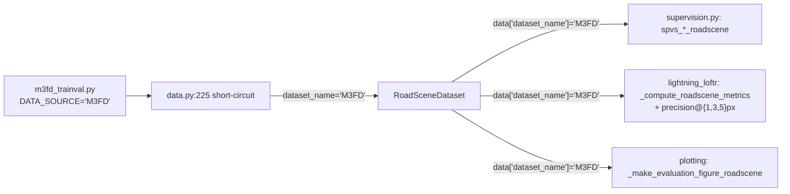

# M3FD_Detection 跨模态数据集接入

> 前置依赖：[eloftr-roadscene-data](../eloftr-roadscene-data/SKILL.md)（数据集 I/O 类、A3 padding、Homography 监督、白名单机制）和 [eloftr-windows-setup](../eloftr-windows-setup/SKILL.md)（环境）。
> v1-v4 跨模态实验链与如何加 v5 见 [eloftr-cross-modal-experiments](../eloftr-cross-modal-experiments/SKILL.md)。
> 评估侧 apples-to-apples 对比方法见 [eloftr-eval-pipeline](../eloftr-eval-pipeline/SKILL.md)。

## 0. 为什么要加 M3FD（背景）

RoadScene 仅 **221 对**（split 后 178 train / 22 val / 22 test），v1-v4 跨模态 finetune 全部在 epoch 3-5 见顶后过拟合，模型与 schedule 都救不回来。M3FD_Detection 提供 **4200 对** 像素级对齐 IR-VIS 街景，规模 ~21×、step/epoch ~24×，是治本扩数据的首选。两者**都是 LWIR 街景**，分布相近，可以直接复用同一套 IR-VIS 监督。

M3FD_Detection 有两个独立子集，**只用 Detection 那 4200 对训练**：

| 子集 | 对数 | 标注 | 用途 |
|---|---|---|---|
| **M3FD_Detection** | 4200 | YOLO 检测框（**忽略**） | 跨模态匹配训练主力 |
| **M3FD_Fusion** | 300 | 无 | 独立场景，留作 OOD 测试 |

## 1. 下载与目录结构

来源：TarDAL 主页 [JinyuanLiu-CV/TarDAL](https://github.com/JinyuanLiu-CV/TarDAL)。

| 渠道 | 链接 | 备注 |
|---|---|---|
| Google Drive | https://drive.google.com/drive/folders/1H-oO7bgRuVFYDcMGvxstT1nmy0WF_Y_6 | 国外推荐，含 M3FD + 整理过的 TNO / RoadScene |
| 百度网盘 | https://pan.baidu.com/s/1GoJrrl_mn2HNQVDSUdPCrw | 提取码 **M3FD**（注意大小写） |

下载解压后期望的目录（与本仓库代码兼容）：

```text
data/M3FD_Detection/
├── Ir/         # 4200 张 PNG，00000.png .. 04199.png
├── Vis/        # 4200 张 PNG，文件名与 Ir 一一对应
├── Annotation/ # YOLO 检测标签（不需要，可以删）
└── index/      # 由 make_m3fd_splits.py 生成（见第 2 节）
```

**两个与 RoadScene 不同的细节**（都通过 config 解决，**不动代码**）：

- 子目录大小写：`Ir` / `Vis`（首字母大写），不是 RoadScene 的 `cropinfrared` / `crop_LR_visible`。
- 扩展名：`.png`，不是 RoadScene 的 `.jpg`。

## 2. splits 脚本

源码：[MyScripts/make_m3fd_splits.py](../../../MyScripts/make_m3fd_splits.py)。

默认行为（无参数运行）：
- `--root data/M3FD_Detection`、`--ir_subdir Ir`、`--vis_subdir Vis`、`--ext .png`。
- 80 / 5 / 10 -> **90 / 5 / 5**（3780 train / 210 val / 210 test）。RoadScene 用 80/10/10 是因为只有 221 对、val 至少要 22 才稳；M3FD 4200 对，val 给 5% (210) 已经远超 RoadScene val 的稳定性，把更多样本交给训练更划算。
- 输出 `data/M3FD_Detection/index/{train,val,test}_pairs.txt`，每行一个 `<id>.png`。

```bat
python MyScripts\make_m3fd_splits.py
```

应该看到：

```
M3FD_Detection splits written under data\M3FD_Detection\index:
  total paired = 4200
  train = 3780
  val   = 210
  test  = 210
```

`total paired` < 4200 说明 `Ir/` 与 `Vis/` 的文件名集合对不上，必须先核对（一般是只解压了一半）。

## 3. data config

源码：[configs/data/m3fd_trainval.py](../../../configs/data/m3fd_trainval.py)。

核心 3 行：

```python
cfg.DATASET.TRAINVAL_DATA_SOURCE = "M3FD"          # 注册在 ALIGNED_IRVIS_SOURCES
cfg.DATASET.ROAD_IR_SUBDIR       = "Ir"            # 大小写匹配磁盘
cfg.DATASET.ROAD_VIS_SUBDIR      = "Vis"
```

其余字段（`ROAD_IMG_RESIZE=480`、`ROAD_PAD_SIZE=480`、`ROAD_DF=32`、`ROAD_HOMOGRAPHY_AUG=True`、`ROAD_HOMOGRAPHY_PROB=1.0`、`ENABLE_PLOTTING=False`）与 RoadScene 持平，第一阶段保持同一画布同一增广，便于跟 RoadScene 实验做 apples-to-apples 对比。等基线打通后再单独立项调高 `ROAD_IMG_RESIZE` 到 640 / 768 看细节涨点。

字段名沿用 `ROAD_*` 前缀**故意保留**——它们的语义已经是"对齐 IR-VIS 通用开关"（M3FD / 未来 MSRS / LLVIP / TNO 也都用），改名是后续单独的 cleanup 任务。

## 4. 白名单：M3FD 如何"无缝"复用 RoadScene 的全套代码

[src/utils/data_source.py](../../../src/utils/data_source.py)：

```python
ALIGNED_IRVIS_SOURCES = frozenset({"roadscene", "m3fd"})

def is_aligned_irvis(name) -> bool: ...
```

只要 `cfg.DATASET.TRAINVAL_DATA_SOURCE = "M3FD"`，下面 5 处 dispatch **全部自动走 IR-VIS 路径**（详见 [eloftr-roadscene-data §2.5](../eloftr-roadscene-data/SKILL.md)）：



`RoadSceneDataset.__init__` 现在接受 `dataset_name='M3FD'` 参数，输出 dict 的 `dataset_name` / `scene_id` 都写 `'M3FD'`，所以下游"按字段 dispatch"的代码（监督、metric、plotting）通过 `is_aligned_irvis('M3FD')` 一律返回 `True`，与 RoadScene 走同一条路径。

## 5. 怎么直接在 M3FD 上训练（不写新 v5 bat）

把任意 `MyScripts\run_roadscene_v*.bat` 临时改两处：

```diff
- python train.py ^
-   configs\data\roadscene_trainval.py ^
+ python train.py ^
+   configs\data\m3fd_trainval.py ^
    configs\loftr\eloftr_full_v1_contrast.py ^
-   --exp_name=roadscene_v1_contrast ^
+   --exp_name=m3fd_v1_contrast ^
    ...
```

启动日志验收（前 30 行必须出现）：

```
[rank 0]: building RoadSceneDataset (dataset_name=M3FD) from data/M3FD_Detection/index/train_pairs.txt
[rank 0]: building RoadSceneDataset (dataset_name=M3FD) from data/M3FD_Detection/index/val_pairs.txt
```

第一个 batch 的 loss 必须能正常打印，**不**报：
- `KeyError: 'depth0'` / `'T_0to1'`（dispatch 落到 ScanNet/MegaDepth 分支才会报这个，说明白名单没命中）。
- `assert len(set(data['dataset_name'])) == 1`（M3FD 单数据源训练永远不该触发）。

注意：复用 v1-v4 schedule 时 **`max_epochs / WARMUP_STEP / MSLR_MILESTONES / EARLY_STOPPING_PATIENCE` 都按 RoadScene 调过**，M3FD 一个 epoch 长约 21× (bs=4 下 945 vs 44 step/epoch)，所以这些 schedule 字段需要在 v5 专属 LoFTR config 里重新调。

> **⚠️ 必看坑**：`945 step/epoch` 这个数字 **只有显式 override** `cfg.TRAINER.N_SAMPLES_PER_SUBSET` 与 `cfg.TRAINER.SB_SUBSET_SAMPLE_REPLACEMENT` 之后才成立。
> LoFTR 的 RandomConcatSampler 默认 `N_SAMPLES_PER_SUBSET=200` 是为 ScanNet/MegaDepth 多场景结构设计的 per-scene quota；RoadScene/M3FD 在 [src/lightning/data.py:248](../../../src/lightning/data.py) 被包装成 `ConcatDataset([ds])` （n_subset=1）后，该默认值退化为"per-dataset 上限 200 样本/epoch"。M3FD 全集 3780 张，默认下每 epoch 只见 200 个（5%），10 epoch 累计触达 ≤2000 个独特样本。
> **任何 M3FD 训练 config 都必须显式加这两行**：
> ```python
> cfg.TRAINER.N_SAMPLES_PER_SUBSET         = 3780
> cfg.TRAINER.SB_SUBSET_SAMPLE_REPLACEMENT = False
> ```
> 完整机制 + 进度条诊断 + 为什么 default.py 不能改见 [eloftr-cross-modal-experiments §4.5](../eloftr-cross-modal-experiments/SKILL.md)。

**v5 已实现并跑完**——见 [configs/loftr/eloftr_full_v5_m3fd.py](../../../configs/loftr/eloftr_full_v5_m3fd.py) 与 [run_m3fd_v5_combined.bat](../../../MyScripts/run_m3fd_v5_combined.bat) / [run_m3fd_v5_small.bat](../../../MyScripts/run_m3fd_v5_small.bat) / [run_m3fd_v5_debug.bat](../../../MyScripts/run_m3fd_v5_debug.bat)。v5 继承 v4 REVISION 2 全部架构改动（FREEZE_BACKBONE_BN=True / InfoNCE / modemb），只重写 schedule（WARMUP_STEP=20、MSLR=[3,5,7]、ES patience=3、max_epochs=10），并显式加上述两个 sampler override。完整设计动机、实测预期、判定标准见 [eloftr-cross-modal-experiments §6 路径 B](../eloftr-cross-modal-experiments/SKILL.md) 和 §7 实验对应表。

### v5 实测速览（详情见 [eloftr-cross-modal-experiments §5.6](../eloftr-cross-modal-experiments/SKILL.md)）

| 维度 | v5 (M3FD-train, ep9) | 对比基准 |
|---|---|---|
| 训练时长 | 3h54m on RTX 4060 | v4 ~30min（21× step 密度） |
| In-domain (M3FD test) p@3 | **0.8072** | v2 RoadScene in-domain p@3=0.8086（**几乎平手**） |
| In-domain (M3FD test) p@5 | **0.8777** | v2 RoadScene in-domain p@5=0.8151（**反超**） |
| In-domain (M3FD test) p@1 | 0.4352 | v2 RoadScene in-domain p@1=0.7567（看似差，但是 v2 过拟合） |
| **OOD (RoadScene test) p@3** | **0.5989** | v2 → M3FD OOD p@3=0.4971（**领先 +20%**） |
| **OOD (RoadScene test) p@1** | **0.1858** | v2 → M3FD OOD p@1=0.1192（**领先 +56%**） |

**核心结论**：v5 学到了真正的通用 IR-VIS 表示，OOD 全面碾压 v2；唯一短板是 in-domain p@1 仍低，由 v6 (v5 ckpt resume + 慢 LR 精修) 补足。

**v6 已实现**——见 [configs/loftr/eloftr_full_v6_finetune.py](../../../configs/loftr/eloftr_full_v6_finetune.py) 和 [run_m3fd_v6_finetune.bat](../../../MyScripts/run_m3fd_v6_finetune.bat)。设计动机详见 [eloftr-cross-modal-experiments §6 路径 D](../eloftr-cross-modal-experiments/SKILL.md)。

## 6. 评估：复用 eval_roadscene.py，换 list_path 即可

[MyScripts/eval_roadscene.py](../../../MyScripts/eval_roadscene.py) 接受任意 `--list_path`，所以同一个 v5 ckpt 可以在三个 test set 上分别跑：

```bat
REM in-domain (M3FD held-out 210 对)
python MyScripts\eval_roadscene.py ^
  --ckpt <v5_ckpt> ^
  --main_cfg configs\loftr\<v5_cfg>.py ^
  --list_path data\M3FD_Detection\index\test_pairs.txt ^
  --out_dir dump\m3fd_eval_v5_indomain ^
  --thr 0.1

REM cross-dataset OOD (RoadScene test 22 对)
python MyScripts\eval_roadscene.py ^
  --ckpt <v5_ckpt> ^
  --main_cfg configs\loftr\<v5_cfg>.py ^
  --list_path data\RoadScene\index\test_pairs.txt ^
  --out_dir dump\m3fd_eval_v5_roadscene ^
  --thr 0.1
```

`eval_roadscene.py` 内部读的是 `cfg.DATASET.TRAINVAL_DATA_SOURCE`，所以 `--main_cfg` 指向 M3FD 训练用的 config 时它会自动读到 `'M3FD'`、自动从 `data/M3FD_Detection/<Ir|Vis>/` 找图像。**不需要改 eval 脚本**。

### v5 实测 OOD 矩阵（已跑，验证 cross-dataset 通用性）

| 训练 → 测试 | RoadScene test (22 对) | M3FD test (210 对) | dump 路径 |
|---|---|---|---|
| **v2 v1 ep62** (RS-train) | p@1=0.7567 p@3=0.8086 p@5=0.8151 mpe=1.97 | p@1=0.1192 p@3=0.4971 p@5=0.6948 mpe=4.66 | `roadscene_eval_v2_modemb_version1_top1` / `m3fd_eval_roadscene_v2_modemb_version1_top1` |
| **v5 v0 ep9** (M3FD-train) | p@1=0.1858 p@3=0.5989 p@5=0.7825 mpe=3.39 | p@1=0.4352 p@3=0.8072 p@5=0.8777 mpe=2.07 | `roadscene_eval_m3fd_v5_combined_version0_top1` / `m3fd_eval_v5_combined_version0_top1` |

**v5 OOD 全面优于 v2 OOD**（详细分析见 [eloftr-cross-modal-experiments §5.6](../eloftr-cross-modal-experiments/SKILL.md)）。命名规则：dump 目录名 = `<eval_dataset>_eval_<train_exp>_<version>_<ckpt_tag>`，第一个前缀（`roadscene_eval_*` / `m3fd_eval_*`）表示**评估**用的数据集，与 ckpt 训练时用的数据集独立。

## 7. 加新对齐 IR-VIS 数据集的样板（M3FD 之后想加 MSRS / LLVIP / TNO）

按"M3FD = 对齐 IR-VIS 第二个一等公民"的标准 3 步：

1. **数据落地**：`data/<NAME>/<ir_dir>/<id>.<ext>` + `data/<NAME>/<vis_dir>/<id>.<ext>`，文件名一一对应。
2. **白名单加名**：在 [src/utils/data_source.py](../../../src/utils/data_source.py) 的 `ALIGNED_IRVIS_SOURCES` 里加上 `"<name>"`（小写）。
3. **数据 config**：复制 [configs/data/m3fd_trainval.py](../../../configs/data/m3fd_trainval.py) → `configs/data/<name>_trainval.py`，改 4 个字段（`<NAME>_PATH`、`TRAINVAL_DATA_SOURCE`、`ROAD_IR_SUBDIR`、`ROAD_VIS_SUBDIR`）。

可选：

- 文件名结构跟 RoadScene / M3FD 都不一样时，复制 [MyScripts/make_m3fd_splits.py](../../../MyScripts/make_m3fd_splits.py) 改默认参数。
- 数据集分辨率显著超过 480（如 LLVIP 1080×720）时，先在 config 里把 `ROAD_IMG_RESIZE` 提到 640 或 768 看显存够不够。

**严禁**：任何地方再写 `== 'roadscene'` 或 `== 'm3fd'` 的字面量比较。所有 dispatch 必须走 `is_aligned_irvis(...)`。

## 8. 常见错误 → 定位指南

| 错误现象 | 大概率原因 | 修复入口 |
|---|---|---|
| 启动日志没出现 `building RoadSceneDataset (dataset_name=...)` | `TRAINVAL_DATA_SOURCE` 拼写不对 / 没在 `ALIGNED_IRVIS_SOURCES` 里 | 检查 [src/utils/data_source.py](../../../src/utils/data_source.py) 与 `configs/data/m3fd_trainval.py` 第 1 节 |
| `FileNotFoundError: ...Ir\\00xxx.png` | `ROAD_IR_SUBDIR` 大小写写错 | M3FD 必须 `Ir` / `Vis`，不是 `ir` / `vis`（Linux 大小写敏感） |
| `KeyError: 'depth0'` / `'T_0to1'` | dispatch 落到 ScanNet/MegaDepth 分支 | 见上 |
| **PL 进度条第 0 epoch 显示 `Epoch 0: ... 50/260` 而非 `945/1155`** | LoFTR config 漏了 `N_SAMPLES_PER_SUBSET=3780` + `SB_SUBSET_SAMPLE_REPLACEMENT=False` 两个 sampler override | 见本节上方 ⚠️ 提示 + [eloftr-cross-modal-experiments §4.5](../eloftr-cross-modal-experiments/SKILL.md)。v5_m3fd.py 已加，新写 v6+ M3FD/LLVIP/KAIST config 必须 opt-in |
| `RuntimeError: Early stopping conditioned on metric 'auc@10' which is not available` 第 1 个 val epoch 末崩溃 | `train.py` 的 monitor 选择没走 `is_aligned_irvis(...)`，`'M3FD'` 落到 `auc@10` else 分支；而对齐 IR-VIS 数据集只产 `precision@{1,3,5}px` | 已修：[train.py](../../../train.py) 现在用 `is_aligned_irvis(config.DATASET.TRAINVAL_DATA_SOURCE)` 选 monitor metric，新增 IR-VIS 数据集只要进 `ALIGNED_IRVIS_SOURCES` 就自动监控 `precision@3px`，**严禁**改回字面量比较 |
| `Calculated padded input size per channel: (36 x 0)` | Mask 经 Homography 后非矩形（Bug A） | 见 [eloftr-roadscene-data §4](../eloftr-roadscene-data/SKILL.md)（已修） |
| `Sizes of tensors must match except in dimension 1/2.` | 双维度同时被裁但只 pad 了一维（Bug B） | 见 [eloftr-roadscene-data §4](../eloftr-roadscene-data/SKILL.md)（已修） |
| val `precision@3px` 直接到 0.95+ | M3FD 配准比 RoadScene 好 + 22 对 RoadScene val 噪声大 | 不一定是 bug，但**对比 v1-v4 时一定要 apples-to-apples 用同一 val set**，参见 [eloftr-eval-pipeline](../eloftr-eval-pipeline/SKILL.md) |
| `assert len(set(data['dataset_name'])) == 1` 触发 | 单 batch 混了 RoadScene + M3FD 样本 | 当前不支持联合训练，参见 [eloftr-roadscene-data §2.5](../eloftr-roadscene-data/SKILL.md) 末尾 |
