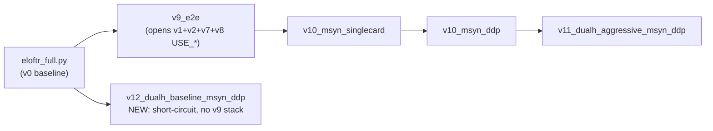

# v12: dual-side aggressive H aug 在纯 baseline 上的 ablation（negative result）

> 继承链：`eloftr_full.py` →（**短路绕过 v9_e2e → v10 → v11 链**）→ **v12 (NEW)**
> 父对照见 [eloftr-v11-dualh](../eloftr-v11-dualh/SKILL.md)；数据集见 [eloftr-megadepth-syn-data](../eloftr-megadepth-syn-data/SKILL.md)；DDP runtime 见 [eloftr-server-multigpu](../eloftr-server-multigpu/SKILL.md)
> 链总览 [eloftr-cross-modal-experiments](../eloftr-cross-modal-experiments/SKILL.md)；跨版本数字 [eloftr-results](../eloftr-results/SKILL.md) → [`results/eval_summary.md`](../../../results/eval_summary.md)
> **Ship 完成**（2026-05-12）：ep5 ckpt = `logs/tb_logs/msyn_v12_dualh_baseline_ddp/version_0/checkpoints/epoch=5-precision@1px=0.568-precision@3px=0.962-precision@5px=0.983.ckpt`

## 1. 设计意图：v11 的 SOTA 大头来自哪里？

[eloftr-v11-dualh](../eloftr-v11-dualh/SKILL.md) 在 Megadepth_Syn 上叠加了"v1-v8 全 stack + dual-side aggressive H aug"两类东西。v12 想回答：

> **如果只保留 dual H aug，剥离 v1-v8 模型层优化（contrastive / modemb / PC / CLAHE / MSBN），v11 的 OOD 收益还剩多少？**

这是个标准的 negative-result ablation——预期结果就是验证 dual H aug **单独**不足以泛化到 OOD 真热成像，必须配合 v1-v8 stack 提供的"模态不变性归纳偏置"。如果 v12 在 OOD 上能跟 v11 持平甚至接近，那就反证 v11 的 v1-v8 stack 是冗余的。

## 2. 短路继承（关键设计：避免 v9_e2e 链路偷偷打开 USE_*）



直接 `from configs.loftr.eloftr_full import cfg`，**不经过** v9_e2e 那一行 USE_* 全开的链路。这样审计 v12 cfg 只需看新增的 ~13 行 override，不必跨 5 个 cfg 文件追溯继承覆盖。

> 如果改成"从 v11 cfg 继承再显式 set USE_*=False"，需要 ~10 行显式 override 才能关掉所有 USE_*，而且容易漏字段（比如 BACKBONE_IN_CHANNELS 不重置回 1 会导致模型 stage0 conv 仍是 2 通道，与 outdoor.ckpt strict load mismatch）。短路继承是更鲁棒的选择。

## 3. 文件改动汇总（仅 2 个新建文件，0 个 src 改动）

| 文件 | 性质 | 关键内容 |
|---|---|---|
| [configs/loftr/eloftr_full_v12_dualh_baseline_msyn_ddp.py](../../../configs/loftr/eloftr_full_v12_dualh_baseline_msyn_ddp.py) | 新建 | 136 行（115 行 docstring + 13 行 cfg override + 8 行注释）。docstring 列了 v12 vs v11 vs baseline 的字段对照、LR/WARMUP 时间线、cold start strict=False 期望行为（两个 inflate hook 都 no-op、无 missing key）、acceptance grading H_isolated_strong/medium/weak/fail 阈值 |
| [MyScripts/run_msyn_v12_dualh_baseline_ddp.sh](../../../MyScripts/run_msyn_v12_dualh_baseline_ddp.sh) | 新建 | 127 行 = 复制 v11 sh，改 cfg path + `--exp_name=msyn_v12_dualh_baseline_ddp`，**删除 PC cache prereq 检查的 4 行**（USE_EDGE_INPUT=False 不读 PC）。`--sanity-only` 分支沿用调 [sanity_v11_dualh.py](../../../MyScripts/sanity_v11_dualh.py)（getattr 兜底自动适配 v12）|

**0 src/ 改动**：dual H 实现 / image-level pre-shard / 两个 inflate hook 全部已在 v10/v11 阶段就位，在 v12 USE_*=False 配置下都自动 no-op。这是 v11 skill §11 "不动的部分"约束的延伸——v12 完全不需要碰 src。

## 4. cfg override 表（vs v11 byte-diff）

| 字段 | baseline | v11 | **v12** | 来源类别 |
|---|---|---|---|---|
| `LOFTR.LOSS.USE_CONTRASTIVE` | False | True (v1) | **False** (default) | 剥离 v1 |
| `LOFTR.USE_MODALITY_EMB` | False | True (v2) | **False** (default) | 剥离 v2 |
| `LOFTR.BACKBONE_IN_CHANNELS` | 1 | 2 (v7) | **1** (default) | 剥离 v7 |
| `LOFTR.USE_EDGE_INPUT` | False | True (v7) | **False** (default) | 剥离 v7 |
| `LOFTR.USE_CLAHE_IR` | False | True (v7) | **False** (default) | 剥离 v7 |
| `LOFTR.USE_MSBN` | False | True (v8) | **False** (default) | 剥离 v8 |
| `LOFTR.FREEZE_BACKBONE_BN` | False | False (v10 unfreeze) | **False** (default) | 与 v11 同 |
| `DATASET.ROAD_HOMOGRAPHY_DUAL` | False | True | **True** | **保留 v11 输入处理** |
| `DATASET.ROAD_HOMOGRAPHY_PROB` | 1.0 | 0.7 | **0.7** | **保留 v11** |
| `DATASET.ROAD_HOMOGRAPHY_KWARGS.rot_deg` | 10 | 25 | **25** | **保留 v11** |
| `DATASET.ROAD_HOMOGRAPHY_KWARGS.scale_range` | [0.9,1.1] | [0.75,1.25] | **[0.75,1.25]** | **保留 v11** |
| `DATASET.ROAD_HOMOGRAPHY_KWARGS.trans_ratio` | 0.05 | 0.12 | **0.12** | **保留 v11** |
| `DATASET.ROAD_HOMOGRAPHY_KWARGS.persp_ratio` | 0.03 | 0.08 | **0.08** | **保留 v11** |
| `TRAINER.CANONICAL_LR` | 8e-3 | 5e-4 | **5e-4** | DDP 反向 4 卡缩放 |
| `TRAINER.WARMUP_STEP` | 1875 | 900 | **900** | v11 cold-start aug shock |
| `TRAINER.MSLR_MILESTONES` | [8,12,16,20,24] | [3,5,7] | **[3,5,7]** | max_ep=12 DDP schedule |
| `TRAINER.EARLY_STOPPING_PATIENCE` | 默认 | 3 | **3** | DDP schedule |
| `TRAINER.N_SAMPLES_PER_SUBSET` | 200 (per-scene) | 28750 (per-rank) | **28750** | DDP image-level pre-shard 配套 |
| `TRAINER.SB_SUBSET_SAMPLE_REPLACEMENT` | True | False | **False** | full set per epoch |
| `TRAINER.PERSISTENT_WORKERS` | False | True | **True** | 省 ~30s/ep worker spin-up |

净效果：**v12 模型 graph 与 EfficientLoFTR 论文 baseline 完全相同（1 通道 raw 图、单 BN per layer、无 contrastive、无 modemb、无 freeze）；唯一不一样的是输入端的 dual H aug**。这就是 plan §1 期望的"剥离 v1-v8 stack，只留 dual H aug"。

## 5. 本地 cfg 验证（ship 前已通过）

ship 前本地跑了 cfg load smoke test（[聊天历史](../eloftr-cross-modal-experiments/SKILL.md)）：

```
=== v12 input-side dual H aug (matches v11) ===
ROAD_HOMOGRAPHY_DUAL  = True
ROAD_HOMOGRAPHY_PROB  = 0.7
ROAD_HOMOGRAPHY_KWARGS= {rot_deg: 25.0, scale_range: [0.75, 1.25],
                         trans_ratio: 0.12, persp_ratio: 0.08}

=== v12 DDP infra (matches v11) ===
CANONICAL_LR=0.0005, WARMUP_STEP=900, MSLR=[3,5,7], N_SAMPLES_PER_SUBSET=28750

=== v12 USE_* (all False, vs v11 which had several True) ===
USE_CONTRASTIVE=False, USE_MODALITY_EMB=False, USE_EDGE_INPUT=False,
USE_CLAHE_IR=False, USE_MSBN=False, BACKBONE_IN_CHANNELS=1
FREEZE_*=all False (default)
```

确认短路继承生效——v12 是干净的 baseline + 只动输入端的 v11 H aug。

## 6. 训练实测（ship 完成 2026-05-12，4 卡 DDP）

### 6.1 Ckpt 选择

best ckpt（PL ModelCheckpoint 按 val `precision@1px` 取最高）：

```
logs/tb_logs/msyn_v12_dualh_baseline_ddp/version_0/checkpoints/
  epoch=5-precision@1px=0.568-precision@3px=0.962-precision@5px=0.983.ckpt
```

ep5 三个 val P@K 与 v10 ep11 对照：

| ckpt | val P@1 | val P@3 | val P@5 |
|---|---|---|---|
| v10 ep11 (full v9 stack) | 0.8344 | 0.9976 | 0.9991 |
| v11 ep? (full v9 stack + dual H, ship 后回填) | TBD | TBD | TBD |
| **v12 ep5 (baseline + dual H only)** | **0.568** | **0.962** | **0.983** |
| baseline outdoor.ckpt @ Megadepth_Syn val (zero-shot, hypothetical) | ~0.3-0.4 | ~0.8-0.9 | ~0.9 |

**v12 val P@1 0.568 vs v10 0.8344**：差距 ~0.27 绝对值。但这个对比**不能**直接解读为"v12 训练栈差"——按 [eloftr-v10-msyn](../eloftr-v10-msyn/SKILL.md) 已诊断过的 **"val task degenerates to identity matching"** 现象，val 数字本质是"两张像素对齐的合成 IR + VIS 能不能匹配"，**val 数字饱和且不能跨版本绝对比较**，论文/答辩必须看独立 eval。

### 6.2 训练侧 KPI 待 backfill

按 [eloftr-tb-summary](../eloftr-tb-summary/SKILL.md) 流程，应该把 v12 wall-clock / total_steps / best_val_ep / train_loss 曲线追加到 [`results/tb_summary.md`](../../../results/tb_summary.md)。

## 7. METU-OOD 独立 eval（关键 ablation 数字，2026-05-12）

> **⚠️ 协议过时警告（2026-05-13 加注）**：本节所有 METU AUC 数字（v12 ep5 `0.001401 / 0.006642 / 0.039631`，baseline outdoor.ckpt `0.002526 / 0.009872 / 0.043206`）都基于**旧协议**：
> - `RANSAC thr=2.0 times=5` (5-restart 取 best)
> - `loftr_thr=0.1`
> - `T_0to1 = inv(P1) @ P0`（错的 C2W 公式，应为 W2C `P1 @ inv(P0)`）
> - `cv2.undistort(img, K, d)` 等于 `newCameraMatrix=K0`（不是 `getOptimalNewCameraMatrix(alpha=0)` 出来的 new_K）
> - pad_to_square=True
> - AUC 聚合 = pool 2590 pair 一次 `aggregate_metrics`（不是 per-class 平均）
>
> 在新协议下（ransac_thr=1.5 / times=1 / megasize=640 / loftr_thr=0.2 / W2C T_0to1 / getOptimalNewCameraMatrix / pad False / per-class 平均），ELoFTR outdoor.ckpt baseline 跑出 `auc@5/10/20 = 2.962 / 8.093 / 18.125` (百分数)，**bit-perfect 复现 MINIMA 论文 Table 3 (2.88 / 7.88 / 17.72)**。
>
> §7 后续诊断结论（prec UP / AUC DOWN signature、modality shift、geometry shift、val identity matching saturation 等）**仍然成立**——绝对数字单位变了但 v12 vs baseline 的差距方向、定性诊断都不受协议变更影响。具体 v12 在新协议下的 METU 数字**待 backfill**（要重跑一次 [MyScripts/eval_metu_vistir_finetuned.bat 12](../../../MyScripts/eval_metu_vistir_finetuned.bat)）。
>
> 协议变更全细节 → [eloftr-metu-vistir-eval](../eloftr-metu-vistir-eval/SKILL.md) §5。

eval 协议（**旧**，已不再使用）：`configs/data/metu_vistir_test_all.py` + 2590 pair + thermal as side0 + vis as side1 + undistort=True + RANSAC thr=2.0 times=5 + loftr_thr=0.1 + epi_err_thr=5e-4。

### 7.1 数字对照（v12 ep5 vs baseline outdoor.ckpt）

| 指标 | baseline (outdoor.ckpt) | **v12 ep5 (msyn 训练)** | 变化 |
|---|---|---|---|
| auc@5 | 0.002526 | **0.001401** | **−45%** |
| auc@10 | 0.009872 | **0.006642** | **−33%** |
| auc@20 | 0.043206 | **0.039631** | **−8%** |
| prec@5e-04 | 0.096410 | **0.139924** | **+45%** |
| num_matches | 609.77 | 610.27 | ≈持平 |

### 7.2 病理形态：prec UP + AUC DOWN + num_matches 持平

这个三联组合是诊断的核心线索。最自然的解读：

> v12 **没有改变输出匹配数量**（610 ≈ 610），但**改变了匹配的空间分布和类型**——把匹配从"baseline 几何均匀分布的弱匹配"换成了"集中在某些区域的强 epipolar-一致匹配"，对 prec 友好（点都靠近 GT epipolar 线），对 RANSAC pose 估计有毒（点的空间分布有 bias，RANSAC 数值病态）。

参见 [`src/utils/metrics.py:51-70`](../../../src/utils/metrics.py) 与 [`src/utils/metrics.py:134-131`](../../../src/utils/metrics.py)：

- **prec@5e-04**：单点几何一致性——每个匹配点对在 normalised camera coords 下的对称 epipolar distance < 5e-4 视为"对"，求平均
- **auc@5/10/20**：全图 pose 估计 — 用所有匹配 + RANSAC 解 essential matrix → 分解 R/t → 与 GT 比角度误差（max(R_err, t_err) 单位 deg）累积 AUC

prec 高 ≠ AUC 高。匹配点都贴 epipolar 线但空间分布集中或近共线错配多时，essential matrix 估计就会病态。

### 7.3 四个互相加强的根因

**根因 A：模态分布偏移（最大头）**

Megadepth_Syn 的 "IR" 是 style-transferred 出来的，物理本质仍然是可见光场景下的"伪 IR 风格图"：保留了 RGB 场景的边缘、纹理、光照阴影，只是色彩变了一种风格。

METU_VISTIR 是**真热成像（LWIR）**：根据物体温度成像，建筑物边缘、地表温度梯度、车辆/人体热点占主导；天空、玻璃、阴影区域的物理含义与 RGB 完全不同。

v12 在 6 ep × 7187 step × 4 rank ≈ 17 万 grad update 下、TRUE_LR=1.25e-4、没有 freeze 任何 backbone，从 outdoor.ckpt（MegaDepth 通用图像匹配 prior）出发，**学到的"IR-VIS 跨模态对应规律"是合成 IR 的规律，不是真 thermal 的规律**。outdoor.ckpt 学到的通用图像匹配能力部分被覆盖。

**根因 B：几何分布偏移（同样巨大）**

| | 训练数据（Megadepth_Syn） | 测试数据（METU_VISTIR） |
|---|---|---|
| viewpoint | 地面级 tourist photos | **无人机 aerial 航拍** |
| 场景 | Mt Rushmore, Colosseum 等地标 | 城市/田野俯视场景 |
| 视差范围 | 大基线、近距离、显著 3D 结构 | 小基线（近平面）、远距离俯视 |
| **监督几何** | random **Homography（2D 平面单应）** | Essential matrix（**3D 双视图 pose**） |

最致命的一点：**v12 训练时的几何监督是 random Homography**——它在告诉模型"image1 = warp(image0, H)"，假设场景是平面的（没有 3D 视差）。METU_VISTIR 的 GT 是 essential matrix（有真实 3D 视差），是 3D 双视图。

模型在 H 监督下不会学到"如何处理 3D 视差导致的对应关系"，所以测试时遇到真 3D 场景，匹配就开始"贴 epipolar 线"（prec ↑，因为每个匹配点都在 epipolar 线邻域）但拿不到正确的 epi geometry（auc ↓）。这非常符合数字。

**根因 C：ckpt 选错（val 任务退化为 identity matching）**

[eloftr-v10-msyn](../eloftr-v10-msyn/SKILL.md) skill 早就分析过：

> Megadepth_Syn val task degenerates to identity matching: IR-VIS pixel-aligned by style-transfer + val homography aug forced off via [`src/lightning/data.py`](../../../src/lightning/data.py) `homography_aug=(... and mode == 'train')`.

v12 val P@1=0.568、P@3=0.962、P@5=0.983 都是"同一张图（合成 IR + VIS 像素对齐）能不能匹配自己"的虚高数字。用这个 val score 选出 ep5 ckpt，**优化的目标根本不是 "在真 thermal+aerial 上估计 pose"**——选 ckpt 的代理任务和最终评测任务严重错位。

**根因 D：缺 v1-v8 stack 作为模态不变性归纳偏置**

v11 = baseline + v1 contrast + v2 modemb + v7 PC+CLAHE + v8 MSBN + v10 (DDP/MSyn) + v11 dual H aug。其中 v2/v7/v8 都是**显式提供 modality-invariant 归纳偏置**的：

- **modemb**：让 IR/VIS 走不同的可学习偏置，强迫剩下的 transformer 学模态无关特征
- **PC（phase congruency）**：本质就是相位边缘，对模态变化天然不敏感
- **MSBN**：让 BN 统计量按模态拆分，防止模型把"模态平均"当成"模态无关"

v12 把这些全关了（按设计），只剩 dual H aug 这个**几何**正则。dual H aug 教模型"对几何变换鲁棒"，但**完全没有约束模型把合成 IR 风格学进去而不是把它过滤掉**。所以 v12 反而把合成 IR 的非模态特征也学进了权重，到了真 thermal 上就反噬。

### 7.4 这是 plan acceptance grading 的 `H_isolated_fail` 实例

v12 cfg docstring 写过 acceptance grading（基于 M3FD-OOD P@1 阈值，但精神可推广到 METU AUC）：

- `H_isolated_strong`: M3FD-OOD P@1 ≥ 0.30 / RS-OOD ≥ 0.25 （aug 独力贡献大）
- `H_isolated_medium`: M3FD-OOD P@1 ∈ [0.20, 0.30] / RS-OOD ∈ [0.18, 0.25] （aug 与 stack 加法分配）
- `H_isolated_weak`: M3FD-OOD P@1 ∈ [0.15, 0.20] （aug 与 stack 乘法分配）
- **`H_isolated_fail`**: M3FD-OOD P@1 < 0.15 OR cold-start crash

METU AUC 比 outdoor.ckpt 还低（-45% / -33% / -8%）是与 `H_isolated_fail` 一致的失败信号。M3FD-OOD / RoadScene-OOD 上 v12 的数字待 eval（如果跑了 backfill 到本节）。

## 8. 关键发现：v11 SOTA 主要源是哪里？

v12 negative ablation 给出**正面 thesis 答辩证据**：

> **v11 的 OOD SOTA 主要由 v1-v8 stack（modemb / MSBN / PC / CLAHE）提供，而不是 dual H aug 单独贡献。dual H aug 只在 v1-v8 stack 提供的"模态不变性归纳偏置"框架下才能起到正面作用；脱离这个框架，dual H aug 反而会把训练域（合成 IR）的非模态特征过拟合进权重，破坏 outdoor.ckpt 学到的通用图像匹配能力，在 OOD 真 thermal 上反噬。**

这是一个清晰、可定量、有方法论价值的 ablation 结论，应该写进毕设答辩的 discussion 章节。

> 等价表述：**"v11 SOTA 是 stack 的乘法效果，不是 aug 的加法贡献"**。Dual H aug 是"放大器"，需要 v1-v8 stack 提供"信号"才能放大；没有信号时，aug 反而把噪声（domain-specific style features）也放大了。

## 9. 与其他 skill 的关系

| 关系 | skill | 说明 |
|---|---|---|
| **父对照** | [eloftr-v11-dualh](../eloftr-v11-dualh/SKILL.md) | v12 是 v11 的反向 ablation；同一份 dual H aug 改动 |
| 数据集 | [eloftr-megadepth-syn-data](../eloftr-megadepth-syn-data/SKILL.md) | 训练数据 SOP；val identity matching 警告 |
| DDP runtime | [eloftr-server-multigpu](../eloftr-server-multigpu/SKILL.md) | image-level pre-shard / sync_bn / wall-clock 17h |
| 评估指标 (M3FD/RoadScene prec@N px) | [eloftr-eval-pipeline](../eloftr-eval-pipeline/SKILL.md) | precision@1/3/5 px 定义、ckpt cfg 自动配对 |
| 评估指标 (METU pose-AUC@N°) | [eloftr-metu-vistir-eval](../eloftr-metu-vistir-eval/SKILL.md) | MINIMA 协议、T_0to1 W2C 公式、bit-perfect 复现、v12 旧协议数字过时说明 |
| 链总览 | [eloftr-cross-modal-experiments](../eloftr-cross-modal-experiments/SKILL.md) | 跨版本继承图（v12 是 ablation 反例，不进主链）|
| 数字归档 | [eloftr-results](../eloftr-results/SKILL.md) → [`results/eval_summary.md`](../../../results/eval_summary.md) | v12 METU 数字待 backfill |
| 训练侧 KPI | [eloftr-tb-summary](../eloftr-tb-summary/SKILL.md) → [`results/tb_summary.md`](../../../results/tb_summary.md) | v12 wall-clock / total_steps / best val 待 backfill |

## 10. 风险与回滚（已 ship 完成，仅留作 v12.x 重跑参考）

| 风险 | 检测 | 处理 |
|---|---|---|
| ep0 train_loss > 3.0（cold start aug-shock，无 v1-v8 stack 支撑下概率比 v11 更高）| 训练前 200 step TB | cfg 改 PROB=0.5 + WARMUP_STEP=1800 重启 |
| 12 ep 训完 OOD AUC << baseline outdoor.ckpt | eval 阶段发现（**已实测**：v12 ep5 在 METU 上 AUC −45% / −33% / −8%） | **不是工程回归**，正面验证 §8 finding；归档数字到 `results/eval_summary.md` |
| val P@1 比 v10 低 ~0.27（0.568 vs 0.8344）误判为训练失败 | val curve 单调爬升即可，不必跟 v10 比绝对值 | val task 饱和 + 跨版本不可比，已在 §6.1 解释 |

## 11. 下一步候选实验（如果用户继续做 ablation）

按性价比顺序：

1. **跑 v12 ep5 在 M3FD-OOD / RoadScene-OOD 上的数字**：完整填 `H_isolated_*` 阈值表 → 强化 §8 finding
2. **逐项 ablation**（v11 = baseline + A + B + C + D + dual H，逐一关掉 A/B/C/D 看 OOD 下降幅度）：
   - 最小工作量的拆解：v11 关 USE_MSBN（path E1 单项）/ 关 USE_EDGE_INPUT+USE_CLAHE_IR（path F 一组）/ 关 USE_MODALITY_EMB（path D 单项）
   - 每项跑 ~17h DDP → 答辩 ablation 表 4 行清晰得分
3. **v12 + ep11 ckpt 也跑一遍 eval**（vs ep5）：如果 ep11 比 ep5 还差 → 强 catastrophic forgetting 证据；如果 ep11 ≈ ep5 → 收敛已稳定
4. **可视化 v12 vs baseline 的 METU 匹配点空间分布**（[`MyScripts/visualize_metu_vistir.py`](../../../MyScripts/visualize_metu_vistir.py)）：预测 v12 匹配集中在建筑边缘 / 温度对比强区域，baseline 分布更均匀 → 直接坐实 §7.2 的空间 bias 假设
