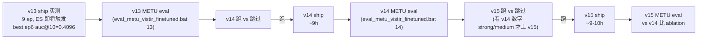

# v15: v14 + v1 Cross-Modal Symmetric InfoNCE Contrastive Loss (Plan-Only)

> 继承链：`eloftr_full.py` → **`v13` (path J B-pure)** → **`v14` (640 + 工程加速)** → **`v15` (THIS, + InfoNCE)**
> 父对照 → [eloftr-v14-resolution-640](../eloftr-v14-resolution-640/SKILL.md)
> contrastive 实现 → [eloftr-v1-contrast](../eloftr-v1-contrast/SKILL.md)
> 跨版本数字 → [eloftr-results](../eloftr-results/SKILL.md) → [`results/eval_summary.md`](../../../results/eval_summary.md)
> **状态**：plan-only, ship pending. 依赖 v14 ship 完成 + METU eval 拿到 baseline 数字, 才能跟 v15 比 ablation.

## 1. 设计意图：InfoNCE 跟 pose 监督是否正交可叠加？

v1 在 RoadScene H 监督上加 contrastive loss 拿到 +X% AUC (见 [eloftr-v1-contrast](../eloftr-v1-contrast/SKILL.md))。但 v14 已经走 pose 监督 (model 已经被强制学 modality-invariant features), contrastive loss 是不是冗余？

v15 想回答：

> **加 contrastive loss (一个显式的跨模态正则化项) 是否在 pose 监督路径下仍有边际收益？**

3 个可能的答案：
- **可叠加正交**: contrastive 跟 pose 监督正交 (用对应 token 配对 vs 反投影 GT), 各自补对方梯度信号 -> v15 > v14
- **冗余饱和**: pose 监督已经把 modality 学透了, contrastive 边际收益 0 -> v15 ≈ v14
- **干扰**: contrastive 跟 pose 监督学到的"哪些 token 该相似"不一致, 互相抵消 -> v15 < v14

## 2. 2 个新建文件 (零 src/ 改动) + cfg 继承链

| 文件 | 关键设计 |
|---|---|
| [`configs/loftr/eloftr_full_v15_pose_msyn_ddp.py`](../../../configs/loftr/eloftr_full_v15_pose_msyn_ddp.py) | 90 行。继承 v14 ddp + **1 行 cfg override**: `cfg.LOFTR.LOSS.USE_CONTRASTIVE = True`. docstring 含 v1 contrastive 设计原理 + v14 v15 ablation 矩阵 + 监控点 + acceptance gate. |
| [`MyScripts/run_msyn_v15_pose_ddp.sh`](../../../MyScripts/run_msyn_v15_pose_ddp.sh) | 112 行。基于 v14 ddp.sh **改 3 处**: main_cfg / exp_name + 注释更新; data_cfg 复用 v14 的 [megadepth_syn_pose_640.py](../../../configs/data/megadepth_syn_pose_640.py). |

**0 src/ 改动**。继承链:

```
eloftr_full.py (v0 baseline)
  └─ v13_pose_msyn_ddp (B-pure, 832, bs=2)
       └─ v14_pose_msyn_ddp (8 项 overrides, 640, bs=4)
            └─ v15_pose_msyn_ddp (THIS, + 1 行 USE_CONTRASTIVE=True)
```

注: v15 没建 singlecard cfg/sh, 因为 contrastive 行为在 single-card + bs=4 也工作, smoke 一般用 4 卡 sanity-only mode 不必建独立 singlecard.

## 3. 唯一改动 + v1 默认超参复用

```python
# eloftr_full_v15_pose_msyn_ddp.py 唯一改动 (相对 v14 ddp)
cfg.LOFTR.LOSS.USE_CONTRASTIVE = True
```

CONTRASTIVE_WEIGHT / CONTRASTIVE_TEMP 走 [`src/config/default.py:186-188`](../../../src/config/default.py) 默认值:
- `CONTRASTIVE_WEIGHT = 0.01`
- `CONTRASTIVE_TEMP = 0.1`

跟 v1 原值完全一致 (v1 设计目的是治 dual-softmax focal 饱和)。让 v15 跟 v1 在两个超参上完全同步, 仅 dataset path 跟 v1 (RoadScene H 监督) 不同 (v15 走 Megadepth_Syn pose 监督)。

## 4. v1 contrastive loss 兼容 MegaDepth pose path

**关键代码点** ([`src/losses/loftr_loss.py:134-180`](../../../src/losses/loftr_loss.py)):

```python
# v1 contrastive 实现仅依赖 data['spv_b_ids/i_ids/j_ids']
b_ids = data['spv_b_ids']
i_ids = data['spv_i_ids']
j_ids = data['spv_j_ids']
# ... InfoNCE on (B*L, D) flatten + L2-normalize + cosine sim ...
```

这 3 个字段 MegaDepth path 的 [`spvs_coarse`](../../../src/loftr/utils/supervision.py) 也会 update ([L125-129](../../../src/loftr/utils/supervision.py)):

```python
data.update({
    'spv_b_ids': b_ids,
    'spv_i_ids': i_ids,
    'spv_j_ids': j_ids
})
```

**所以 v15 在 v14 上零代码改动直接可用**, 仅 cfg toggle。

v14 走 MegaDepth pose path, `b_ids` 来自 spvs_coarse 的 mutual NN check + depth_consistent 双约束 ([supervision.py:99-102](../../../src/loftr/utils/supervision.py))。数量比 RoadScene H path 偏少但充足 (v13 实测 50-200 GT match / pair, bs=4 -> n_pos 200-800 / batch, 足够 InfoNCE 信号)。

## 5. 工程开销 (相对 v14 几乎可忽略)

| 项 | v14 baseline | v15 增量 | v15 总 |
|---|---|---|---|
| 显存 / 卡 | ~17 GB | feat_c0/c1_tokens [4, 6400, 256] fp32 = 25 MB/batch + autograd ~50-75 MB | **~17.05 GB** (+0.4%) |
| step time | ~0.83 s/step | contrastive matmul 6400² × 4 = 160M FLOP fp32 ~5-10 ms / step | **~0.84 s/step** (+0.5-1%) |
| TB scalar | 4 个 (loss/auc) | +4 个 (loss_contrast / loss_i2v / loss_v2i / n_pos) | 8 个 |
| events.tfevents | ~220 MB | scalar 增量可忽略 | **~220 MB** |
| ep wall-clock | ~33 min | +0.5% | ~33 min |
| 12-18 ep ship | ~9-10 h | +0.5% | **~9-10 h** |

## 6. acceptance gate (待 v14 ship 完成 + METU eval 拿到 baseline 数字后填)

| 档位 | METU all auc@20 vs v14 | 解读 |
|---|---|---|
| Strong | ≥ v14 + 1.0pp | 论文 "InfoNCE in pose supervision works", InfoNCE 跟 pose 监督正交可叠加 |
| Medium | in [v14 + 0.3, v14 + 1.0)pp | 写 ablation 表小贡献 |
| Flat | in [v14 − 0.3, v14 + 0.3]pp | contrastive 边际, 论文叙事可省略此 ablation |
| Negative | in [v14 − 1.0, v14 − 0.3)pp | contrastive 跟 pose 监督干扰, 调 CONTRASTIVE_WEIGHT 0.01 → 0.005 重试 |
| Fail | < v14 − 1.0pp | 严重负效应, 回退 v14 |
| Crash | NaN loss | InfoNCE temp 过低 / n_pos 为 0; 检查 [`loftr_loss.py:156-158`](../../../src/losses/loftr_loss.py) zero-fallback |

## 7. 训练时关键监控点 (TB scalar)

ENABLE_PLOTTING=False 关掉 train figure, 但**所有 scalar 仍保留**, v15 多出的 4 个 scalar 都能在 TB 看到:

| scalar | 健康判据 | 病理信号 |
|---|---|---|
| `train/loss_contrast` | 单调下降 (cross-modal 对齐学到了) | 一直 plateau / 升 -> contrastive 跟主 loss 干扰 |
| `train/loss_i2v` vs `train/loss_v2i` | 接近 (symmetric InfoNCE 双向均衡) | 长期不对称 -> 模态偏向 (image0=IR vs image1=VIS 学到不对称信号) |
| `train/n_pos` | ≥ 30 / batch (够 InfoNCE 信号) | < 10 / batch -> spv_b_ids 不足, contrastive 退化, 检查 spvs_coarse 输出 |

## 8. ship 时序 (依赖 v14 完成)



**推荐流程**：
1. **现在 (本 skill)**: cfg + sh 已建好, plan-only 状态, 等 v14 ship 完成
2. **v14 ship 完成 + METU eval 后**: 看 v14 数字
   - v14 数字 strong/medium → v15 跑确认 contrastive 是否正交可叠加
   - v14 数字 weak/fail → 跳过 v15, 反思 v14 设计
3. **v15 ship 完成后**: backfill 数字到 [eloftr-results](../eloftr-results/SKILL.md) + 本 skill description

## 9. v15 ship 后的 backfill 工作

```
python MyScripts/read_tb_metrics.py summary --logdir logs/tb_logs/msyn_v15_pose_ddp/version_<N>
```

backfill 进:
- 本 skill description 的 "Ship 状态" + 实测曲线
- [eloftr-results](../eloftr-results/SKILL.md) -> [`results/eval_summary.md`](../../../results/eval_summary.md)
- [eloftr-tb-summary](../eloftr-tb-summary/SKILL.md) -> [`results/tb_summary.md`](../../../results/tb_summary.md)
- 关键: 对比 v14 vs v15 在 METU all auc@20 上的差异, 写论文 contrastive ablation 章节
