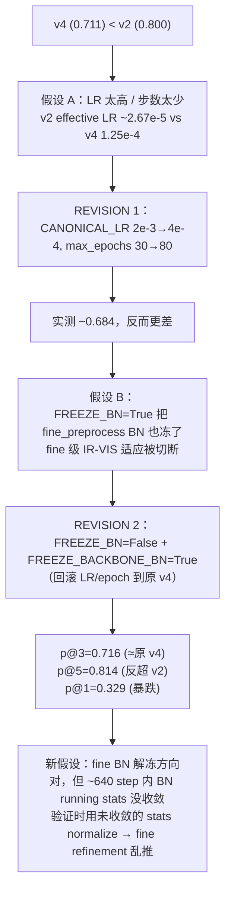

# v3 / v4：Anti-Overfit Stack 与 BN 解冻 REVISION 2

> 继承链：v2 (modemb) → **v3 (freeze stack)** → **v4 (REVISION 2)** → v5 (M3FD) → v6 → v7
> 总览见 [eloftr-cross-modal-experiments](../eloftr-cross-modal-experiments/SKILL.md)
> v2 见 [eloftr-v2-modemb](../eloftr-v2-modemb/SKILL.md)；v5 起的多数据集见 [eloftr-v5-m3fd](../eloftr-v5-m3fd/SKILL.md)

> **v3 / v4 共一个 skill 的理由**：v4 = v3 的诊断闭环。v3 触发 p@5 反超 v2 + p@1 暴跌的奇怪指纹 → REVISION 2 改成只冻 backbone BN 验证 fine BN 是否是关键 → 实测两个一起读才看得懂归因。

## 1. v3：全冻 + EarlyStopping

[configs/loftr/eloftr_full_v3_combined.py](../../../configs/loftr/eloftr_full_v3_combined.py)：

```python
from configs.loftr.eloftr_full_v2_modemb import cfg
cfg.LOFTR.FREEZE_BACKBONE      = True
cfg.LOFTR.FREEZE_BN            = True
cfg.TRAINER.EARLY_STOPPING     = True
cfg.TRAINER.EARLY_STOPPING_PATIENCE = 4
cfg.TRAINER.CANONICAL_LR       = 8e-3      # TRUE_LR = 5e-4 at bs=4
cfg.TRAINER.WARMUP_STEP        = 1         # 实际等于关掉 warmup
cfg.TRAINER.MSLR_MILESTONES    = [5, 7]    # 默认 [8,12,16,20,24] 太晚
```

## 2. 三个 freeze flag 的优先级与实现

[src/config/default.py:38-54](../../../src/config/default.py) 提供三个独立 flag，全部默认 `False`（保持 v0/v1/v2 行为字节级一致）：

| Flag | 作用范围 | 同时影响 |
|------|---------|----------|
| `FREEZE_BACKBONE` | `matcher.backbone.*` 所有 conv 权重 `requires_grad=False` | 不动 BN 模式（BN 仍 train-mode + running stats 仍更新） |
| `FREEZE_BN` | **所有** `BatchNorm2d` (backbone **+** fine_preprocess) eval-mode + affine 冻结 | 包含 fine BN |
| `FREEZE_BACKBONE_BN` | **仅** `matcher.backbone.*` 内的 BN eval-mode + affine 冻结；fine_preprocess BN 保持 trainable | 不影响 backbone conv 权重 |

**优先级**：`FREEZE_BN=True` 覆盖 `FREEZE_BACKBONE_BN`（前者已冻全部 BN，后者再做就重复 + 污染日志）。优先级靠两处守卫保证：

[src/lightning/lightning_loftr.py:80-94](../../../src/lightning/lightning_loftr.py) 的 `__init__`：
```python
self._freeze_bn          = bool(config.LOFTR.get('FREEZE_BN', False))
self._freeze_backbone_bn = bool(config.LOFTR.get('FREEZE_BACKBONE_BN', False))
if config.LOFTR.get('FREEZE_BACKBONE', False):
    for p in self.matcher.backbone.parameters(): p.requires_grad = False
if self._freeze_bn:
    self._apply_freeze_bn()
if self._freeze_backbone_bn and not self._freeze_bn:   # ← and-not 守卫
    self._apply_freeze_backbone_bn()
```

[src/lightning/lightning_loftr.py:130-142](../../../src/lightning/lightning_loftr.py) 的 `train()` override（PL 每 epoch 都会 `self.train(True)` 把 BN 拉回 train-mode，必须重新冻一遍）：
```python
def train(self, mode=True):
    super().train(mode)
    if getattr(self, '_freeze_bn', False):
        self._apply_freeze_bn()
    elif getattr(self, '_freeze_backbone_bn', False):   # ← elif 而非 if
        self._apply_freeze_backbone_bn()
    return self
```

**反向兼容验证**（v0/v1/v2/v3 字节级不变）：

| 版本 | FREEZE_BN | FREEZE_BACKBONE_BN | __init__ 走哪 | train() 走哪 |
|------|-----------|--------------------|--------------|-------------|
| v0/v1/v2 | False (default) | False (default) | 都跳过 | 都跳过 |
| v3 | True | False (default) | 走 `_apply_freeze_bn`；backbone-only 被 `not _freeze_bn` 拦下 | 走 `if` 分支，`elif` 不进入 |
| v4 (REVISION 2) | False | True | 走 `_apply_freeze_backbone_bn` | 走 `elif` 分支 |

`_apply_freeze_backbone_bn` 用 `self.matcher.backbone.modules()` 严格限定遍历范围，**不会跨到 fine_preprocess / loftr_coarse / fine_matching**——这是 REVISION 2 能"只冻 backbone BN 而保留 fine BN 可训"的关键。

## 3. Optimizer 只看可训练参数

[src/optimizers/__init__.py:9-21](../../../src/optimizers/__init__.py)：用 `filter(lambda p: p.requires_grad, model.parameters())` 替代 `model.parameters()`，否则 AdamW 的 `weight_decay` 会**直接对 `param.data` 减衰减项**（AdamW 不依赖梯度），让冻结权重也漂走。

兼容性：v0/v1/v2 没冻结任何参数，filter 是 no-op，行为字节级一致。

## 4. EarlyStopping

[train.py:11, 144-168](../../../train.py)：
- 第 11 行 import `EarlyStopping`。
- `monitor_metric / monitor_mode / filename_tpl` 在 RoadScene 分支里取 `'precision@3px' / 'max'`，**先于** `if not args.disable_ckpt:` 块计算，方便 ES 与 ckpt 共用。
- ES callback 只看 `config.TRAINER.EARLY_STOPPING`，与 `--disable_ckpt` 完全独立；调试脚本 `*_v3_debug.bat` 即便加了 `--disable_ckpt` 也会触发 EarlyStopping 日志。

## 5. 启动日志验收清单

| 跑哪个 | 关键日志 | Trainable params |
|--------|----------|----------------|
| v3 (`FREEZE_BACKBONE=True, FREEZE_BN=True`) | `Froze backbone: 9.50M params` + `Froze all BatchNorm2d layers (eval-mode + no-grad)` | `~5.7M / Total: ~16.0M` |
| v4 REVISION 2 (`FREEZE_BACKBONE=False, FREEZE_BN=False, FREEZE_BACKBONE_BN=True`) | `Froze backbone BatchNorm2d layers (eval-mode + no-grad); fine_preprocess BN remains trainable` | `~15.99M / Total: ~16.0M`（仅 backbone BN ~10K affine 被冻） |
| v0/v1/v2 (`默认全 False`) | 上述 freeze 日志**全部缺席** | `~16.0M / Total: ~16.0M`（全开） |

通用日志（v3+ 都该看到）：
```
missing_keys (kept at init value): ['modality_emb_ir', 'modality_emb_vis']
EarlyStopping enabled (monitor=precision@3px, mode=max, patience=...)
```

TensorBoard 应同时出现 baseline / v1 / v2 三套 loss：
- `train/loss_c, loss_f, loss_l`（baseline）
- `train/loss_contrast, loss_i2v, loss_v2i, n_pos`（v1）
- `train/mod_emb_ir_norm, mod_emb_vis_norm`（v2）

**Sanity 检查**：v4 REVISION 2 启动后如果 trainable params 显示 ~5.7M（接近 v3），说明 `not self._freeze_bn` 守卫失效或 v4 配置被覆盖到 `FREEZE_BN=True`，必须排查 yacs 合并顺序。

## 6. v3 / v4 实测结果与 REVISION 2 诊断

### 6.1 实测分数（precision@Npx，最佳 epoch）

| run | 最佳 ep | p@1px | p@3px | p@5px | 备注 |
|-----|---------|-------|-------|-------|------|
| **v2 v0**（baseline 最佳） | 49 | **0.741** | **0.800** | 0.806 | bs=2，effective TRUE_LR ~2.67e-5，~6400 step |
| 原 v4 v0（FREEZE_BN=True） | 14 | — | 0.711 | — | bs=4，TRUE_LR=1.25e-4，~880 step |
| v4 REVISION 1（仅降 LR + 80 epoch） | — | — | ~0.684 | — | **被实测证伪**（更差） |
| v4 REVISION 2（FREEZE_BACKBONE_BN=True） | 9 | 0.329 | 0.716 | **0.814** | bs=4，~640 step（ES 在 ep 16 触发） |

### 6.2 假设演化



### 6.3 关键诊断信号：p@5 反超 v2，但 p@1 暴跌

REVISION 2 出现了之前所有版本都没见过的指标分布：

| 阈值 | v2 v0 | v4 REVISION 2 | Δ |
|------|-------|---------------|---|
| p@5px | 0.806 | **0.814 (+0.008)** | 粗匹配（coarse）质量持平甚至更好 |
| p@3px | 0.800 | 0.716 (-0.084) | 中等精度位置稍差 |
| p@1px | 0.741 | **0.329 (-0.412)** | 亚像素精度 **塌了一半** |

**亚像素塌而粗匹配反而稍好**是非常诊断性的指纹：
- coarse transformer + dual-softmax 在 1/8 分辨率上仍然能找到对的 patch（→ p@5 OK）
- 但 fine 级 refinement 把已经对上的点 "推偏了"（→ p@1 崩坏）
- `fine_preprocess` 的 2 个 BN（[src/loftr/loftr_module/fine_preprocess.py](../../../src/loftr/loftr_module/fine_preprocess.py) 的 `layer{1,2}_outconv2[1]`，共 ~768 affine 参数）正好夹在 coarse-to-fine 上采样之后、`fine_matching` 之前——它们出问题就是 sub-pixel refine 出问题

### 6.4 根本机制：BN running-stats 收敛需要 ≥3000 step

BN 用 momentum=0.1 的 EMA 更新 running stats：
```
running_stat ← 0.9 * running_stat + 0.1 * batch_stat
```

- v2 v0：bs=2 + ~80 step/epoch × 80 epoch = **~6400 步 BN 更新**，加上 v2 effective LR 极小（~2.67e-5），特征分布漂移得也慢，**BN running stats 有时间追上**
- v4 REVISION 2：bs=4 + ~40 step/epoch × ~16 epoch = **~640 步 BN 更新**，BN 还停留在 "从 MegaDepth pretrained stats 漂移到 IR-VIS 域的中途"——**未收敛**
- 验证时用 `running_stat`（不用 batch_stat），未收敛的 stats 直接喂给 fine refinement → 亚像素回归乱推

### 6.5 REVISION 2 的最终判定

按 [configs/loftr/eloftr_full_v4_combined.py](../../../configs/loftr/eloftr_full_v4_combined.py) docstring 的判定标准：

- p@3px 0.716 ≈ 原 v4 0.711 → **"fine BN 全冻是 v4 < v2 的主要瓶颈" 假设被证伪**
- 但 p@5px 反超 + p@1px 暴跌的指纹 → **方向对，被另一个因素压制（BN 收敛步数不足）**

修正后的真正归因：**v2 的胜利不是任何单一架构选择，而是 "fine BN 解冻 + 极慢 LR + 极长训练" 三者的组合**。换掉任意一项（v3/v4 冻 fine BN，或 v4 REVISION 2 解冻 fine BN 但短训练）都会塌掉。

> 实现层面 `FREEZE_BACKBONE_BN` 这个 flag **本身是正确的**——p@5 反超就是 backbone BN 被正确冻住的证据，p@1 暴跌就是 fine BN 被精确解冻的证据。后续 v5 直接复用此 flag。

## 7. 跨版本指标对比（v2 vs v4 vs v5 vs v6 vs v6.1）

完整 OOD 矩阵在 [eloftr-v5-m3fd](../eloftr-v5-m3fd/SKILL.md) §OOD 矩阵 + [eloftr-v6-finetune](../eloftr-v6-finetune/SKILL.md) §实测对比 那里。本节只放 RoadScene val 上 v2 / v4 REVISION 2 的对照（→ v5 起跨数据集就要看 OOD 矩阵了）。

## 8. Bat 入口

- v3：[run_roadscene_v3_debug.bat](../../../MyScripts/run_roadscene_v3_debug.bat) / [_small.bat](../../../MyScripts/run_roadscene_v3_small.bat) / [_combined.bat](../../../MyScripts/run_roadscene_v3_combined.bat)
- v4：[run_roadscene_v4_debug.bat](../../../MyScripts/run_roadscene_v4_debug.bat) / [_small.bat](../../../MyScripts/run_roadscene_v4_small.bat) / [_combined.bat](../../../MyScripts/run_roadscene_v4_combined.bat)
