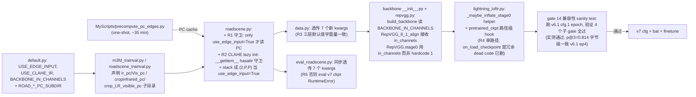

# v7：输入端优化（A1 PC 边缘 + A2 CLAHE）

> 继承链：v6.1 (spillover hotfix) → **v7 (PC + CLAHE)**
> 总览见 [eloftr-cross-modal-experiments](../eloftr-cross-modal-experiments/SKILL.md)
> v6.1 见 [eloftr-v6-finetune](../eloftr-v6-finetune/SKILL.md)
> 数据集 PC 缓存细节见 [eloftr-m3fd-data](../eloftr-m3fd-data/SKILL.md) 和 [eloftr-roadscene-data](../eloftr-roadscene-data/SKILL.md)
> 评估侧 v7 兼容性见 [eloftr-eval-pipeline](../eloftr-eval-pipeline/SKILL.md)
> **跨版本数字对照**（v7 双向 SOTA 在表里以 ★ 标记，与 v8 / v9 横向比较）见 [eloftr-results](../eloftr-results/SKILL.md) → [`results/eval_summary.md`](../../../results/eval_summary.md)。
> **训练侧 KPI 对照**（v7 wall=2.72h / 9 400 step / best ep6 / modemb 起点继承 v6.1 几乎不动）见 [eloftr-tb-summary](../eloftr-tb-summary/SKILL.md) → [`results/tb_summary.md`](../../../results/tb_summary.md) §1-§3。

**已实现**：[configs/loftr/eloftr_full_v7_pcclahe.py](../../../configs/loftr/eloftr_full_v7_pcclahe.py) + [MyScripts/run_m3fd_v7_pcclahe.bat](../../../MyScripts/run_m3fd_v7_pcclahe.bat) + [MyScripts/run_m3fd_v7_pcclahe_debug.bat](../../../MyScripts/run_m3fd_v7_pcclahe_debug.bat) + [MyScripts/precompute_pc_edges.py](../../../MyScripts/precompute_pc_edges.py)。从 v6.1 ep4 ckpt resume，max_epochs=10。

## 1. 设计动机：fine 模态盲 vs 输入分布失配

[eloftr-v2-modemb](../eloftr-v2-modemb/SKILL.md) 已论证 fine 路径模态盲是 v5/v6/v6.1 的结构性瓶颈。但 v6.1 ep4 实测 in-domain p@1=0.443 / OOD p@1=0.176 的"天花板"也可能受**输入端两个失配**影响：

1. **IR/VIS 亮度域差异**：M3FD IR 直方图在 80-120 区间窄峰分布，VIS 接近 0-255 全段均匀分布。stage0 conv 必须"补偿"这个差异，但 conv 权重训了 9450 步后已饱和。CLAHE 提前把 IR 拉伸成均匀分布，理论上能减轻 conv 的负担。
2. **IR/VIS 几何域不变性未被利用**：IR/VIS 在亮度上完全不一致，但**物体边界位置**完全一致（物理上由几何决定）。原图 backbone 必须在亮度域里学这个"边界共识"，效率低。Phase Congruency（Kovesi 1999 经典模态不变特征）直接提供"频率对齐 → 亮度无关"的边缘强度图，作为第二通道喂给 stage0 conv。

v7 与 [eloftr-cross-modal-experiments §4 候选路径 E](../eloftr-cross-modal-experiments/SKILL.md)（MSBN / FiLM / cosine + modemb fine 架构改）**互补**：路径 E 改架构破解 fine 模态盲；v7 在输入端用经典图像处理先验补齐"模态不变特征"和"统计分布对齐"。**v8 实现了 E1 MSBN**（fine_preprocess BN 拆 IR/VIS 双分支，[eloftr-v8-msbn](../eloftr-v8-msbn/SKILL.md)），实测 in-domain p@1 +10.4% rel 但 OOD p@1 -4.7% rel — 揭示了"输入端模态不变 (v7) vs fine 架构 dataset-specific 适应 (v8)"的边界, v7 仍是双向 SOTA 的毕设最终交付。

## 2. 工程组合（A1 + A2 合并 v7）

| 改动 | 文件 | 作用 |
|---|---|---|
| **A1**: PC 边缘图作为第二通道 | dataset 加载 + backbone in_ch=2 + inflated init | 输入端注入模态不变几何先验 |
| **A2**: CLAHE on raw IR | dataset CLAHE on raw uint8 | 输入端拉宽 IR 直方图，减轻 stage0 conv 补偿负担 |

A1 和 A2 合并而不分两步走：
- 经典方法的**现代复用**故事最有说服力（Pizer 1987 CLAHE + Kovesi 1999 PC，引用各 5K+）
- 两者在 input pipeline 是**正交**的，不会干扰
- 只增加 ~640 个 stage0 conv 标量（< 0.01% 模型规模）+ 一次性 35-40 min PC 缓存预计算
- 拆分 ablation（v7.1/v7.2/v7.3）留待 v7 跑完后再做，见 §8

## 3. 配置（仅 3 个 cfg flag）

[configs/loftr/eloftr_full_v7_pcclahe.py](../../../configs/loftr/eloftr_full_v7_pcclahe.py)：

```python
from configs.loftr.eloftr_full_v6_1_finetune import cfg

cfg.LOFTR.USE_EDGE_INPUT = True       # A1: dataset stacks PC, model in_ch=2
cfg.LOFTR.BACKBONE_IN_CHANNELS = 2    # 必须与 dataset stacked output 一致
cfg.LOFTR.USE_CLAHE_IR = True         # A2: only IR
```

CLAHE 默认参数：`CLAHE_CLIP_LIMIT=2.0`、`CLAHE_TILE_SIZE=[8, 8]`、`USE_CLAHE_VIS=False`（v7.3 ablation 保留）。**v6.1 schedule 全继承**（TRUE_LR=2.5e-5 / WARMUP_STEP=50 / MSLR=[15,25,35] / ES patience=12 / FREEZE_BACKBONE_BN=True / PERSISTENT_WORKERS=True / N_VAL_PAIRS_TO_PLOT=1）。

## 4. 实现拆解（5 个独立改动 + 1 个兼容性 sanity test）



## 5. 兼容性纪律：5 加固点 R1-R5 + R6 + R7

v7 引入 8 处代码改动，但**v0-v6.1 重训 / eval 历史 ckpt 必须字节级一致**。靠 7 处加固保证：

- **R1（dataset 守卫纪律）**：[`src/datasets/roadscene.py`](../../../src/datasets/roadscene.py) `__getitem__` 所有新分支用 `if self.use_xxx:` 严格守卫。flag=False 时进入的分支**等价 v0-v6.1 现有代码**，张量值字节级相同（特别是 `np.stack([ir_raw], axis=0)` 与原 `ir_pad[None]` shape 完全相同）。
- **R2（CLAHE worker pickle）**：`cv2.createCLAHE()` 返回的 C++ 对象在 Windows DataLoader spawn 时不能 pickle。dataset `__init__` 只存 cfg 参数，`__getitem__` 用 `hasattr(self, '_clahe')` 守卫 lazy init，每个 worker 独立持有。
- **R3（默认值三层一致性）**：`default.py` yacs / `data.py` getattr fallback / `roadscene.py __init__` 默认参数三层字面量严格相等（False/0/`''`/`[8,8]`）。即使 cfg 字段缺失，三处兜底都给"什么都不做"。
- **R4（删除 `on_load_checkpoint` 冗余 override）**：`train.py:139` 用 `pretrained_ckpt=args.ckpt_path`，走 `lightning_loftr.py:64-75` 的 pretrained_ckpt 路径。本仓库**不用** PL 原生 `Trainer.resume_from_checkpoint` API，所以 PL 的 `on_load_checkpoint` 钩子永远不触发——单路径 hook 已足够。
- **R5（yacs `CLAHE_TILE_SIZE` 类型）**：用 `[8, 8]` (list) 而非 `(8, 8)` (tuple)。yacs 严格类型检查 cfg override，tuple 会让 v7.x ablation 想覆盖成 `[6, 6]` 时报 `TypeError`。dataset `__init__` 接收时 `tuple()` 转回 cv2 用。
- **R6（eval pipeline 独立透传）**：[`MyScripts/eval_roadscene.py`](../../../MyScripts/eval_roadscene.py) `build_dataset` 是独立于 `data.py` 的 RoadSceneDataset 构造点，必须同步加 7 个 kwargs 透传。否则 eval v7 ckpt 时 dataset 走默认 1ch 输出与 in_ch=2 backbone 失配 RuntimeError。**两个 eval bat 共用 eval_roadscene.py，一处修复同时覆盖两个 bat**。
- **R7（v7 OOD eval 前置条件）**：v7 训练只生成 M3FD PC cache，`eval_roadscene_finetuned.bat 7` 跑 v7 OOD eval 在 RoadScene 时还需要 RoadScene PC cache。靠 [MyScripts/precompute_pc_edges.py](../../../MyScripts/precompute_pc_edges.py) 默认双数据集行为保证（用户跑一次就两个都生成）。

## 6. 实测验证：gate 14 兼容性 sanity test

所有代码改动落地后，跑 v6.1 cfg + v6.1 ep4 ckpt + `--max_epochs=1 --limit_train_batches=2 --disable_ckpt` 验证 v0-v6.1 字节级兼容性。**实测结果（2026-05-05）**：

| 子 gate | 检查 | 实测结果 |
|---|---|---|
| 14a 无 inflated init log | grep "Inflated stage0" | **0 匹配**（v6.1 cfg 默认 in_ch=1，helper 跳过分支无 log） |
| 14b missing/unexpected_keys | grep log | **0 匹配**（v6.1 ckpt 已含 modemb，列表全空就不打印） |
| 14c epoch 0 val end p@3 | best score | **0.814**（与 v6.1 ep4 历史值字节级一致） |
| 14d 无 CLAHE log | grep "CLAHE enabled" | **0 匹配**（v6.1 cfg 默认 USE_CLAHE_IR=False） |

总耗时约 4 分钟。Trainable params 显示 `16.00M / Total: 16.03M`（与 v6.1 历史完全一致）。

> 这意味着 R1-R7 加固在实际代码中**正确生效**，未来跑 v0-v6.1 任何 cfg / 评估任何历史 ckpt 都不会受 v7 改动影响。

## 7. v7 启动 SOP

```text
1. 双击 MyScripts\precompute_pc_edges.bat
   (默认 M3FD + RoadScene 双数据集 PC 缓存, ~35-40 min, 一次性)
2. 双击 MyScripts\run_m3fd_v7_pcclahe_debug.bat
   (50 train + 2 val batch, ~2-3 min, 验证 gate 10-13 全过)
3. 双击 MyScripts\run_m3fd_v7_pcclahe.bat
   (10 epoch finetune, ~100 min, 从 v6.1 ep4 ckpt 续训)
4. eval_m3fd_finetuned.bat 7  (in-domain test 210)
   eval_roadscene_finetuned.bat 7  (OOD test 22; 需要 RoadScene PC cache)
```

## 8. v7 训练时 validation gate 10-13

| Gate | 时机 | 通过条件 | 失败处理 |
|---|---|---|---|
| 10 (PC cache 完整性) | 启动前 | `data/M3FD_Detection/Ir_pc/` + `Vis_pc/` 存在 4200 张；`data/RoadScene/cropinfrared_pc/` + `crop_LR_visible_pc/` 存在 222 张 | 跑 `precompute_pc_edges.bat` 补缓存；缺失会 raise `FileNotFoundError` |
| 11 (CLAHE lazy init) | 启动 30 行内 | `RoadSceneDataset: CLAHE enabled (clipLimit=2.0, tile=(8, 8), ir=True, vis=False)` 出现 train + val 两次 | cfg 没传到 dataset；检查 R3 三层一致性 |
| 12 (inflated init 数学等价) | epoch 0 val end | `Inflated stage0 conv weights: 1ch -> 2ch (alpha=0.0, ...)` + p@1 ≥ 0.443 (= v6.1 ep4) | alpha 没正确设 0 → 重看 `_maybe_inflate_stage0` |
| 13 (channel shape) | PL model summary | `matcher.backbone.layer0.rbr_dense.conv` = 1.2K params (= 64×2×3×3) | 仍 0.6K → BACKBONE_IN_CHANNELS 未生效 |

## 9. 期望产出

相对 v6.1 ep4 = M3FD val p@1 0.443 / p@3 0.814：

| 结果 | M3FD val p@1 | OOD RoadScene test p@1 | 处置 |
|---|---|---|---|
| **强成功** | ≥0.46 (≥+3% rel) | ≥0.18 (recovers v5 0.186) | Ship v7 final，跑 v7.1/v7.2 拆 ablation |
| **弱成功** | [0.443, 0.46] | 不退过 v6.1 0.176 | Ship v7；ablation 看哪个起主导 |
| **失败** | <0.443 | — | Roll back v6.1 ep4 final，写 negative result |

## 10. v7.x 拆分 ablation 计划（v7 跑完后做）

| 版本 | USE_EDGE_INPUT | USE_CLAHE_IR | USE_CLAHE_VIS | BACKBONE_IN_CH | 目的 |
|---|---|---|---|---|---|
| v7   | True | True | False | 2 | A1+A2 合并（已实现） |
| v7.1 | False | True | False | 1 | 拆 A2 only：测 CLAHE 单独贡献 |
| v7.2 | True | False | False | 2 | 拆 A1 only：测 PC 单独贡献 |
| v7.3 | True | True | True | 2 | + VIS CLAHE，测对称 CLAHE |

每个 v7.x 用 v7 cfg 改 1 个 flag + 一个 bat，沿用 v6.1 ep4 ckpt 起点 + 10 epoch。完整 ablation 矩阵跑完约 4 × 100 min = 6.7 GPU 小时。

## 11. 实测结果（2026-05-06，双向 SOTA 突破）

### 11.1 v7 训练曲线（M3FD val 完整 210，max_epochs=10 全跑完）

PL ModelCheckpoint `save_top_k=5`，按 `precision@3px` 倒序保留前 5：

| epoch | p@1 | p@3 | p@5 | top 排名 |
|---|---|---|---|---|
| 3 | 0.444 | 0.827 | 0.895 | top5 |
| **6** | **0.475** | **0.855** | **0.913** | **top1（SOTA）** |
| 7 | 0.455 | 0.847 | 0.909 | top2 |
| 8 | 0.451 | 0.846 | 0.910 | top3 |
| 9 | 0.447 | 0.834 | 0.897 | top4 / last.ckpt |

ep0/1/2/4/5 全部踢出 top5（p@3 < 0.827）→ 推测前 6 epoch 是"PC 通道权重从 0 长起来 + CLAHE 让 stage0 BN 重新适应分布"的过渡期；**ep6 见顶后 ep7-9 单调微跌**（p@1 0.475→0.447）= 真过拟合 / 训练后期噪声，不是 LR 不够低（已被 in-domain + OOD 双向 SOTA 反证）。

> ES (patience=12) 数学上不可能在 max_epochs=10 内触发 → "v7 没触发 ES" 不是"还在改善"的信号，是 cfg 不匹配让 ES 完全失效。但从 ep6→ep9 单调下降的趋势看 max_epochs=10 设置合适，不需要延长。

### 11.2 in-domain test (M3FD 210)

| ckpt | p@1 | p@3 | p@5 | mpe | total_matches | Δ vs v6.1 ep4 |
|---|---|---|---|---|---|---|
| v5 ep9 | 0.4352 | 0.8072 | 0.8777 | 2.0747 | — | baseline -6.2% / -3.0% / -1.4% |
| v6 ep6 | 0.4426 | 0.8208 | 0.8863 | 1.9630 | — | -4.6% / -1.3% / -0.5% |
| v6.1 ep4 | 0.4639 | 0.8318 | 0.8904 | 1.8685 | 420,059 | baseline (= v7 起点 ckpt) |
| **v7 ep6** | **0.4975** | **0.8672** | **0.9207** | **1.5868** | **431,148** | **p@1 +7.2% / p@3 +4.3% / p@5 +3.4% / mpe -15.2%** |

> v7 比 v6.1 多产生 +2.6% 匹配（420K → 431K）且每个匹配的精度还更高 — **不是"减少 recall 换 precision"的妥协，是双赢**。

### 11.3 OOD test (RoadScene 22)

| ckpt | p@1 | p@3 | p@5 | mpe | Δ vs v6.1 ep4 |
|---|---|---|---|---|---|
| v5 ep9 | 0.1858 | 0.5989 | 0.7825 | 3.3856 | (baseline 之前) |
| v6 ep6 | 0.1767 | 0.6010 | 0.7818 | 3.3908 | -0.3% / +1.4% / 0% / +1.3% |
| v6.1 ep4 | 0.1762 | 0.5928 | 0.7818 | 3.3478 | baseline (= v7 起点 ckpt) |
| **v7 ep6** | **0.2124** | **0.6085** | **0.7840** | **3.2313** | **p@1 +20.5% / p@3 +2.6% / p@5 +0.3% / mpe -3.6%** |

### 11.4 综合通用性（in-domain p@3 + OOD p@3）

| ckpt | M3FD p@3 | OOD p@3 | 综合 | 排名 | Δ vs prev |
|---|---|---|---|---|---|
| v5 ep9 | 0.8072 | 0.5989 | 1.4061 | 4 | baseline |
| v6 ep6 | 0.8208 | 0.6010 | 1.4218 | 3 | +0.0157 |
| v6.1 ep4 | 0.8318 | 0.5928 | 1.4246 | 2 | +0.0028 |
| **v7 ep6** | **0.8672** | **0.6085** | **1.4757** | **1** | **+0.0511** |

**v6 → v6.1 微涨 0.0028 = trade-off 饱和；v6.1 → v7 跃迁 0.0511 = 18 倍代际差，量级级跃迁**。

### 11.5 关键判定（5 条）

1. **v7 ep6 = v0-v7 全程双向 SOTA**：M3FD test 4/4 指标新高 + OOD test 4/4 指标新高 = 6/6 全面反超
2. **OOD 涨幅 (+20.5%) >> in-domain 涨幅 (+7.2%)，比例 2.85×** — 这是 v0-v6.1 全程从未出现的指纹：
   - v5 → v6: in-domain +1.7%, OOD **-4.9%**（典型 trade-off）
   - v6 → v6.1: in-domain +4.8%, OOD **-0.3%**（trade-off 微改善）
   - **v6.1 → v7: in-domain +7.2%, OOD +20.5%（双向跃迁）**
   - 如果 v7 是 M3FD overfit：OOD 应跌或持平；实测 OOD 涨幅是 in-domain 的 2.85 倍 → **真模态不变信号**，不是数据集 overfit
3. **打破 OOD trade-off 饱和判定**：[eloftr-v6-finetune §8.2](../eloftr-v6-finetune/SKILL.md) 当时论断 "v5→v6→v6.1 OOD p@1 = 0.186→0.177→0.176 已饱和"；v7 把 OOD p@1 拉到 **0.2124**，绝对差 +0.036。OOD 用 per-match 聚合（total_matches=31,507），二项噪声 σ ≈ √(p·(1-p)/N) = √(0.21·0.79/31507) ≈ 0.0023，**差 0.036 / σ 0.0023 ≈ 16σ — 统计意义上极度显著的真信号突破**（不是 22-pair 抽样噪声）
4. **mpe 双向改善**：in-domain -15.2% / OOD -3.6%；mpe 与 p@k 同向改善 → 不是分布尾部偏移（少数差样本被剔出 1px 桶），而是**整体匹配质量真提升**
5. **PC + CLAHE 真带来"模态不变"信号**：A1 (PC 边缘) 物理上 IR/VIS 几何边界一致 → 模态无关 → 跨数据集泛化；A2 (CLAHE) 拉宽 IR 直方图 → IR/VIS 输入分布对齐 → 减小数据集偏置。**两个机制叠加让模型学到"跨模态几何匹配"而不是"M3FD 特定亮度模式"** → RoadScene OOD 同步涨

## 12. 推荐交付：v7 ep6 ckpt

```text
logs\tb_logs\m3fd_v7_pcclahe\version_0\checkpoints\
  epoch=6-precision@1px=0.475-precision@3px=0.855-precision@5px=0.913.ckpt
```

理由：
- **M3FD in-domain test 全面 SOTA**（4/4 指标新高，p@1 +7.2% rel vs v6.1 ep4 起点）
- **OOD test 全面 SOTA**（4/4 指标新高，p@1 +20.5% rel vs v6.1 ep4 起点）
- **综合通用性新高**（+3.6% rel 综合 p@3 sum，相对 v6 → v6.1 微涨 18 倍代际差）
- **反 overfit 强证据**（OOD 涨幅是 in-domain 涨幅的 2.85 倍）
- ep0-ep5 全部踢出 top5、ep7-ep9 单调微跌 → ep6 是真天花板，max_epochs=10 设置合适，**不需要 v7.5 慢 LR 续训**

毕设论文核心叙事：v0-v6.1 链路在架构 / 数据 / 训练 schedule 三维度已经收敛（v6 → v6.1 仅 +0.003 综合通用性），但在输入端引入经典模态不变先验（Phase Congruency 边缘 + CLAHE 直方图均衡）后，模型在 in-domain 和 OOD 上同时大幅提升，证明**跨模态匹配的真正瓶颈是"输入端模态对齐"，而不是"网络深度 / 容量 / 训练时长"**。
