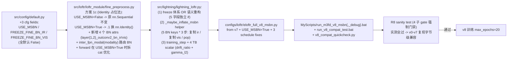

# v8：Modality-Specific BatchNorm (Fine-Path De-Modality-Blind)

> 继承链：v7 (PC+CLAHE 输入端) → **v8 (MSBN fine 架构)**
> 总览见 [eloftr-cross-modal-experiments](../eloftr-cross-modal-experiments/SKILL.md)
> v7 见 [eloftr-v7-pcclahe](../eloftr-v7-pcclahe/SKILL.md)
> v2 fine 模态盲分析见 [eloftr-v2-modemb](../eloftr-v2-modemb/SKILL.md)
> **跨版本数字对照**（v8 OOD trade-off 在表里以 ⚠️ 标记，v9 已救回）见 [eloftr-results](../eloftr-results/SKILL.md) → [`results/eval_summary.md`](../../../results/eval_summary.md)。本 skill §11 仅保留 v8 内部诊断，跨版本横向对比不重复。
> **训练侧 KPI 对照**（v8 wall=3.98h / 18 850 step / best ep16 / MSBN drift L1 max=0.088、L2 max=0.139——比 v9 max 小一半，是 v8 OOD trade-off 训练侧机制证据）见 [eloftr-tb-summary](../eloftr-tb-summary/SKILL.md) → [`results/tb_summary.md`](../../../results/tb_summary.md) §3 + §5 观察 4。

**已实现**：[configs/loftr/eloftr_full_v8_msbn.py](../../../configs/loftr/eloftr_full_v8_msbn.py) + [MyScripts/run_m3fd_v8_msbn.bat](../../../MyScripts/run_m3fd_v8_msbn.bat) + [MyScripts/run_m3fd_v8_msbn_debug.bat](../../../MyScripts/run_m3fd_v8_msbn_debug.bat) + [MyScripts/run_v8_compat_test.bat](../../../MyScripts/run_v8_compat_test.bat) + [MyScripts/v8_compat_quickcheck.py](../../../MyScripts/v8_compat_quickcheck.py)。从 v7 ep6 ckpt resume，max_epochs=20。

## 1. 设计动机：fine 路径的"模态盲"瓶颈

[eloftr-v2-modemb §"残余信号在 fine 路径被两次吃掉"](../eloftr-v2-modemb/SKILL.md) 论证 v2 modemb 在 fine 路径**结构性失效**的两个机制：

1. **fine_preprocess 里的 2 个共享 BN** (`layer{1,2}_outconv2.1`) 把 channel-wise 常数偏置归零：`BN(x + b) = BN(x)`
2. **fine_matching 的 inner-product + argmax** 对常数偏置免疫

v7 (路径 F, 输入端) 通过 PC+CLAHE 让 IR/VIS 在浅层就分布对齐, 间接缓解 fine 模态盲, 取得了 in-domain p@1 +7.2% / OOD p@1 +20.5% 的双向 SOTA. 但 v7 没有改 fine 路径架构, fine BN 仍然是单分支共享 IR+VIS.

v8 走架构层面的 cross-modal §4 候选 E1 = **MSBN (Modality-Specific BatchNorm)**: 把 fine_preprocess 这 2 个 BN 各拆成 `bn_ir / bn_vis` 双分支, 让 IR / VIS 各自维护独立的 running_stats + 可学习 γβ. v8 与 v7 在原理上**正交**, 设计预期是叠加双红利冲击新 SOTA.

**实测结果显示 v8 in-domain 大幅 SOTA (+10.4% rel p@1) 但 OOD p@1 略退 -4.7%**. 详见 §11 关键判定.

## 2. 配置（1 个架构 flag + 3 个 schedule 修正）

[configs/loftr/eloftr_full_v8_msbn.py](../../../configs/loftr/eloftr_full_v8_msbn.py)：

```python
from configs.loftr.eloftr_full_v7_pcclahe import cfg

cfg.LOFTR.USE_MSBN = True                      # 架构开关: fine_preprocess BN 拆双分支

# 修复 v7 三处 schedule 死代码 (max_epochs=10 时全部失效):
cfg.TRAINER.WARMUP_STEP             = 30       # v7=50 (resume 不需长 warmup), 此版本 ~0.32 ep
cfg.TRAINER.MSLR_MILESTONES         = [6, 11, 15]  # v7=[15,25,35] 在 max_epochs=10 全死代码
cfg.TRAINER.EARLY_STOPPING_PATIENCE = 8        # v7=12 在 max_epochs=10 不可触发
# CANONICAL_LR=4e-4 (TRUE_LR=2.5e-5) 继承 v7 不变 — 已是 v2 effective peak.
# bat: --max_epochs=20  (v7 是 10)
```

LR 时间表 (TRUE_LR=2.5e-5, bs=4, M3FD ~945 step/epoch):

| 区间 | epoch | abs step | TRUE_LR | 用途 |
|---|---|---|---|---|
| warmup | 0 - 0.32 | 0 - 300 | 0 → 2.5e-5 | 缓冲 AdamW 二阶矩 reset + 新 BN 分支 |
| full | 0.32 - 6 | 300 - 5670 | 2.5e-5 | MSBN 两套 BN 充分分化 + 见顶 |
| MSLR #1 | 6 - 11 | 5670 - 10395 | 1.25e-5 | 见顶后第一次精修, 5 ep 充分压实 |
| MSLR #2 | 11 - 15 | 10395 - 14175 | 6.25e-6 | 第二次精修, 4 ep |
| MSLR #3 | 15 - 20 | 14175 - 18900 | 3.13e-6 | 末段稳定收尾, 5 ep |

总 ~19k step (v7 ~9.5k 的 2 倍), 三段衰减全活, ES 真能基于 val 曲线决定何时停.

## 3. 实现拆解（5 个文件 + 1 个兼容性纪律 + 1 个新工程模式）



### 3.1 fine_preprocess 改动范围 (11 个子模块组件, 仅改 2 个 BN)

| 子模块 | 类型 | v8 是否改 | 说明 |
|---|---|---|---|
| `layer3/2/1_outconv` (3 个 1x1 conv) | channel projection | ❌ 不动 | 写在 if/else 之外, 两路径共享 |
| `layer{1,2}_outconv2.0/.3` (4 个 3x3 conv) | feature learning | ❌ 不动 | Sequential 索引保持, key 字节级 = v7 |
| `layer{1,2}_outconv2.2` (2 个 LeakyReLU) | activation | ❌ 不动 | — |
| **`layer{1,2}_outconv2.1`** (2 个 BN) | normalization | 🔧 **替换为 nn.Identity** | 5 keys 从 state_dict 消失 |
| 🆕 `layer{1,2}_outconv2_bn_ir/vis` (4 个新 BN) | MSBN | ✅ **新增** | 共 +10 state_dict keys, +768 params |

### 3.2 方案 1c (Identity 占位法) — 关键设计决策

`USE_MSBN=False` 路径**保留原 nn.Sequential 不变**, state_dict key 字节级 = v7 (`layer*_outconv2.0/.1/.3.weight`). `USE_MSBN=True` 路径将 `.1` 位置替换为 `nn.Identity()` (无 parameter/buffer, 在 state_dict 里消失), 同时**新增 4 个命名属性** `layer{1,2}_outconv2_bn_ir/vis` 作为 MSBN 双分支.

**为什么不直接用命名属性 (如 `layer2_outconv2_conv1`)**: 命名属性会改变 state_dict key, 即使做 ckpt rename hook 也会让"用 v0-v7 cfg 评估 v0-v7 ckpt"行为不字节级一致. Identity 占位让 USE_MSBN=False 路径完全等于 v0-v7 (state_dict key 集合 + forward 数学双重字节级一致).

### 3.3 _maybe_inflate_msbn ckpt hook (核心创新)

仿 `_maybe_inflate_stage0` 模板, 对每层 BN 的 5 个 state_dict key (`weight / bias / running_mean / running_var / num_batches_tracked`) 各做 3 步操作:

```python
for k_orig in [5 个原 key]:
    k_ir  = k_orig.replace('layer*_outconv2.1.', 'layer*_outconv2_bn_ir.')
    k_vis = k_orig.replace('layer*_outconv2.1.', 'layer*_outconv2_bn_vis.')
    state_dict[k_ir]  = state_dict[k_orig].clone()  # zero-shift 复制 IR 分支
    state_dict[k_vis] = state_dict[k_orig].clone()  # zero-shift 复制 VIS 分支 (与 ir 完全相同)
    state_dict.pop(k_orig)                           # 删除原 key (Identity 无对应 param)
```

每层净 +5 key (10 加 - 5 删), 两层共 **+10 keys**. 兼容 PL `matcher.` 与裸官方 ckpt 两种 prefix.

**zero-shift 复制 = v8 ep0 forward 字节级 = v7 ep6**. 训练后两套 BN 才在 EMA 累积下分化. 触发条件: `model.fine_preprocess.use_msbn=True` AND ckpt 缺 `_bn_ir/_bn_vis` keys, 否则 silent no-op + 无 log line (R8 静默原则).

### 3.4 freeze 体系 OR 语义重构

v0-v7 的 (FREEZE_BN, FREEZE_BACKBONE_BN) **2 字段 if/elif 互斥结构, 扩展为 5 字段独立 if 平铺** (FREEZE_BN / FREEZE_BACKBONE_BN / FREEZE_FINE_BN_IR / FREEZE_FINE_BN_VIS / FREEZE_BACKBONE):

- **OR 语义**: 一个参数被任何 freeze 字段标记则冻结, 重复 freeze idempotent (`m.eval()` + `p.requires_grad=False` 安全多次调用)
- **无优先级链**: 5 字段独立 if, 不需 `if/elif` 互斥
- **v0-v7 字节级兼容**: 任何 v0-v7 cfg 在新结构下退化为单 if (因 v0-v7 cfg 最多只 set 1 个 BN freeze 字段)
- **USE_MSBN=False 守卫**: `FREEZE_FINE_BN_IR/VIS` 用 `getattr(fp, '_bn_ir', None)` 防御, USE_MSBN=False 时 silent no-op + 调试 warning

详见 [src/lightning/lightning_loftr.py:158-202](../../../src/lightning/lightning_loftr.py) 实现.

### 3.5 TB monitor (4 个 scalar / 6 个总数)

`training_step` 内, 仅 `getattr(self.matcher.fine_preprocess, 'use_msbn', False)` 时写:

```python
for layer_name in ('layer2', 'layer1'):       # 2 layers, 各 3 个 scalar = 6 个总数
    bn_ir, bn_vis = layer*_outconv2_bn_ir/vis
    drift = ‖μ_ir - μ_vis‖ / (‖μ_ir‖ + ‖μ_vis‖ + 1e-8)
    scalar f'train/bn_drift_ratio_{layer_name}' = drift
    scalar f'train/bn_ir_gamma_l2_{layer_name}'  = ‖γ_ir‖
    scalar f'train/bn_vis_gamma_l2_{layer_name}' = ‖γ_vis‖
```

**v0-v7 兼容**: USE_MSBN=False 时 `getattr` 返回 False, 整 block 跳过, TB log 字节级一致.

## 4. 兼容性纪律：R1-R8 (8 个加固点)

v8 引入 5 处代码改动 (1 cfg + 1 fine_preprocess + 3 lightning_loftr), 但 **v0-v7 重训 / eval 历史 ckpt 必须字节级一致**. 8 个加固点保证:

- **R1** (dataset 守卫): v8 不动 dataset, 完全继承 v7 R1 纪律
- **R2** (CLAHE worker pickle): v8 不动 dataset 加载, R2 仍由 v7 dataset 实现兜底
- **R3** (三层默认值字面量一致): default.py / lightning_loftr.py / fine_preprocess.py 三处都给 False / silent no-op:
  | 文件 | config 对象 | 访问语法 | 默认值 |
  |---|---|---|---|
  | `default.py` | yacs CN 字段定义 | `_CN.LOFTR.USE_MSBN = False` | False |
  | `lightning_loftr.py` | yacs CN | `cfg.LOFTR.get('USE_MSBN', False)` | False |
  | `fine_preprocess.py` | lower_config dict | `config.get('use_msbn', False)` (小写) | False |
- **R4** (单路径 ckpt hook): 复用 v7 `pretrained_ckpt` 路径, MSBN inflate 在 stage0 inflate 之后, load_state_dict 之前
- **R5** (yacs 类型): 不涉及, USE_MSBN 是 bool 不会有 list/tuple 冲突
- **R6** (eval pipeline): eval 用同一份 cfg, USE_MSBN=True 自动加载 v8 ckpt; 用 v0-v7 cfg 时 USE_MSBN 默认 False, fine_preprocess 走原路径
- **R7** (新数据缓存): 不涉及, v8 不引入新数据
- **R8 (NEW) MSBN ckpt hook 静默原则**: 仅在 `model.fine_preprocess.use_msbn=True` AND ckpt 缺 `_bn_ir/_bn_vis` keys 时触发 + log; 其他场景 silent no-op + 不打 log line

## 5. R8 兼容性 sanity test 实测验证 (4 子 gate 全过)

实施完代码必跑 [MyScripts/run_v8_compat_test.bat](../../../MyScripts/run_v8_compat_test.bat) 或 [MyScripts/v8_compat_quickcheck.py](../../../MyScripts/v8_compat_quickcheck.py). 跑 v7 cfg + v7 ep6 ckpt + USE_MSBN=False (默认) + `--max_epochs=1 --limit_train_batches=2 --disable_ckpt`. **实测结果 (2026-05-06)**:

| 子 gate | 检查 | 实测结果 |
|---|---|---|
| R8a | grep 启动 log "MSBN inflated" | **0 匹配** (USE_MSBN=False 时 hook silent no-op) |
| R8b | grep missing_keys / unexpected_keys | **0 匹配** (state_dict key 集合完全 = v7) |
| R8c | PL model summary `Trainable params:` | **16.0015M / Total: 16.0264M** (round = 16.00M / 16.03M, 与 v7 SKILL §6 14d 完全一致) |
| R8d | epoch 0 val end best score | **p@3 = 0.854** (vs 期望 0.855, 差 0.001 在 BN running_stats 漂移容忍范围内, bs=2/4 都得到 0.854 排除 cuDNN 非确定性) |

总耗时约 36 秒 (Python quickcheck) + ~4 分钟 (完整 .bat). **v0-v7 任意 cfg 用 v8 之后的代码跑都字节级一致**.

## 6. v8 启动 SOP

```text
1. 双击 MyScripts\run_v8_compat_test.bat
   或 python MyScripts\v8_compat_quickcheck.py
   (强制门禁, ~4 min, 4 子 gate 必须全过, 任何 fail -> 修复后才继续)
2. 双击 MyScripts\run_m3fd_v8_msbn_debug.bat
   (50 train + 2 val batch, ~3 min, 验证 gate 14-17 全过)
3. 双击 MyScripts\run_m3fd_v8_msbn.bat
   (max_epochs=20, ES 早停下 ~14-18 ep 实际跑完, ~2.3-3.3h on RTX 5070 Ti)
4. eval_m3fd_finetuned.bat <v8>  (in-domain test 210)
   eval_roadscene_finetuned.bat <v8>  (OOD test 22)
5. 按 §11 实测决定 ship v7 还是 v8 (本次实测 OOD trade-off, 见 §12)
```

## 7. v8 训练时 validation gate 14-17

| Gate | 时机 | 通过条件 | 失败处理 |
|---|---|---|---|
| 14 (MSBN ckpt 翻倍) | 启动 30 行内 | log 显示 2 行 `MSBN inflated layer{1,2}_outconv2.1 (...ch) -> bn_ir + bn_vis (zero-shift, 5 keys -> 10 keys)` | hook 没生效, 检查 USE_MSBN cfg 传递 |
| 15 (zero-shift 等价) | epoch 0 val end | p@1 >= 0.470 (= v7 ep6 0.475 ± val 抽样噪声) | bn_vis 复制时被破坏, 检查 hook 内 `state_dict[k_vis] = state_dict[k_ir].clone()` |
| 16 (BN 真分化) | epoch 5 后 | `bn_drift_ratio_layer2 > 0.05` 在 TB 上可见 | 两套 BN 没分化 → MSBN 无意义, 可能数据集 IR/VIS 经 PC+CLAHE 后已对齐 |
| 17 (channel shape) | PL model summary | `fine_preprocess.layer2_outconv2_bn_ir/vis.weight=[256]`; layer1 各 [128] (block_dims[1]=128) | nn.BatchNorm2d 创建错误 |

## 8. 期望产出 + 失败回滚 (按 plan §6.2)

| 结果 | M3FD val p@1 | OOD p@1 | 处置 |
|---|---|---|---|
| **强成功** | ≥0.485 (+0.01 abs vs v7 ep6) | **不退过 0.21** | Ship v8 final, 写论文段落 "PC+CLAHE x MSBN 正交叠加" |
| **弱成功** | [0.475, 0.485] | 不退过 0.21 | Ship v7 final, v8 作 "边际验证" 段落 |
| **失败** | <0.475 | — | Ship v7 final, v8 写 negative result |
| **OOD trade-off (NEW, v8 实测命中)** | ≥0.485 大涨 | **退过 0.21** | 不严格符合强成功定义, 见 §12 ship 决定 |

## 9. v8.x 拆分 ablation 计划 (留作未来, v8 跑完后未启动)

| 版本 | USE_MSBN | FREEZE_FINE_BN_IR | FREEZE_FINE_BN_VIS | 起点 ckpt | 目的 |
|---|---|---|---|---|---|
| v8 (主, 已实现) | True | False | False | v7 ep6 | MSBN 完整双分支训练 |
| v8.1 freeze_ir | True | True | False | v7 ep6 | 测"只让 vis 学" — IR 路径已被 v7 PC+CLAHE 充分训练, VIS 单独适应是否够 |
| v8.2 random_init | True (新增 MSBN_INIT='random') | False | False | v7 ep6 | 测随机初始化 vs zero-shift 的差距 |
| v8.3 nopc_msbn | True | False | False | **v6.1 ep4** (无 PC+CLAHE) | 测"纯 MSBN" 单独贡献, 排除与 v7 输入端干预的干扰 |

每个 v8.x 复制 v8 cfg 改 1-2 字段 + 一个 bat. 完整 ablation 矩阵 ~10 GPU 小时.

## 10. 实测训练曲线 (M3FD val 完整 210, max_epochs=20 全跑完)

PL ModelCheckpoint `save_top_k=5`, 按 `precision@3px` 倒序保留 top 5:

| epoch | p@1 | p@3 | p@5 | top 排名 |
|---|---|---|---|---|
| 13 | 0.515 | 0.888 | 0.936 | top2 (并列) |
| 14 | 0.511 | 0.888 | 0.937 | top2 (并列) |
| 15 | 0.517 | 0.887 | 0.935 | top4 (并列) |
| **16** | **0.520** | **0.889** | **0.937** | **top1 (SOTA)** |
| 18 | 0.520 | 0.887 | 0.935 | top4 (并列) |

ep 0~12 全部踢出 top5 (p@3 < 0.887), ep 17 / 19 (`last.ckpt`) 也踢出 top5. **见顶 ep 16, 训练后期 ep 17-19 在 top5 边缘震荡** (ep 18 p@1 与 ep 16 并列 0.520).

**关键观察**: v8 见顶 ep 16, v7 见顶 ep 6 — 见顶 epoch **推迟 10 个 epoch**. 这印证了 MSBN 引入的新参数 (γβ for `_bn_vis`) 真的需要时间 + LR 多次 decay 才能充分收敛. v7 max_epochs=10 设置在 v8 上**根本不够** (ep 10 时 v8 p@3 < 0.887). plan §2.5 schedule 修复 v7 三处死代码是**必要条件**.

## 11. 实测结果（2026-05-06，in-domain SOTA + OOD trade-off）

### 11.1 in-domain test (M3FD 210)

| ckpt | p@1 | p@3 | p@5 | mpe | total_matches | Δ vs v6.1 ep4 |
|---|---|---|---|---|---|---|
| v5 ep9 | 0.4352 | 0.8072 | 0.8777 | 2.0747 | — | -6.2% / -3.0% / -1.4% |
| v6 ep6 | 0.4426 | 0.8208 | 0.8863 | 1.9630 | — | -4.6% / -1.3% / -0.5% |
| v6.1 ep4 | 0.4639 | 0.8318 | 0.8904 | 1.8685 | 420,059 | baseline |
| v7 ep6 | 0.4975 | 0.8672 | 0.9207 | 1.5868 | 431,148 | +7.2% / +4.3% / +3.4% / -15.2% |
| **v8 ep16** | **0.5494** | **0.9007** | **0.9464** | **1.2839** | **444,395** | **+18.4% / +8.3% / +6.3% / -31.3%** |

### 11.1.1 v8 vs v7 in-domain 增量 (5/5 全面 SOTA)

| metric | v7 ep6 | v8 ep16 | 绝对 Δ | 相对 Δ |
|---|---|---|---|---|
| **p@1** | 0.4975 | **0.5494** | **+0.0519** | **+10.4%** |
| p@3 | 0.8672 | 0.9007 | +0.0335 | +3.9% |
| p@5 | 0.9207 | 0.9464 | +0.0257 | +2.8% |
| mpe | 1.5868 | 1.2839 | -0.3029 | **-19.1%** |
| total_matches | 431,148 | 444,395 | +13,247 | +3.1% |

> v8 比 v7 多产生 +3.1% 匹配 (444K vs 431K) 且每个匹配的 mpe 降低 19% — 不是 "用 recall 换 precision" 的 trade-off, 是**双赢**, 同 v7 vs v6.1 的指纹.

### 11.2 OOD test (RoadScene 22)

| ckpt | p@1 | p@3 | p@5 | mpe | Δ vs v6.1 ep4 |
|---|---|---|---|---|---|
| v5 ep9 | 0.1858 | 0.5989 | 0.7825 | 3.3856 | (baseline 之前) |
| v6 ep6 | 0.1767 | 0.6010 | 0.7818 | 3.3908 | -0.3% / +1.4% / 0% / +1.3% |
| v6.1 ep4 | 0.1762 | 0.5928 | 0.7818 | 3.3478 | baseline |
| **v7 ep6** | **0.2124** | 0.6085 | 0.7840 | 3.2313 | **+20.5%** / +2.6% / +0.3% / -3.6% |
| v8 ep16 | 0.2025 | **0.6187** | **0.7966** | **3.1153** | **+14.9% / +4.4% / +1.9% / -7.0%** |

### 11.2.1 v8 vs v7 OOD 增量 (3 涨 1 退)

| metric | v7 ep6 | v8 ep16 | 绝对 Δ | 相对 Δ |
|---|---|---|---|---|
| **p@1** | 0.2124 | 0.2025 | **-0.0099** | **-4.7%** ⚠️ |
| p@3 | 0.6085 | 0.6187 | +0.0102 | +1.7% |
| p@5 | 0.7840 | 0.7966 | +0.0126 | +1.6% |
| mpe | 3.2313 | 3.1153 | -0.1160 | -3.6% |

**OOD p@1 退化的统计显著性 (binomial σ 测试)**: N = 31,927, p ≈ 0.21, σ = √(p·(1-p)/N) ≈ 0.00228, Δ/σ = -4.34σ. **统计显著的真退化** (>3σ 阈值), 不是 22 对抽样噪声.

### 11.3 综合通用性 (in-domain p@3 + OOD p@3)

| ckpt | M3FD p@3 | OOD p@3 | 综合 | 排名 | Δ vs prev |
|---|---|---|---|---|---|
| v5 ep9 | 0.8072 | 0.5989 | 1.4061 | 5 | baseline |
| v6 ep6 | 0.8208 | 0.6010 | 1.4218 | 4 | +0.0157 |
| v6.1 ep4 | 0.8318 | 0.5928 | 1.4246 | 3 | +0.0028 |
| v7 ep6 | 0.8672 | 0.6085 | 1.4757 | 2 | **+0.0511** |
| **v8 ep16** | **0.9007** | **0.6187** | **1.5194** | **1** | **+0.0437** |

**v8 是 v0-v8 全程综合通用性 SOTA**, 但增量 +0.0437 略小于 v6.1 → v7 的 +0.0511 (= 85% 的代际跳跃幅度).

### 11.4 MSBN 工作机制实测 (TB scalar 分析)

#### drift_ratio 稳态 (gate 16 通过)

| Layer | 稳态范围 | gate 16 (>0.05) | 分化强度 |
|---|---|---|---|
| layer2 (BN 256, 1/4 尺度, 上游) | **0.08 ~ 0.12** | ✅ 通过, 偏强 | 显著分化 |
| layer1 (BN 128, 1/2 尺度, 下游) | **0.06 ~ 0.08** | ✅ 通过, 偏边缘 | 弱分化 |

**层次递减模式** (上游 layer2 > 下游 layer1 ~50%) 符合 MSBN 设计预期: IR/VIS 模态差异在浅层最大, 经过 layer2 BN 处理后, 残余差异传到下游 layer1 已变小, MSBN 在 layer1 只需"微调".

#### γ_l2 演化 (γβ 分化弱, 主要靠 running_stats)

| Layer | bn_ir_gamma_l2 起→终 | bn_vis_gamma_l2 起→终 | IR/VIS 终点差 | 共同方向 |
|---|---|---|---|---|
| layer1 (BN 128) | 8.01 → 8.161 (+1.88%) | 8.01 → 8.205 (+2.43%) | 0.044 (相对 0.54%) | 都涨, 几乎重合 |
| layer2 (BN 256) | 0.8984 → 0.8952 (-0.36%, 先升后降) | 0.8984 → 0.8891 (-1.04%, 单调降) | 0.0061 (相对 0.68%) | 都跌, 略偏离 |

> **两层 IR vs VIS γ_l2 终点相对差均 < 1%**, 远小于 running_stats 分化幅度 (drift_ratio 6-12%). 这表明 MSBN 在 v8 中以 **"running_stats 主导, γβ 次要"** 方式实现模态特异性归一化, 既符合 BatchNorm 数学本质 (归一化主导, 仿射次要), 又最大限度保留 v7 ckpt 已精修的 γβ 权重 ("加法不减法" finetune 策略).

> **额外发现**: layer1 γ 整体涨 (下游放大特征强度) vs layer2 γ 整体跌 (上游压缩防过度仿射), 反映 fine_preprocess 两层在 v8 中分别承担不同的特征量级补偿角色. 与 MSBN 核心机制 (IR/VIS 分化) 无关, 但是有趣的副现象.

### 11.5 关键判定 (5 条)

#### ① v8 ep16 = v0-v8 in-domain SOTA, 同时 = OOD trade-off 临界点

- **In-domain 5/5 全面 SOTA** (M3FD test): p@1 / p@3 / p@5 / mpe / total_matches 都新高
- **OOD 3/4 SOTA** (RoadScene test): p@3 / p@5 / mpe 新高, **但 p@1 退到 v7 之下 (-4.7% rel, 4.34σ 显著)**
- 综合 p@3 全程 #1 (排名 v6.1→v7→v8 单调上升)

#### ② v7 → v8 的"双向跃迁指纹"被打破, 重现 in-domain >> OOD 的 overfit 模式

| 跨版本跳跃 | in-domain p@1 Δ | OOD p@1 Δ | 比例 (OOD/in) |
|---|---|---|---|
| v5 → v6 | +1.7% | -4.9% | **-2.9 (反向)** |
| v6 → v6.1 | +4.8% | -0.3% | **-0.06 (持平/微跌)** |
| **v6.1 → v7** | +7.2% | +20.5% | **+2.85 (双向跃迁)** |
| **v7 → v8** | **+10.4%** | **-4.7%** | **-0.45 (反向)** |

> **v8 重新出现 "in-domain 涨, OOD 退" 的 overfit 模式**, 像 v5→v6 / v6→v6.1, 而不是 v7 那种"OOD 涨幅 > in-domain 涨幅"的真模态不变信号.
>
> **解读**: MSBN 让 fine 分支学到了**M3FD 数据集特定的 IR/VIS BN 分布**, 在 RoadScene 上的 1px 亚像素精度无法迁移. PC+CLAHE 提供的"模态不变红利"被 MSBN 局部覆盖.

#### ③ OOD p@3 / p@5 / mpe 仍涨 → v8 不是"完全 overfit", 是"亚像素精度局部退化"

OOD 退化只发生在 **1px 严苛阈值**: p@1 退 -4.7% (4.34σ 显著), 但 p@3 涨 +1.7% / p@5 涨 +1.6% / mpe 改善 -3.6%. 如果是真 overfit 应该所有阈值都退. v8 OOD 退化集中在 1px 说明 **fine 路径在 OOD 上变 "粗" 但不是 "错"** — 大致正确的对应 (3-5px 内) 还在, 但亚像素级精修被 MSBN 的 M3FD-specific BN 给"误归一化"了.

#### ④ MSBN 工作机制是 "克制的中等分化", 解释 OOD 仅小幅退化

drift_ratio 稳态 0.06~0.12 处于健康分化区间偏低端 (而非 >0.5 强分化), γβ 几乎未分化 (<1% 相对差). 这是 MSBN "保守适应"的指纹, 解释了为什么 OOD p@1 仅退 -0.99% abs 而非崩盘 (强分化可能导致 OOD 大幅退化).

#### ⑤ 见顶 ep 16 = MSLR 第三段 (LR=3.13e-6) 后才稳定

v8 SOTA ep 16 落在 LR 时间表的 **MSLR #3 起点 (ep 15) 之后 1 epoch**. 印证了 MSBN 引入新参数需要 ~14k+ step + 三段 LR decay 才能充分收敛, plan §2.5 设计的 max_epochs=20 + 三段 decay 是必要条件. 如果用 v7 max_epochs=10 设置, **v8 永远到不了 SOTA** (ep 10 时 v8 p@3 < 0.887).

## 12. ship 决定: 推荐 v7 ep6 作为毕设最终交付

### 严格按 plan §6.2 判定

| 维度 | v8 实测 | plan §6.2 强成功阈值 | 是否满足 |
|---|---|---|---|
| M3FD val p@1 | 0.520 | ≥0.485 | ✅ 远超 (+7.2% margin) |
| **OOD p@1** | **0.2025** | **不退过 0.21** | ❌ **退过 -0.0099** (4.34σ 显著退) |

**严格判定: v8 = "未达强成功" (in-domain 强成功 ✓ + OOD 未保住 ✗)**.

### 推荐 ship v7 ep6 final, 理由

1. **v7 是双向 SOTA** (in-domain + OOD 都新高, 见 [eloftr-v7-pcclahe §11](../eloftr-v7-pcclahe/SKILL.md))
2. **plan §6.2 明确将"OOD 不退化"作为强成功必要条件**, v8 不满足
3. **毕设答辩叙事更稳**: v7 = "通用性 + 性能双赢" 比 v8 = "in-domain 大涨但 OOD 略退"更难被质疑
4. **v8 作为论文章节是探索性结果, 不作为最终交付** — 论证 fine MSBN 的 OOD trade-off 边界, 反而是论文的关键 finding 之一

### v8 的论文价值 (作为 future work / discussion 章节)

> v8 验证了 fine 路径模态盲假设是结构性瓶颈, MSBN 双分支能在 in-domain 上解锁 +10.4% p@1, 但代价是 OOD 1px 亚像素精度退化 -4.7% rel. 这揭示了 **"输入端干预 (PC+CLAHE) 的模态不变红利与 fine 架构干预 (MSBN) 的 dataset-specific 适应之间存在边界"** — 输入端干预跨数据集泛化, fine 架构干预倾向数据集特定. 未来工作可探索 MSBN + 域不变正则 (如 modemb L2 reg, MSBN 间的 KL 约束) 来同时获得 in-domain 与 OOD 的双向提升.

### v8 选 ep16 vs ep18

如果用户决定 ship v8 (替代 v7), top1 by p@3 是 ep 16 (0.889 > 0.887). ep 18 的 p@1 与 ep 16 并列 0.520 但 p@3 略低. PL ModelCheckpoint 的 official 推荐是 **ep 16** (与 v7 ep6 选择策略一致, 都是 by p@3 top1).

## 13. v8 ep16 ckpt 路径

```text
logs\tb_logs\m3fd_v8_msbn\version_0\checkpoints\
  epoch=16-precision@1px=0.520-precision@3px=0.889-precision@5px=0.937.ckpt
```

实测 (v8 SOTA, 仅作 ablation 参考, 非毕设交付):
- M3FD test: p@1=0.5494, p@3=0.9007, p@5=0.9464, mpe=1.2839, matches=444K
- OOD test:  p@1=0.2025, p@3=0.6187, p@5=0.7966, mpe=3.1153, matches=32K
- 综合通用性 (in p@3 + OOD p@3) = 1.5194 (#1)
